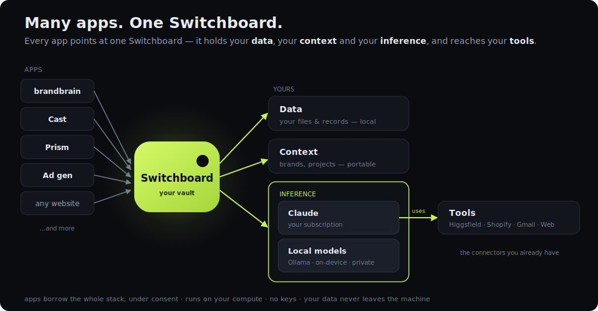
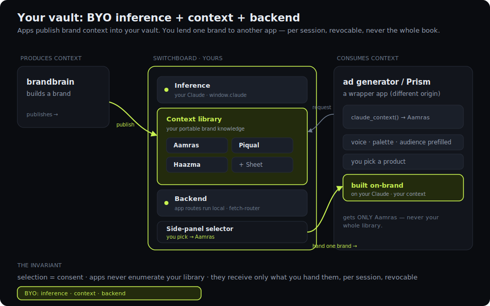
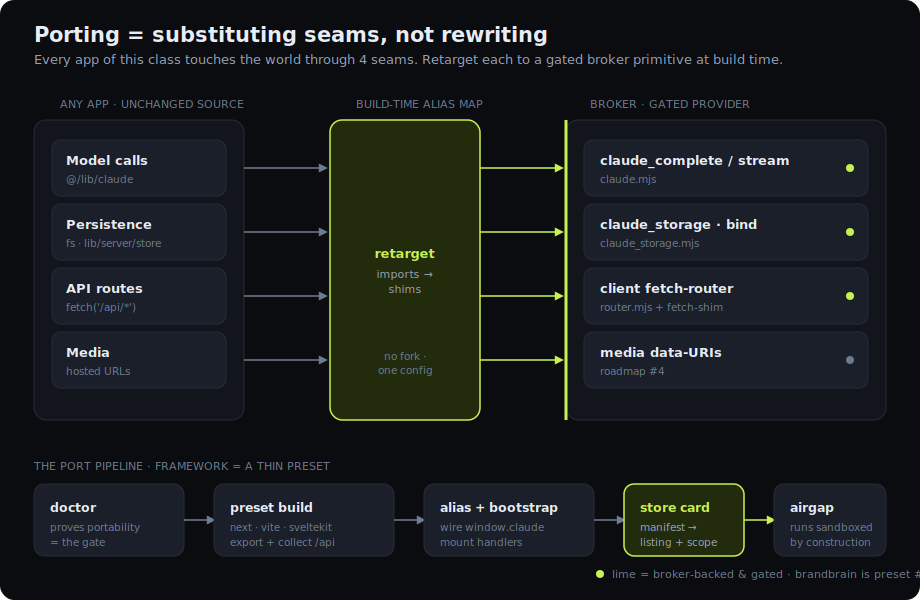

# Switchboard — MetaMask, but for AI

A local **sidekick** daemon holds your Claude (or any local model) and your connected MCP tools. A
browser **extension** injects a standard provider — `window.claude` — into every page, so **any
website runs on the visitor's own model, tools, context, and data** without ever holding an API key,
seeing a credential, or paying for inference. Every sensitive action is brokered through an explicit,
scoped, per-origin consent UI. Think `window.ethereum` / EIP-1193, where the asset is *your Claude,
your tools, and your context.*

> **The consent broker is the product** — the plumbing is commodity. Security design leads here.
>
> The repo is still scoped `@relay/*`; the product is **Switchboard**. The injected provider stays
> `window.claude`.



## The idea: a vault you own and lend out

Switchboard is a wallet for AI. You own three things and lend them to apps under consent — **inference**
(your Claude), **context** (your portable brand/project knowledge), and a **backend** (an app's own
routes, run locally). An app you don't have to trust with your whole life gets exactly the one thing
you hand it, for the session, revocably.



- **Economic inversion** — the site runs on the *visitor's* model/compute, not the operator's bill.
- **Capability inheritance** — the site instantly gets every MCP tool + connector the visitor already
  connected; it integrates and OAuths nothing.
- **Data locality** — credentials + data stay on the user's machine; only prompts reach the model.
- **Context portability** — build a brand once in one app, use it in any other, on your own compute.

## The broker primitives

Every primitive funnels through the same out-of-band gate (`packages/sidekick/src/security/gate.ts`).
Reads pre-approve within scope; writes prompt every time (or auto-approve under a per-site "trust"
mode); nothing bypasses it.

| Primitive | What it gives an app | Consent model |
|---|---|---|
| `claude_complete` / `claude_stream` | the visitor's Claude (agentic tool use) | model in scope; writes gated |
| `claude_session` | a **warm** per-`(origin, sessionId)` thread — no cold start per turn, pooled | read-only (web reads only) |
| `claude_storage` | a private per-origin folder; **`bind`** points it at a real project folder | reads free; `bind` = path consent |
| `claude_context` | shared, cross-app **context** (publish / read the one you're lent) | selection = consent; never enumerable |
| `claude_callTool` | any MCP tool / claude.ai connector the user granted | read auto · write per-action |
| `claude_speak` | on-device text-to-speech — a local TTS server or macOS `say` | local · no cloud, no credits |

**Context can be backed by a source you already keep** — a published Google Sheet's CSV is fetched and
parsed to JSON rows (SSRF-guarded, cached), so a spreadsheet becomes live shared context with zero new
infra. A global **"working on" project** scopes every connected app at once.

**One surface, any brain.** `window.claude` looks identical whether it's served by your Claude
subscription, a local model (Ollama / LM Studio), or an on-device engine — `claude_speak` even
synthesizes voice locally. Switchboard is the orchestrator: Claude **+** connectors **+** local models,
all on your compute.

## Porting existing apps

An app is a small set of runtime **seams**; porting is *substituting* each seam with a broker-backed
shim at build time — not rewriting, and not adopting an invasive SDK. Frameworks collapse to thin
presets; a portability `doctor` gates fit.



**Proven on the real brandbrain** (`examples/brandbrain-port`): its Next.js frontend static-exports,
all **32 route handlers** bundle into a client-side fetch-router via seam shims (`@/lib/claude` →
`window.claude`, `lib/server/*-store` → `claude_storage`, the warm session → `claude_session`), and a
`switchboard.json` manifest drives the connect scope + folder bind. It runs unchanged on the visitor's
Claude, reading their existing `.data/` folder — no server, no keys. See
[`ROADMAP.md`](ROADMAP.md) for what's built.

## The side panel

The extension's side panel is a consumer surface, not a logs dashboard: **Working on** (your active
project, in its own brand palette) · **Connectors** (friendly capability tiles) · **Apps** (details
tucked into per-app expanders) · a **Wrapp store** launcher (open any app in a new tab, already
connected). A bottom-sheet project switcher includes **Connect a Google Sheet**. Activity, budgets,
and the kill switch live behind a menu. Consent (connect / write / folder-bind / context-pick) renders
**inline** — and survives an MV3 worker eviction via a durable, re-pushed prompt queue; the panel is
self-healing, so a new connection appears live without a reopen.

**This tab** shows the site you're on and, when it hasn't opted into Switchboard, suggests a wrapp that
does the same job on your own compute, context and data. And every wrapp carries the *same* **connect
chip** (`mountConnect`) — a standard, un-restylable lockup that greets you by name and shows the one
project lent to that app.

## Packages

| Package | What it is |
|---|---|
| [`@relay/protocol`](packages/protocol) | BYOP-1 wire contract (types) shared by all three below — the design-in-code |
| [`@relay/sidekick`](packages/sidekick) | The daemon: model backends + MCP tools + storage + context + warm sessions + **the out-of-band gate** + audit |
| [`@relay/extension`](packages/extension) | MV3 extension: injects `window.claude`, is the **origin oracle**, holds the pairing token, hosts the panel + consent UI |
| [`@relay/sdk`](packages/sdk) | The developer wrapper (`relay.complete/stream/storage/context/speak`) + the standard `mountConnect` header chip |
| [`examples/brandbrain-port`](examples/brandbrain-port) | The real brandbrain, ported into the store |
| [`examples/apps`](examples/apps) | Wrapps + the store home — brandbrain, Prism, ad generator, **Cast** (AI persona studio), `store.html` |
| [`spec/BYOP-1.md`](spec/BYOP-1.md) | The adoptable provider standard |

See [ARCHITECTURE.md](ARCHITECTURE.md) for the trust chain, the gate, and how a request flows.

## Status

All packages compile; the spine is proven end-to-end by spikes under `packages/sidekick/spike/` and
`examples/brandbrain-port/proof/`:

| Spike | Proves | Result |
|---|---|---|
| `storage-spike` | per-origin store, isolation, traversal-safe, bind existing data | 23/23 |
| `context-spike` | cross-app publish → lend-by-selection → read; moat holds | 9/9 |
| `context-source-spike` | Google Sheet CSV → JSON rows, SSRF guard, cache | 13/13 |
| `session-spike` | warm thread, sequential turns, later turns ~40% faster | 6/6 |
| `consent-durable-spike` | consent survives a mid-prompt socket drop | 3/3 |
| `run-live` / `run-context-demo` | real brandbrain data + Claude + a real route, end-to-end | green |

Plus the original gate / MCP / daemon round-trip spikes. Honest gaps (see [ARCHITECTURE.md](ARCHITECTURE.md)):
the local-model tool loop, and the private-Sheet write path (read-only for now).

## Dev

```bash
npm install
npm run build

# Terminal 1 — the sidekick. Prints a pairing token.
npm run sidekick

# Load packages/extension as an unpacked MV3 extension; paste the pairing token into the panel.

# Terminal 2 — the wrapp store (Prism, ad generator, …).
npm run apps          # http://localhost:5174

# The brandbrain port:
node examples/brandbrain-port/build.mjs        # build (needs ~/Documents/Projects/brandbrain)
node examples/brandbrain-port/serve.mjs        # http://127.0.0.1:5178
```

## Security invariants (never violate)

1. The extension is the **origin oracle** — origin comes from the browser, never the page.
2. The daemon is the **only** enforcement point — never the model.
3. Reads pre-approve within scope; **writes prompt every time** (or per-site trust), non-bypassable.
4. Tool danger class is **default-deny**, decided by daemon policy.
5. Secrets never cross to the page — results only. Context is **selection = consent**; apps never
   enumerate the library, and receive only the one you hand them.
6. Everything is audited; per-origin revoke + a global kill switch.
