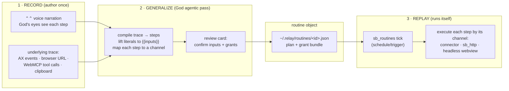
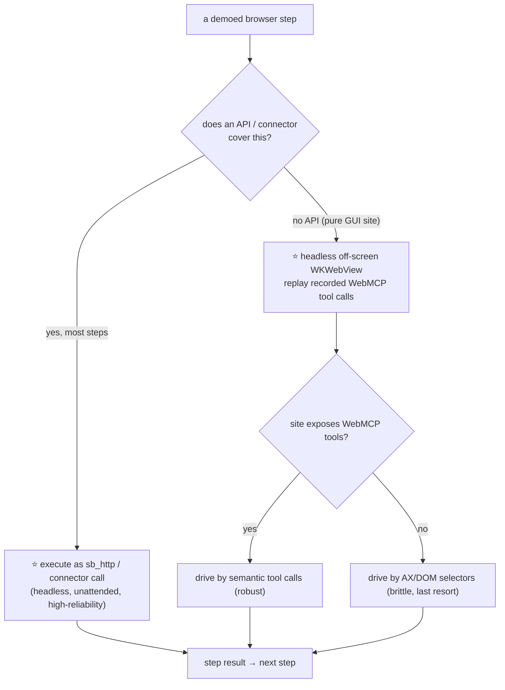

# CopyFlow — show a workflow once, God learns it, it runs itself

**Status:** design / decision-ready — no implementation. (2026-08-03)
**Author:** design note answering the founder's "can a user SHOW a workflow and God turns it into a routine?"
**Related:** [ROUTINES doctrine (memory `relay-routines`)](../CLAUDE.md), [GOD-HANDS.md](./GOD-HANDS.md),
[GOD.md](./GOD.md), [WEBMCP.md](./WEBMCP.md), [CAPABILITIES.md](./CAPABILITIES.md),
[GUIDED-TESTING.md](./GUIDED-TESTING.md), [AMBIENT.md](./AMBIENT.md), the CursorGuide primitive
(`packages/menubar/CursorGuide.swift`), the God webview bridge (`packages/menubar/GodWebWindow.swift`),
the switchboard connector (`packages/switchboard-mcp/`), autopilot (`examples/autopilot/`).

---

## TL;DR — the verdict up front

The founder's example — **fetch from a website → add to a Google Sheet → make a PDF → email it** — is
achievable, but **not** by teaching God to puppet a browser unattended. The decisive reframe:

> **A demonstrated GUI workflow is a spec, not the execution plan.** God watches the demo to learn
> *intent* ("pull the daily numbers, append a row, render a PDF, mail it to Sam"), then **compiles that
> intent down to API-and-connector calls** wherever an API exists, and only falls back to driving a
> real browser for the one or two steps that have no API. The demo is how you *author* a routine
> cheaply; it is not how the routine *runs*.

Four concrete recommendations:

1. **Record via a ⭐ hybrid** — the user narrates each step by voice (⌃⌃, reusing God's eyes + the
   CursorGuide float) **while** a lightweight event/URL trace runs underneath (AX + WebMCP page-tool
   capture). Voice gives *intent*; the trace gives *ground-truth values to parameterize*.
2. **CopyFlow is BOTH** — a **wrapp** (the record/generalize/manage UI that *any* user installs) sitting
   on top of a **daemon `sb_routines` capability** (the clock + gated execution) plus a small new
   **`sb_recorder`** capability (the trace sink). The wrapp authors; the daemon runs.
3. **Routines are `~/.relay` control-plane objects** — one `~/.relay/routines/<id>.json` per routine
   (the compiled plan + its grant bundle), `routines.json` (daemon-written status), `routines-control.json`
   (menubar-written pause/kill) — the *exact* two-file split the routines doctrine already specced. The
   panel lists them by **reusing the connected-apps rail** pattern.
4. **Unattended browser = decompose-first, ⭐** — turn the demoed GUI flow into API calls
   (`sb_http` + Google Sheets / Gmail connectors) and keep a **headless off-screen `WKWebView` pool**
   (the `GodWebWindow` engine, run invisibly) as the fallback for no-API steps — so the routine never
   fights the user for their cursor.

The smallest slice that proves the thesis: **record a 2-step "narrate + trace" demo of a pure-API flow
(fetch JSON → append a Sheet row), generalize it into one `~/.relay/routines/*.json`, and replay it on a
daemon tick.** No browser-driving, no PDF, no schedule UI. That single loop is learn→replay end-to-end.

---

## 0. Grounding — this is ~70% assembly of parts that already ship

CopyFlow is not a new subsystem. Every hard primitive already exists in the repo; CopyFlow is the
*binding* of them plus a recorder and a compiler.

| Need | Existing primitive | Where | CopyFlow reuses it for |
|---|---|---|---|
| Watch the user by voice + screen | God ⌃⌃ loop (capture → think → speak → point) | `GOD.md` §2, `examples/god/` | The RECORD narration channel — God's eyes see each demoed step. |
| Float step labels by the cursor, no grant | **CursorGuide** (`.tour`/`.test`, 30fps mouse poll, passive monitors) | `packages/menubar/CursorGuide.swift` | The recorder's on-screen "I'm capturing step N" chip + REPLAY-preview "here's what I'll do". |
| Drive a wrapp's REAL UI in a controlled webview | **GodWebWindow** (WKWebView + shim + `GodDaemonBridge`, `listTools`/`drive`) | `packages/menubar/GodWebWindow.swift` | The browser-execution surface for no-API steps — run it **off-screen** for unattended replay. |
| Page declares its actions as tools | **WebMCP** expose/consume (`navigator.modelContext`, `window.__god`) | `docs/WEBMCP.md`, `kit/webmcp.js` | Capture the *tool calls* the browser part makes → a clean, replayable step (not pixel coords). |
| Run a wrapp headless, gated + audited | **switchboard connector** (`claude_callTool`, `wrapp__*`) | `packages/switchboard-mcp/`, `GOD.md` §6 | REPLAY of any step that maps to an installed wrapp action. |
| Background gated execution while away | **routines doctrine** (2-tier, `routines.json` + `routines-control.json`) | memory `relay-routines`, autopilot as "routine #1" | The whole temporal engine CopyFlow schedules onto. |
| A finite decision/move engine | **autopilot** (`decision`/`draft`/`choose`/`ripple`, spend tracking) | `examples/autopilot/src/engine.js` | The model for a routine as a *finite sequence of steps with drafted-vs-confirmed values*. |
| Outbound API with the user's creds, token never on the page | **`sb_http` + `sb_secrets`** (designed) | `docs/CAPABILITIES.md` §A/C | The API path for fetch/Sheets/Gmail steps. |
| Cron/background jobs capability slot | **`sb_jobs`** (named, deferred) | `docs/CAPABILITIES.md` "Deferred" | The scheduler `sb_routines` formalizes. |
| Harness-level scheduling (today) | `mcp__scheduled-tasks__*` + the `/schedule` skill | this environment | A stopgap trigger before a native daemon timer exists (see §3). |
| ~/.relay control plane the menubar reads directly | `god-state`, `god-consent.json`, `guide-run.json`, `test-run.json`, `catalog.json`, `shortcuts.json` … | `packages/menubar/RelayMenuBar.swift` | Every CopyFlow file follows this established "file in / file out, no new transport" pattern. |

**Two things that DON'T exist yet in this worktree** (honest): `docs/ROUTINES.md` and
`packages/sidekick/src/routines/registry.ts` live on the unmerged `claude/autopilot-autonomous` branch.
So in *this* tree, routines are **doctrine only** — CopyFlow's build plan must assume the routines
capability is built alongside it, not inherited.

---

## 1. The record → generalize → replay loop

The core loop is three phases. RECORD is a UX/permissions problem; GENERALIZE is a God agentic pass;
REPLAY is §4 (execution) on a §3 (schedule).



### 1.1 The RECORD step — options

The question is *what signal do we capture while the user demonstrates?* Four options:

| Opt | Mechanism | Grant cost | Captures | Reliability of the capture | Verdict |
|---|---|---|---|---|---|
| **a. Voice narrate** | User does the task and says each step aloud via ⌃⌃; God's screen-vision confirms; CursorGuide floats "recording step N". Reuses God eyes + guide primitive verbatim. | **Zero new** (mic + screen already God's). | *Intent*, in the user's words ("now I paste it into the daily-numbers sheet"). | High for intent; **low for exact values** (voice won't dictate a URL or a cell range precisely). | Necessary, not sufficient. |
| **b. AX / computer-use event capture** | Record real UI events: AX-tree focus/press/value changes + the `computer-use` teach primitives (`teach_step`/`teach_batch` exist in this environment). | Accessibility (God already holds it); computer-use `request_teach_access`. | *Exact* clicks, typed text, target elements. | Medium — brittle across app updates/layout; native-app coordinates don't generalize; heavy. | Good for native-app steps; poor for the browser. |
| **c. WebMCP page-tool capture** | For the browser parts, capture the **tool calls** the page exposes/receives via `navigator.modelContext` (WEBMCP Direction 2 "consume", the `tabcall` transport). A step becomes `sheets_appendRow({...})`, not "click at 812,344". | `activeTab` on demand (WEBMCP's answer); origin-stamped by the extension. | *Semantic* browser actions with real args — the cleanest possible trace. | High **where the page exposes WebMCP tools**; degrades to (b)/DOM where it doesn't. | The browser gold path. |
| **⭐ d. Hybrid (a + c, b as fallback)** | Voice narration is the spine (intent + step boundaries); underneath, capture the **browser URL + any WebMCP tool calls + clipboard + focused-field values** as a parallel trace. Native-app-only steps fall back to (b). God fuses the two: narration says *what*, the trace supplies the *literal values* to parameterize. | Zero-to-`activeTab`; no computer-use unless a native step needs it. | Intent **and** ground-truth values, browser-semantic where possible. | Highest overall; each channel covers the other's blind spot. | **Recommended.** |

**Why hybrid wins:** the two failure modes are complementary. Voice alone can't capture "the URL was
`https://api.foo/daily?d=2026-08-03`"; event-capture alone can't capture "…and this is the number I
actually care about, ignore the rest." Together, narration segments the trace into labeled steps and
the trace fills each step's literals. Crucially, the hybrid **prefers WebMCP semantic calls over pixel
events** — a recorded `sheets_appendRow({sheetId, values})` is infinitely more replayable than a click
at coordinates that move when the window resizes.

**The recorder is a new capability, `sb_recorder`** (small): a trace sink the daemon opens for the
duration of a demo. It receives `{t, channel, kind, payload, origin}` events from three producers —
God's ⌃⌃ narration turns, the extension's WebMCP/URL observer (WEBMCP already stamps origin), and an
optional AX/computer-use tap — writing them to `~/.relay/recordings/<id>.jsonl`. It records; it never
acts. (Mirrors GUIDED-TESTING's file-driven contract, in reverse: that doc scripts steps *for* a human;
this captures steps *from* a human.)

### 1.2 The trace schema (what RECORD writes)

```jsonc
// ~/.relay/recordings/<id>.jsonl — one event per line, append-only
{ "t": 0,    "channel": "voice",  "kind": "say",      "text": "fetch today's numbers from the dashboard" }
{ "t": 1200, "channel": "web",    "kind": "navigate", "origin": "https://dash.acme.com", "url": "https://dash.acme.com/daily?d=2026-08-03" }
{ "t": 4300, "channel": "web",    "kind": "toolcall", "origin": "https://dash.acme.com", "tool": "export_json", "args": {"range":"today"} }
{ "t": 5100, "channel": "voice",  "kind": "say",      "text": "now append it as a new row in the daily-numbers sheet" }
{ "t": 6800, "channel": "web",    "kind": "toolcall", "origin": "https://docs.google.com", "tool": "sheets_appendRow",
             "args": {"spreadsheetId":"1AbC…","range":"Sheet1!A:D","values":["2026-08-03", 142, 17, "$4,210"]} }
{ "t": 9000, "channel": "voice",  "kind": "say",      "text": "make a PDF and email it to sam@acme.com" }
```

### 1.3 The GENERALIZE step — a God agentic pass over the trace

Who generalizes: **God, in one agentic pass** (the daemon-tier loop from `relay-routines`: gated
`complete()` + storage, no code-editing). It reads the whole `recordings/<id>.jsonl` and emits a
compiled routine. Three jobs:

1. **Segment & label** — fuse voice `say` events (step boundaries + intent) with the web/AX events
   between them into an ordered `steps[]`.
2. **Lift literals → `{{inputs}}`** — the model's judgement call, grounded by the trace. Values that
   look instance-specific become **parameters**: the date `2026-08-03` → `{{run.date}}` (a
   per-run/temporal input), `sam@acme.com` → `{{recipient}}` (a routine input, defaulted to the demoed
   value), the spreadsheetId → `{{sheet}}` (a bound resource). Values that are structural
   (`Sheet1!A:D`, the export tool name) stay literal. **The demoed values become the defaults**, so a
   routine is runnable as-recorded and *also* re-parameterizable.
3. **Assign each step a replay channel** (this is where GENERALIZE meets §4): `connector` (an installed
   wrapp/MCP action), `http` (a raw API call via `sb_http`), or `browser` (must drive a page). The pass
   *prefers to promote* a recorded browser `toolcall` to a `connector`/`http` step when a matching API
   exists — e.g. a recorded `sheets_appendRow` becomes a **Google Sheets connector** call, dropping the
   browser entirely for that step.

Output is the routine object (§3), presented to the user as a **review card** (reusing autopilot's
draft-vs-confirmed model: God *drafts* every input + grant; only a human *click* confirms). Nothing runs
until the user confirms the plan and its grant bundle — confirming the routine **is** the standing grant
(`relay-routines`: "registering a routine is its own standing grant").

---

## 2. Is CopyFlow a wrapp, a capability, or both?

**Both — and the split is the whole design.** Map onto the four-layer wrapp model + the
backend-as-connector/routines doctrine:

| Layer | CopyFlow's content | Lives where |
|---|---|---|
| **Capability** | (1) `sb_recorder` — the trace sink. (2) `sb_routines` — the clock + gated step executor (the routines doctrine, formalized as a `CAPABILITIES.md`-shaped module). (3) reuses `sb_http`/`sb_secrets` + the switchboard connector for step execution. | **daemon** |
| **Workflow** | The record→generalize→replay orchestration; the GENERALIZE agentic pass (a God skill/prompt); the per-step channel router. | daemon loop + a God skill |
| **UI shell** | The authoring/management surface: "Record a workflow" entry, the live recording chip (CursorGuide), the review/generalize card, the routines list with last-run + pause/run-now. | **CopyFlow wrapp** (webview) + a native panel rail |
| **Skin** | brandbrain design system tokens; the notch/panel dot-matrix language. | shared house kit |

**Recommendation, concretely:**

- **`sb_routines` is a daemon capability that ANY wrapp can request** — not CopyFlow-specific. Autopilot
  requests it ("routine #1"); a future wrapp requests it to run its own thing nightly. It owns the
  clock, the two-file control plane, and the gated per-step executor. This is the *temporal half of
  backend-as-connector* — the exact framing in `relay-routines`.
- **CopyFlow is a wrapp that installs on top of it** — it is the **authoring + management client**. Its
  unique value is turning a *demonstration* into a routine object (the recorder + the generalize pass +
  the review UI). It is the first *general-purpose routine authoring tool*; autopilot is a *hardcoded*
  routine. CopyFlow lets a user mint routines without a developer.
- **The routines *list* is native (panel), not the wrapp** — because routines run with every tab closed,
  the always-present menubar must show them (same reason the routines doctrine puts the control plane in
  the menubar). CopyFlow's webview handles authoring; the panel handles at-a-glance status + pause. Two
  surfaces, one object.

So: **CopyFlow (wrapp) authors and manages; `sb_routines` + `sb_recorder` (daemon capabilities)
record, schedule, and run.** A user installs the CopyFlow wrapp; the capabilities are platform.

---

## 3. Setting up routines + showing active routines

### 3.1 Storage model — `~/.relay` control-plane objects

Follows the established pattern (the menubar reads these files directly; "no daemon changes" to *show*
them). Three roles, matching the routines doctrine's two-file split plus the per-routine definition:

| File | Writer | Reader | Purpose |
|---|---|---|---|
| `~/.relay/routines/<id>.json` | CopyFlow (on confirm) | `sb_routines` | The **routine definition**: compiled steps, inputs+defaults, schedule, **grant bundle**, source recording id. |
| `~/.relay/routines.json` | daemon (`sb_routines`) | menubar panel | **Status**: which routines are active/idle/running, last-run outcome, next-run time, tokens spent while away. |
| `~/.relay/routines-control.json` | menubar (user) | daemon | **Control**: `{off?, routines?: {<id>: {off?, runNow?}}}` — global kill switch + per-routine pause + run-now. |

Two-files-for-status-vs-control is deliberate (doctrine): status and control writers never clobber each
other. The `<id>.json` definition is separate again so editing a routine never races the status writer.

```jsonc
// ~/.relay/routines/daily-report.json  (the confirmed, compiled routine)
{
  "id": "daily-report",
  "title": "Daily numbers → sheet → PDF → email",
  "sourceRecording": "rec_2026-08-03_1", 
  "inputs": { "recipient": "sam@acme.com", "sheet": "1AbC…" },     // defaults from the demo, editable
  "schedule": { "kind": "cron", "expr": "0 8 * * 1-5", "tz": "America/Los_Angeles" },
  "tier": "daemon",                                                 // daemon | claude-code (relay-routines)
  "grants": {                                                       // the pre-authorized bundle (§3.3)
    "http":   { "hosts": ["dash.acme.com"] },
    "connectors": ["google_sheets", "gmail"],
    "browser": []                                                   // no unattended browser needed here
  },
  "steps": [
    { "id":"fetch",  "channel":"http",      "call":{"method":"GET","url":"https://dash.acme.com/daily?d={{run.date}}"} },
    { "id":"append", "channel":"connector", "call":{"tool":"google_sheets.appendRow","args":{"spreadsheetId":"{{sheet}}","values":"{{fetch.rows}}"}} },
    { "id":"pdf",    "channel":"connector", "call":{"tool":"copyflow.renderPdf","args":{"from":"{{append.range}}"}} },
    { "id":"email",  "channel":"connector", "call":{"tool":"gmail.send","args":{"to":"{{recipient}}","attach":"{{pdf.file}}"}}, "sendClass": true }
  ]
}
```

### 3.2 The trigger / schedule layer

| Option | What it is | Pros | Cons | Verdict |
|---|---|---|---|---|
| **Daemon timer (`sb_routines`)** | The capability owns a scheduler loop; on each tick it evaluates cron/interval/event triggers and runs due routines (autopilot's `tick():Promise<number>` shape, generalized). | Self-contained; works offline-of-cloud-cron; the doctrine's design; integrates the spend tracker + control files natively. | Must be built; only fires while the daemon runs (Mac awake / LaunchAgent). | **⭐ target.** The right home. |
| **`mcp__scheduled-tasks__*` / `/schedule`** | The Claude Code harness's own scheduled tasks (present in this environment). | Exists **today**; good for a bring-up stopgap or the claude-code-tier routines. | External to the daemon's control plane; won't show in `routines.json`; not the product surface. | Stopgap + the claude-code tier's runner. |
| **Event triggers** | "when a file lands", "when an email arrives" — ride the ambient/connector signals. | Powerful (the "when X happens" half). | Bigger design; defer. | Later. |

**Recommendation:** `sb_routines` daemon timer is the destination; supported trigger kinds v1 =
`cron` + `interval` + `manual (run-now)`. Event triggers are a later addition. For the **claude-code
tier** (heavy, code-editing routines — `relay-routines`), the runner can be a `/schedule`d cloud/CC
agent, since that tier already means "spin up a full Claude Code agent per run."

### 3.3 The consent model — a routine is a pre-authorized grant bundle

This is the crux of running unattended safely, and it falls out of existing doctrine:

- **Confirming the routine IS the standing grant** (`relay-routines`; GOD-HANDS §1 "adding a hand is the
  grant"). At authoring time the review card shows the **exact bundle**: these hosts (`sb_http`), these
  connectors (Sheets, Gmail), this browser origin if any. One deliberate human confirm authorizes the
  whole routine to run on its schedule — the same "install ≈ consent" bar, not a per-run prompt.
- **The send line never moves** (`relay-routines`, non-negotiable): steps flagged `sendClass`
  (email/publish/pay/delete) do **not** get blanket unattended authorization. Options, in order of the
  product's honesty:
  - **v1 (safe default): stage-and-notify.** The unattended run does everything up to the send, then
    **drops a notch/notification consent card** ("Daily report ready — send to sam@acme.com?"). The
    human taps to release the send. This preserves "no tier sends unattended" perfectly.
  - **v2 (opt-in per routine): a pre-authorized send budget** — "auto-send to *this fixed recipient*, up
    to once/day" as an explicit, narrow, revocable standing grant on that one routine. Still bounded,
    still audited, still revocable in the panel. Never the default.
- **Every step is gated + audited** by the daemon exactly as today (origin-stamped, classified,
  `audit.log`). Unattended changes *who initiated* (the scheduler, principal `routine@<id>`), not the
  gate. Reads auto-approve within the bundle; writes are pre-authorized by the bundle; sends escalate.

### 3.4 Showing active routines — reuse the connected-apps rail

The panel already renders a **rail of connected apps** with status. Routines are the same shape:

```
┌ ROUTINES ─────────────────────────────────┐
│ ● Daily report        ✓ 8:00a · sent       │  ← green dot = healthy; last-run + outcome
│   sheet → PDF → email      ⏸ pause  ▷ run   │
│ ● Lead digest         ⏱ next Mon 9:00a      │
│   idle                     ⏸ pause  ▷ run   │
│ ◐ Invoice sync        ⟳ running… (step 2/4) │  ← live progress from routines.json
│ ✕ Competitor watch    ⚠ failed · no API     │  ← red = needs attention, tap for the trace
└────────────────────────────────────────────┘
      + Record a new workflow   (opens CopyFlow)
```

- Rows read from `routines.json` (status). Pause/run-now write `routines-control.json`. Zero new
  transport — identical to how the panel already reads `catalog.json`/`models.json` and writes
  `shortcuts.json`.
- A **running** routine surfaces live: the notch can show a small "routine running" pill (reuse the God
  running-pill), and a failed/needs-consent routine **drops a card from the notch** (reuse
  `ActionConsentDrop` / the stage-and-notify send card from §3.3).
- Tap a row → the routine's last-run **trace** (which step, what it called, the result) — the audit log
  rendered, so the user can see exactly what ran on their behalf while away. This is the transparency
  half of the moat.

---

## 4. The hard one — running a routine that needs a BROWSER, unattended

The founder's real question. A step like "fetch data from a website" or "add to a Google Sheet" *was
demonstrated* in a browser. But **unattended replay in the user's visible browser is the wrong model**:
it fights the user for the cursor, breaks when they switch tabs, and can't run while they're away with
the lid closed. The options, and why the answer is "mostly don't drive a browser at all":

| Opt | Mechanism | Reliability | Consent story | Works while user is AWAY / busy? | Verdict |
|---|---|---|---|---|---|
| **a. WebMCP act-on-tab (extension)** | Replay the recorded page-tool calls against a real tab via the extension (`activeTab`, WEBMCP Direction 2). | Med — needs that exact site open & logged in; dies on navigation/tab-close (WEBMCP open Q). | Clean (page tools are write-class, origin-stamped). | **No** — needs a live foreground tab the user isn't using. | Good for *attended* replay; wrong for unattended. |
| **b. In-app WKWebView (GodWebWindow), on-screen** | God's own floating webview loads the site and drives it. | Med-high (controlled surface, the proven bridge). | God's grant model, gated. | **No** if visible — steals focus/screen. | Not unattended as-is. |
| **b′. ⭐ Headless off-screen WKWebView pool** | Same `GodWebWindow` engine, but the window is **never ordered on-screen** (offscreen frame, `visible:false` — the code already supports `open(visible:)`); a small pool of these runs sites the daemon needs, invisibly, with the user's session cookies. | Med-high; the controlled surface without the focus theft. | Same gated bridge; origin-stamped. | **Yes** — invisible, doesn't touch the user's cursor or foreground app. | The **browser fallback** home. |
| **c. Computer-use driving a real browser** | Puppet a real Chrome via `computer-use`/AX. | Low — brittle pixels, layout-fragile, slow. | Heavy grant; the firehose we explicitly avoid. | **No** — literally moves the user's mouse. | Reject for routines. |
| **d. ⭐ Decompose to API: `sb_http` + connectors** | GENERALIZE promotes each browser step to an API call where one exists: raw fetch via `sb_http` (creds injected daemon-side, token never on a page), Google Sheets via a Sheets connector/MCP, email via a Gmail connector. | **High** — no UI, no layout fragility, parallelizable, resumable. | Best — `sb_http` host-allowlist + connector grants, all in the routine bundle; credentials never touch a page (CAPABILITIES §A). | **Yes** — pure daemon calls, fully unattended. | **Primary path.** |

### 4.1 The recommendation — decompose-first, headless-webview-fallback



**The core move (restating the TL;DR reframe):** the *demonstration* happens in a browser because that's
how the human knows how to do it; the *routine* runs as API calls because that's how a machine should do
it reliably and unattended. GENERALIZE (§1.3) is exactly the compiler that does this promotion — a
recorded `sheets_appendRow` toolcall becomes a Google Sheets **connector** step; a recorded dashboard
navigation+export becomes an `sb_http` GET. Only a site with *no* API and *no* WebMCP surface forces the
brittle DOM path — and that step is flagged in the review card as "fragile, may need re-recording."

### 4.2 Addressing "God can't drive a browser while the user does other things"

This is precisely why **on-screen browser-driving is banned for routines** and the two escape valves
are:

1. **Don't need a browser** (path d) — the 80% case after decomposition. Nothing visible happens.
2. **Invisible browser** (path b′) — when a page genuinely must be driven, it runs in an **off-screen**
   WKWebView the user never sees, on a background pool, using their existing session. It cannot conflict
   with the user's foreground work because it shares nothing with the foreground — separate webview,
   separate window (never keyed/ordered-front), separate from the user's cursor.

Two honest constraints of b′: (i) **auth/session** — the headless webview needs the site's cookies; v1
scopes this to sites the user has authorized for that routine (a bound resource in the grant bundle),
and a session-expiry surfaces as a "re-connect this site" needs-attention row (§3.4), never a silent
failure; (ii) **anti-bot / login walls** — some sites will block headless automation, which is another
reason decomposition-to-API is primary and browser-driving is the reluctant fallback.

---

## 5. The worked example, end to end

**"Every weekday 8am: fetch the daily numbers from our dashboard → append a row to the Google Sheet →
render a PDF → email it to Sam."** Through the recommended architecture:

| # | Phase | What happens | Existing primitive | NEW piece |
|---|---|---|---|---|
| 0 | Author | User clicks "Record a workflow" in the CopyFlow wrapp. | CopyFlow wrapp UI | CopyFlow (wrapp) |
| 1 | RECORD | User does it once, narrating: "fetch today's numbers…" ⌃⌃; God's eyes confirm; CursorGuide floats "recording". Underneath, the trace captures the dashboard URL, the export toolcall, the `sheets_appendRow` call, the recipient. | God ⌃⌃ loop, CursorGuide, WebMCP observer | `sb_recorder` + `recordings/<id>.jsonl` |
| 2 | GENERALIZE | God's agentic pass compiles the trace: lifts `2026-08-03`→`{{run.date}}`, `sam@acme.com`→`{{recipient}}`, the sheetId→`{{sheet}}`; promotes the export to an `sb_http` GET, the append to a **Sheets connector** call, adds a `copyflow.renderPdf` step, an `sb_http`/**Gmail connector** send flagged `sendClass`. | autopilot draft/confirm model, switchboard connector | GENERALIZE skill + the channel router |
| 3 | Confirm | Review card shows the 4 steps, the inputs (defaulted from the demo), and the grant bundle (`http: dash.acme.com`, connectors `google_sheets`+`gmail`). User confirms once → standing grant. Schedule set to `0 8 * * 1-5`. | ActionConsentDrop / review card | `routines/daily-report.json` written |
| 4 | Schedule | `sb_routines` sees the cron; registers it; shows it idle in the panel rail. | routines doctrine | `sb_routines` timer + `routines.json` |
| 5a | REPLAY · fetch | 8:00am tick. Step `fetch`: `sb_http` GET `dash.acme.com/daily?d={{run.date}}` — daemon injects the user's dashboard credential, token never on a page. **No browser.** | `sb_http` + `sb_secrets` | — |
| 5b | REPLAY · append | Step `append`: Google Sheets connector `appendRow` with the fetched rows. Gated (write-class, pre-authorized by bundle), audited. **No browser.** | switchboard connector | Sheets connector binding |
| 5c | REPLAY · pdf | Step `pdf`: `copyflow.renderPdf` (a CopyFlow-provided action / the `pdf` skill in-env) turns the range into a PDF file in the routine's scratch. | pdf skill / a small render action | `copyflow.renderPdf` action |
| 5d | REPLAY · email | Step `email` is `sendClass`. v1: everything's ready, a **notch card drops** — "Daily report ready → sam@acme.com. Send?" User taps once → Gmail connector sends. (v2 opt-in: pre-authorized daily auto-send.) | ActionConsentDrop, Gmail connector | stage-and-notify send gate |
| 6 | SHOW | Panel rail: "● Daily report ✓ 8:00a · sent". Tap → the run's audit trace. | connected-apps rail | routines rail binding |

**Where the browser would appear (and didn't):** every step decomposed to an API/connector — so this
canonical example runs **fully unattended with zero browser-driving**. The headless-webview fallback
(§4.1 b′) only engages if, say, the dashboard had no export API and no WebMCP tools — then step `fetch`
becomes an invisible off-screen WKWebView replaying the recorded page-tool calls.

---

## 6. Phased build plan, risks, and the smallest proving slice

### 6.1 Phases

| Phase | Deliverable | Depends on | Proves |
|---|---|---|---|
| **P0 · routines capability** | `sb_routines` (timer + `routines/*.json` + `routines.json`/`routines-control.json` + gated per-step executor). Land the doctrine's `registry.ts` (currently stranded on `claude/autopilot-autonomous`) into main. | connector, gate | A routine can run on a schedule, gated, and show in the panel. |
| **P1 · replay (no record)** | Hand-write one `routines/<id>.json` (connector + `sb_http` steps only) and have `sb_routines` execute it. Panel rail lists it; pause/run-now work. | P0, `sb_http` | **REPLAY** end-to-end, unattended, API-only. |
| **P2 · recorder + generalize** | `sb_recorder` trace sink + the WebMCP/URL/voice producers; the GENERALIZE God pass; the review/confirm card → writes a `routines/<id>.json`. | P1, God loop, WEBMCP-consume | **LEARN → REPLAY**: a demoed API-only flow becomes a running routine. |
| **P3 · CopyFlow wrapp UI** | The authoring wrapp (record button, live chip via CursorGuide, review card, manage view) + the native panel routines rail. | P2 | Any user authors a routine without a dev. |
| **P4 · headless browser fallback** | Off-screen `GodWebWindow` pool driving no-API steps via recorded WebMCP calls; session-binding + re-connect surfacing. | P2, GodWebWindow | The no-API long tail; the founder's "works from a browser" edge. |
| **P5 · send-budget + schedule UX + event triggers** | v2 pre-authorized send budgets; richer schedule editor; "when X happens" triggers. | P3 | Hardening + power. |

### 6.2 Honest risks / unknowns

- **Generalization is a judgement call.** Which literals are parameters vs. structural is model-inferred;
  wrong lifts produce a routine that silently does the wrong thing. Mitigation: the review card makes
  **every** lifted input explicit and editable; defaults = demoed values so worst case it repeats the
  demo exactly; a first "supervised run" (attended, user watches) before it goes unattended.
- **WebMCP maturity.** Direction-2 "consume" (the tabcall transport) is the *one real build* in WEBMCP
  and origin-trial-dependent; the recorder's browser channel leans on it. Fallback: URL + AX + clipboard
  capture still yields a usable (brittler) trace; the polyfill (WEBMCP Direction 3) reduces browser
  dependence.
- **Unattended auth.** Headless-webview sessions expire; `sb_http` credential injection needs the
  connector connected. Both must fail **loud** (needs-attention rows), never silently skip. No routine
  should ever *appear* to run while actually doing nothing.
- **The send line.** Pressure will come to auto-send by default. Doctrine says no; hold stage-and-notify
  as the default and keep auto-send an explicit, narrow, revocable per-routine budget.
- **Routines run on the user's own Claude/tokens while away** — the spend tracker (autopilot already has
  `spend()`; `routines.json` surfaces "tokens spent while away") must be visible so a routine can't
  quietly burn budget. A per-routine token budget with auto-pause on breach.
- **Site fragility.** DOM-selector steps break on redesigns. Flag them at authoring; prefer API/WebMCP;
  make a broken step a clear "re-record this step" prompt, not a dead routine.

### 6.3 What to build first to prove it (the smallest slice)

**One loop: record a 2-step, API-only demo → generalize → replay on a manual tick.**

- Scope: fetch JSON from one URL (`sb_http`) → append a row to a Google Sheet (one connector). **No**
  PDF, **no** email, **no** cron (run-now only), **no** browser-driving, **no** polished wrapp UI.
- Record via the ⭐ hybrid but minimal: voice narration segments + the WebMCP/URL trace for the two
  calls.
- Generalize with one God pass; show a bare review card; write one `routines/<id>.json`.
- Replay by writing `routines-control.json {runNow}`; `sb_routines` executes the two gated steps; result
  visible in `routines.json`.

If that loop works, **learn→replay is proven**; everything else (schedule, PDF, email, browser fallback,
the wrapp UI, the panel rail) is additive around a validated core. It also forces P0+P1+P2's seams to
exist, so it's the true critical path, not a throwaway.

---

## Choose the first slice (a/b/c)

**a)** Build **P0+P1 first — the routines *engine*** (schedule + gated replay + panel rail) against a
hand-written routine file, then add record/generalize. *Safest; proves unattended execution before
teaching learning.*

**b)** ⭐ Build **the §6.3 smallest slice — the full learn→replay loop, API-only** (record 2 steps →
generalize → run-now). *Proves the actual thesis (demonstration→routine) end-to-end in the thinnest
possible form; forces the engine + recorder seams together.*

**c)** Build **the recorder + generalize pass first** (turn a demo into a `routines/*.json` we inspect by
hand), deferring any execution. *De-risks the hardest unknown (generalization quality) before investing
in the engine.*
