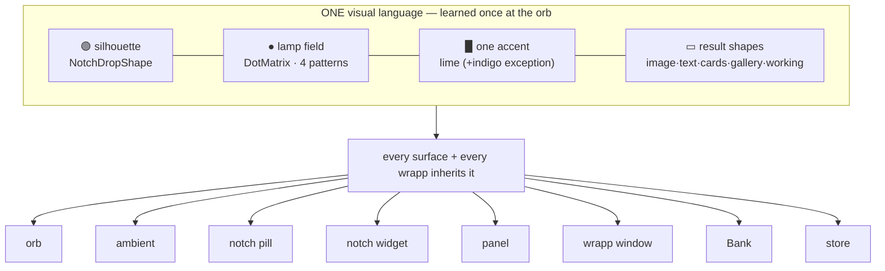
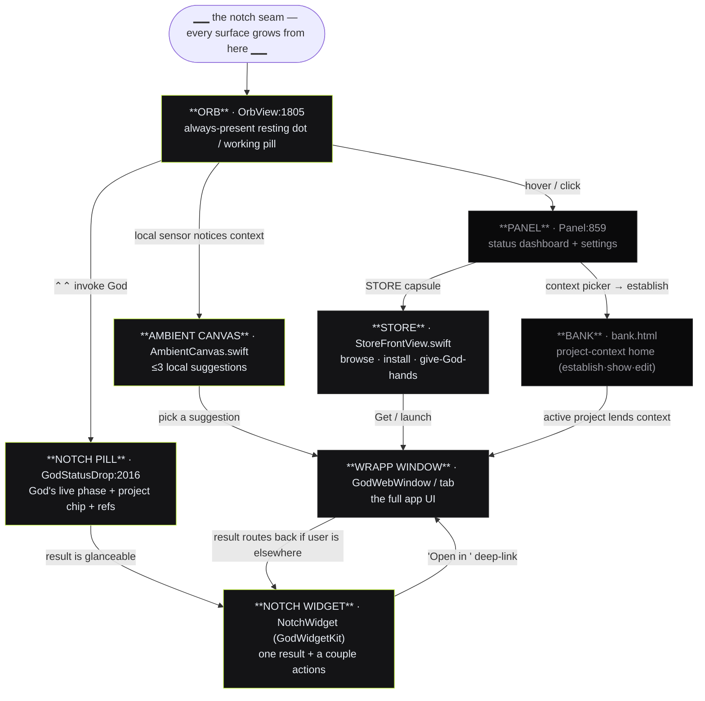
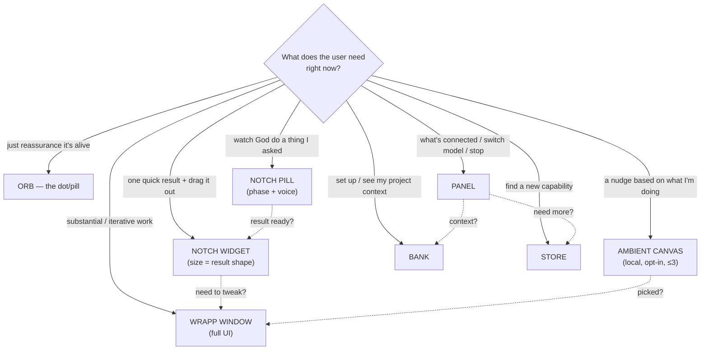
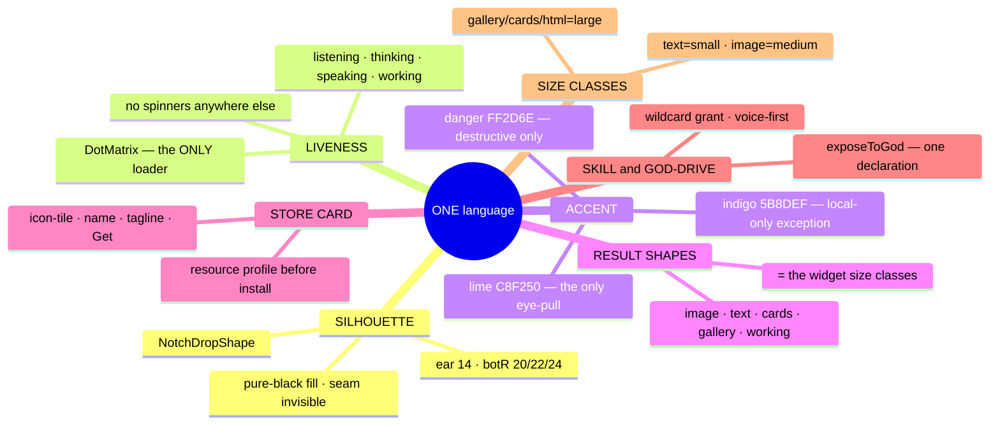
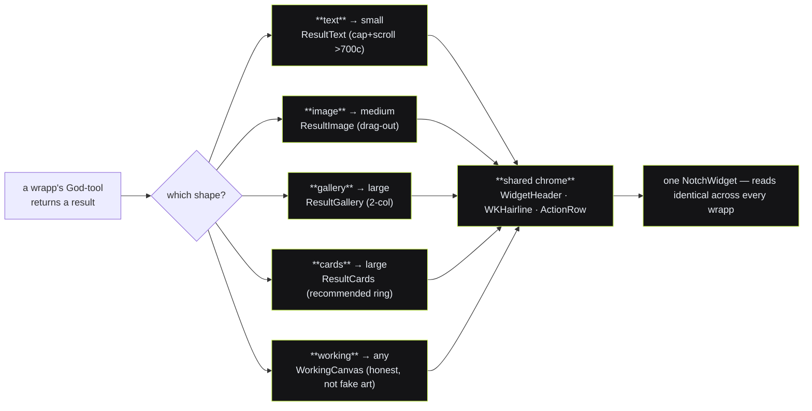
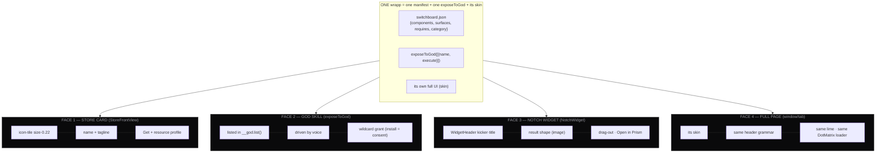
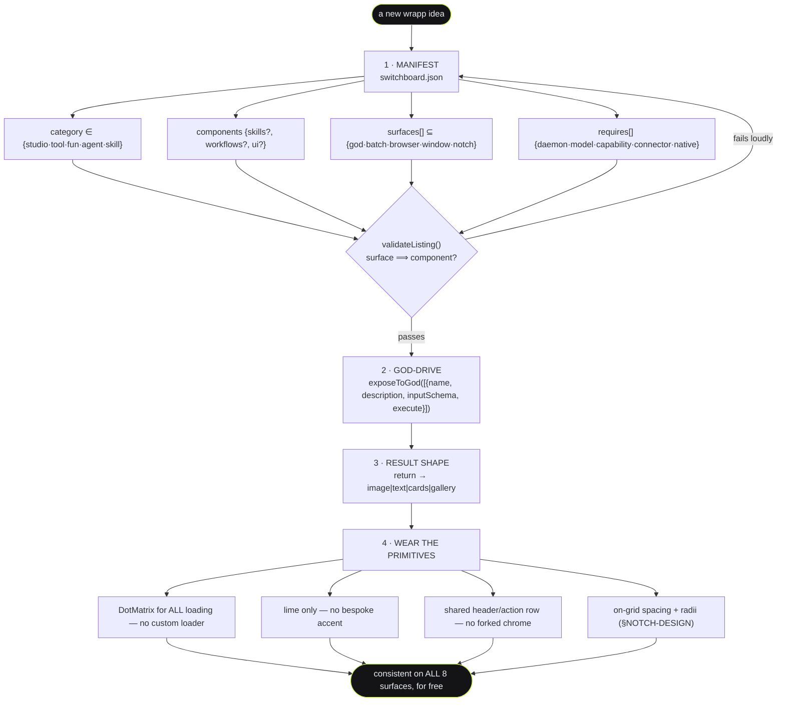
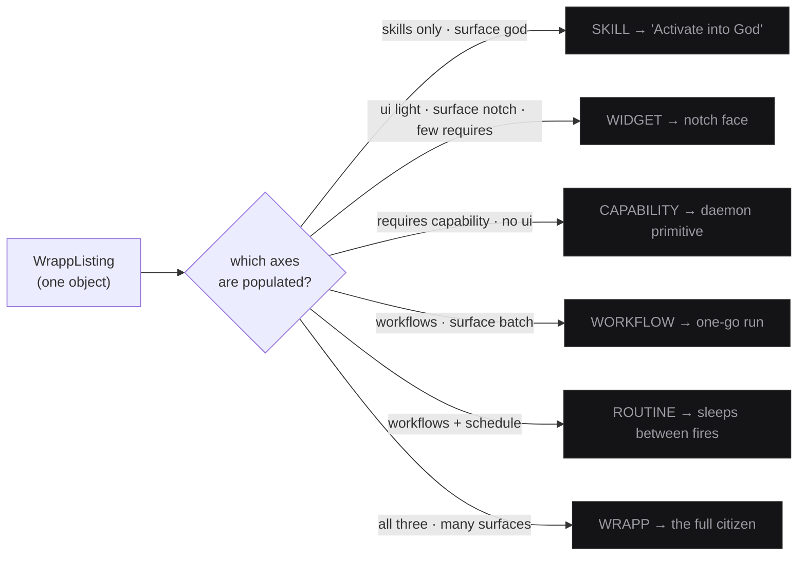
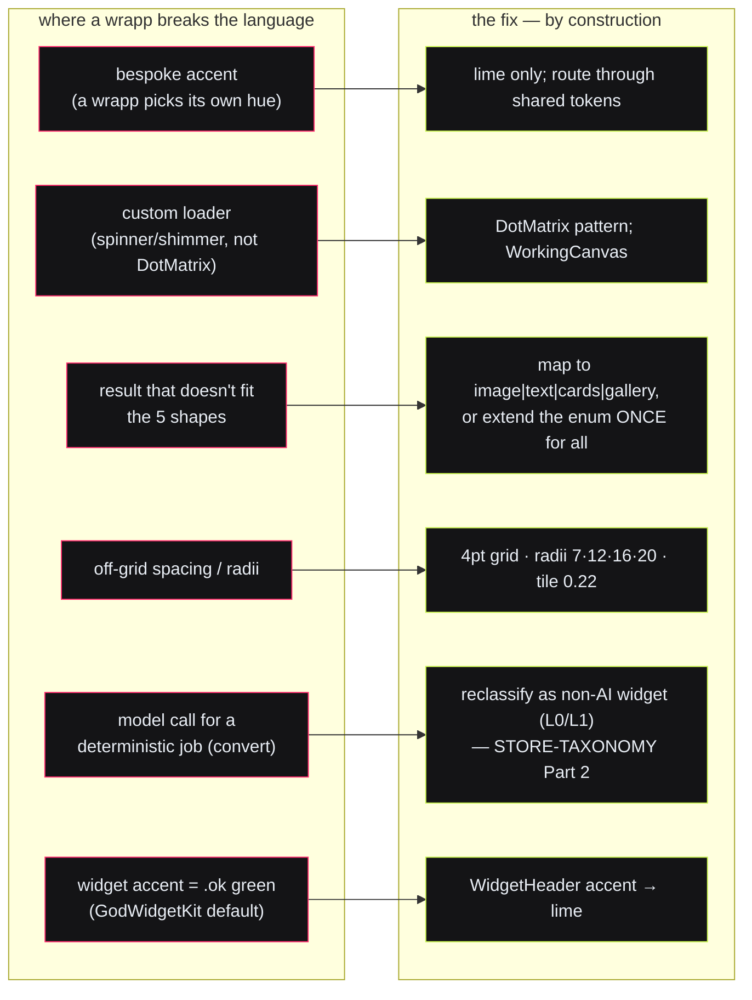

# DESIGN-SYSTEM.md — one language, learned once, across 65+ wrapps and every surface

**Status:** design spine. Written 2026-08-03 as the layer *above* [`NOTCH-DESIGN.md`](./NOTCH-DESIGN.md)
(the token law) and [`PANEL-REDESIGN.md`](./PANEL-REDESIGN.md) (the made result). Those two pin the
*numbers* on the notch surface. This doc answers the two questions the founder actually asked:

> **(a) "What shows where?"** — the information architecture across *all* surfaces.
> **(b) "How does a user learn the language once?"** — the shared primitives that make 65 wrapps feel
> like ONE product, and the contract a new wrapp signs to inherit them by construction.

The diagrams are the content. Prose only names what a picture can't.

Grounded in real code: `packages/menubar/RelayMenuBar.swift` (`NotchDropShape` :1756, `OrbView` :1805,
`DotMatrix` :1931, `GodStatusDrop` :2016, `Panel` :859), `GodWidgetKit.swift` (the widget kit),
`AmbientCanvas.swift`, `StoreFrontView.swift`, `packages/protocol/src/store.ts` (the listing model),
`examples/apps/src/kit/webmcp.js` (`exposeToGod`), and the 66-listing `catalog.json`
(33 skill · 24 tool · 4 agent · 3 studio · 2 fun).

---

## 0. The thesis in one picture

Switchboard is a telephone **operator's switchboard**. Every surface is the same black notch shape
growing from the top-centre seam, lit by the same lamp field (`DotMatrix`), pulled by the same single
lime accent. A user learns *one* grammar at the orb and it holds all the way down to a wrapp's result.



**The rule that makes it work:** a surface never invents chrome. It composes from the shared primitives
(§2). A wrapp never invents chrome either — it fills a result *shape*, declares a *manifest*, and gets
every surface for free (§3). Consistency is **by construction**, not by review.

---

# 1. Surface IA — "what shows where"

## 1.1 The full map (escalation ladder: glance → act → dwell → manage)

Eight surfaces, one anchor (the notch seam). They form a **progressive-disclosure ladder**: each rung
shows *more* and costs *more attention*, and each escalates to the next by a single gesture. Nothing
appears at a random screen position — everything `presentFromNotch` / `dismissToNotch`.



## 1.2 Per-surface contract — one job · belongs · MUST-NOT · when · escalates-to

The **MUST-NOT column is the anti-clutter rule** — the discipline that keeps each surface a *glance*,
not a dumping ground.

| Surface | Its ONE job | What belongs | **MUST-NOT (anti-clutter)** | Appears when | Escalates to |
|---|---|---|---|---|---|
| **Orb** (`OrbView`) | Ambient presence + health at a glance | 3 health-tinted dots (idle) or a breathing "working" pill | No text, no menu, no result. Never more than the dot↔pill morph | Always (resting state of the app) | Panel (hover/click), Pill (⌃⌃) |
| **Ambient canvas** (`AmbientCanvas`) | Offer 1–3 *locally-sensed* next actions | kicker `AMBIENT · <context>` + ≤3 suggestion rows + ✕ | Never >3 rows, never a result, never network/model output. Defers the instant God takes the notch | Local sensor matches an installed wrapp; nothing up | Wrapp window (pick a suggestion) |
| **Notch pill** (`GodStatusDrop`) | Show God's live phase *while it works* | phase label + `DotMatrix` + project chip + ref chips | No result rendering, no walls of text (God narrates by voice). One phase at a time | ⌃⌃ / God turn active | Notch widget (on result), Window ("show the wrapp") |
| **Notch widget** (`NotchWidget`) | Deliver ONE glanceable result + 1–2 actions | header (kicker·title·project) + one result shape + action row (drag-out·copy·open) | Never a second result, never a scroll marathon (cap+scroll), never bespoke chrome | God/wrapp finishes and user is *not* in the window | Wrapp window ("Open in <wrapp>") |
| **Panel** (`Panel`) | The status dashboard + control plane | hero state · context picker · connected apps · models │ tools · daemon controls | Not a settings app; ≤2 columns; resist adding rows — push depth to Store | Hover/click the orb | Store (capsule), Bank (context→establish) |
| **Wrapp window** (`GodWebWindow` / tab) | The full app — dwell + deep work | the wrapp's own full UI (its skin) | Must still wear the shared header/result grammar; can't fork the accent or the loader | "Open in…", a store launch, a picked suggestion | Widget (result drops back if you leave) |
| **Bank** (`bank.html`) | Where a project is *established, shown, edited* | active-project hero + 4 facets · establish front door · tasks · brain · ask | Not a generic file browser; shows only `.md` the user owns; never fabricates a facet (blank = CTA) | Panel context → establish/define; direct open | Wrapp window (lends active context everywhere) |
| **Store** (`StoreFrontView`) | Browse · install · give-God-hands | featured heroes · "Apps we love" · "New skills" · resource profile before Get | Never installs silently; never hides weight/egress (STORE-TAXONOMY R6); centre-modal, not a notch drop | Panel STORE capsule; deep-link | Wrapp window (Get→launch), God (add a hand) |

## 1.3 Decision guide — "for need X, which surface"



**The single load-bearing routing law** (from GOD-HANDS §"drive state machine"): *one drive session, two
surfaces, never both.* The result routes **by where the user IS** — window frontmost → the window shows
it; user elsewhere or window closed → it **drops from the notch as a widget, like a notification.** The
widget and the window are the same result seen from two attention-distances.

```
        ┌──────────────── ONE result, routed by attention ────────────────┐
        │                                                                  │
  user watching the window          user is elsewhere / window closed      │
        │                                        │                         │
        ▼                                        ▼                         │
  window renders it inline            notch WIDGET drops (notification)     │
  (pill flashes "done")               tap → opens the window ──────────────┘
```

---

# 2. The shared primitives every wrapp inherits

These are the atoms. A user learns them once; every wrapp speaks them. **Nothing below is per-wrapp** —
a wrapp *fills* these, never redefines them.

## 2.1 The seven primitives at a glance



## 2.2 The silhouette + the lamp field (the two you *see* first)

```
        THE SILHOUETTE — NotchDropShape (RelayMenuBar.swift:1756)
   ┌───────────────────────────────────────────────────────┐  ← flat top edge (against the black bar, INVISIBLE)
   ╲_ear 14_                                       _ear 14_╱     concave "ears" flare in — reads as the notch growing
     │                                                   │
     │            pure black #000 (Color.page)           │      never tinted — the seam with the menubar must vanish
     │                                                   │
     ╰────────────── botR 20/22/24 ──────────────────────╯      panel=20 · ambient=22 · widget=24 · dot=12

   THE LAMP FIELD — DotMatrix (:1931) — the OPERATOR'S SWITCHBOARD, and the ONLY liveness/loading idiom
   ┌ pattern = f(col, row, time), tinted by the single accent, 4 patterns and NO others ┐
   │  listening · · • ·        thinking  ·•· ▁▂▃        speaking  ~~•~~        working  ▁▂▃▂▁    │
   │  (VU meter)  · • • •       (diagonal sweep)         (scrolling wave)      (left→right ripple) │
   └ reduce-motion → a still legible mid-frame (grid(0)); one live field per surface, max ─────────┘
```

**Liveness law:** the 4 `DotMatrix` patterns are the *entire* loading/liveness vocabulary. No wrapp ships
a spinner, a shimmer, a custom progress bar, or a bespoke "generating…" animation. God's phases are
distinguished by *pattern*, never by hue (kills the old cyan/orange literals). The one tolerated
`ProgressView` (`WorkingCanvas`) is on the migration list to a dot-matrix row.

## 2.3 The palette — one accent, two counted exceptions

```
  MONOCHROME GRAPHITE (structure)                 THE PULLS (meaning only, never decoration)
  page   #000000  notch body                      lime     #C8F250  ← THE accent. the only eye-pull.
  rail   #0A0A0B  recessed plane                   ┌ exceptions, each counted and semantic ┐
  panel  #141416  card / chip fill                 │ localInk #5B8DEF  local-only capture    │
  raised #1E1E21  hover / active                   │ danger   #FF2D6E  destructive / signed-out│
  edge   #282829  THE hairline (only border)       └───────────────────────────────────────┘
  ink    #E8EDF4  primary text (never pure white)  ink-on-lime is ALWAYS .page (#000). one value.
  inkDim #9A9AA2 · inkFaint #6C6C74  secondary      active ring is ALWAYS lime.opacity(0.45). one value.
```

> **The web store shell is the one licensed divergence.** `docs/DESIGN.md` governs the *web* store
> homepage/landing pages with a near-white pill accent (`#EDEDEA`) on a near-black directory — a
> deliberately separate skin, because that surface is a *catalog*, not a notch drop. The **native notch
> surface is always lime.** Category tiles (`FAM`/`catTint`) keep their tint because that colour is
> *content* (like a preview thumbnail), never chrome. Everywhere else on the native surface, a
> `Color(...)` literal is a bug.

## 2.4 The result shapes = the widget size classes (the finite set)

A wrapp result is **not free-form**. It is one of a closed set of shapes, and the shape *is* the widget
size class (iOS-widget grammar). This is what lets 65 wrapps' outputs read as one system.



The Swift enum is the law (`GodWidgetKit.swift:297`):
`WidgetResult = working | image(caption,steer,file) | gallery(caption,items) | cards(caption,items) | text`.
If a result doesn't fit one of these, that's a **design smell to resolve** (§4), not a license to invent
a sixth renderer.

## 2.5 Anatomy of ANY wrapp across surfaces (the same wrapp, four faces)

This is the payoff diagram. Take **one** wrapp (say Prism, the image tool). The user meets it as four
faces — and because all four are composed from §2's primitives, they are unmistakably the *same* wrapp.



```
  SAME WRAPP, FOUR ATTENTION-DISTANCES — the through-line is the shared primitives
  ┌ store card ┐   ┌ God skill ┐    ┌ notch widget ┐        ┌ full page ┐
  │ ▢ Prism    │   │ prism_run │    │ PRISM ● ····  │        │  Prism    │
  │  make an…  │ → │  (voice)  │ →  │ [   image   ] │  ───→   │ full editor│
  │  [ Get ]   │   │  wildcard │    │ drag · Open ▸ │  tweak  │  (its skin)│
  └────────────┘   └───────────┘    └───────────────┘        └───────────┘
     icon-tile        one decl        result-shape             same header,
     + profile        drives UI        + action row            lime, DotMatrix
```

---

# 3. How a NEW wrapp plugs into all of it

A wrapp becomes consistent **by construction** by satisfying one contract. Fill the manifest, expose one
action, pick a result shape, wear the primitives — and every surface in §1 renders it correctly with
zero bespoke UI.

## 3.1 The plug-in flow



## 3.2 The checklist a wrapp signs (correct-by-construction)

```
  ┌ MANIFEST (switchboard.json — the wrapp OWNS its listing) ────────────────────────┐
  │ ☐ id · name · tagline · category ∈ {studio·tool·fun·agent·skill}                  │
  │ ☐ components: at least one of {skills, workflows, ui}                             │
  │ ☐ surfaces[]: each surface has its implied component (god⟹skills, batch⟹workflows,│
  │              browser/window/notch⟹ui)  ← validateListing rejects a lie            │
  │ ☐ requires[]: declare model/capability/connector; mark one-feature needs `lazy`   │
  │ ☐ resource profile: egressTier · needsModel · background (STORE-TAXONOMY R6)       │
  └───────────────────────────────────────────────────────────────────────────────────┘
  ┌ GOD-DRIVE (kit/webmcp.js) ────────────────────────────────────────────────────────┐
  │ ☐ exactly one primary exposeToGod tool (its one-go action), reusing the wrapp's    │
  │   OWN pipeline (drive the real UI, return a JSON-safe result God speaks)           │
  │ ☐ inert without a host — a normal tab is unaffected                                │
  │ ☐ destructive/outward action (send·pay·publish·delete) → still hits ActionConsent  │
  └───────────────────────────────────────────────────────────────────────────────────┘
  ┌ RESULT + PRIMITIVES ──────────────────────────────────────────────────────────────┐
  │ ☐ result maps to ONE of {image·text·cards·gallery} (working = the loading state)   │
  │ ☐ loading is a DotMatrix pattern — never a spinner/shimmer/bespoke bar             │
  │ ☐ zero Color(...) literals; lime is the only accent (indigo only for local-only)   │
  │ ☐ header = WidgetHeader (kicker·title·project chip); actions = ActionRow           │
  │ ☐ the project chip rides the header (context-first — the run is grounded)          │
  │ ☐ spacing on the 4pt grid; radii ∈ {7·12·16·20}; icon-tile corner = size·0.22      │
  └───────────────────────────────────────────────────────────────────────────────────┘
```

## 3.3 One item model, many roles (why adding a type never forks anything)

A "skill", a "widget", a "capability" are **not** new schemas — they're the *same* `WrappListing` with a
different axis populated (STORE-TAXONOMY Part 1). The router never changes.



---

# 4. Gaps — where today's wrapps break the language, and the fix

The bones are shared but execution has drifted. These are the concrete breaks, each with a one-line fix.
(Token-level drift on the *notch surface itself* is catalogued in NOTCH-DESIGN §11; this section is about
**wrapp-level** breaks — where a wrapp violates the one-language contract.)



| # | The break (grounded) | Where | The fix |
|---|---|---|---|
| 1 | **Second accent green.** `WidgetHeader.accent = .ok` (green) is the default on every widget | `GodWidgetKit.swift:26, :319` | Default `accent = .lime`; retire green from widgets (health = lime/danger/faint) |
| 2 | **Cyan/orange phase hues** as un-named literals | `GodGlowView` :1873–1874 | All phases lime; disambiguate by `DotMatrix.Pattern`; delete the literals |
| 3 | **Model call for a deterministic job** — `convert` burns a cloud sonnet call to reshape JSON↔CSV | `examples/apps/src/convert.js` | Reclassify as an **L1 non-AI widget** (`papaparse`+`js-yaml`); badge "no AI · on your device" |
| 4 | **Half-point font drift** inside the kit (`hanken(10.5/11.5/12.5)`, `splMono(8.5)`) | `GodWidgetKit.swift`, `AmbientCanvas.swift` | Snap to the 7-step scale (`display/title/heading/body/label/kicker/mono`) — NOTCH-DESIGN §3 |
| 5 | **Active-ring opacity drift** (0.5 / 0.4 / 0.35) | `:1596`, `:976`, `GodWidgetKit:77` | One token `lime.opacity(0.45)` everywhere |
| 6 | **Three spacing/radius enums** with the same numbers (`WK`, `AmbT`, `M`) | kit + ambient + store | Merge into module-level `SB`/`SBr`; delete `18` and stray radii |
| 7 | **Six button implementations**, one per surface | `GhostButton`, `WKActionButton`, `tabPill`, chip pills, STORE capsule, ConsentDrop | Factor `SBButton(style:)` / `SBChip` / `SBIconTile` / `SBSection` — NOTCH-DESIGN §9 |
| 8 | **Bank produces nothing** — the context home can't establish a project from itself | `bank.js` (extractor is MCP-only) | Land `sb_brand`/`sb_http` + the Establish front door (BANK-MAKEOVER §2.2 / IDEAFETCH) |

**The meta-fix (why #1–#7 keep recurring):** every surface *reinvents its controls* because there is no
factored control kit. Ship the `SB*`/`SBr` tokens and the `SBButton`/`SBChip`/`SBIconTile`/`SBSection`
primitives (NOTCH-DESIGN §9), and a new wrapp UI becomes *composed*, not hand-rolled — the drift becomes
**unspellable**.

---

## Appendix — the surface ↔ primitive matrix (which primitive each surface uses)

```
                    │ silhouette │ DotMatrix │ lime  │ result │ store │ God-  │ size
  surface           │ NotchDrop  │ (loader)  │ accent│ shapes │ card  │ drive │ class
  ──────────────────┼────────────┼───────────┼───────┼────────┼───────┼───────┼──────
  Orb               │     ·      │  ● (dots) │  ●    │   ·    │   ·   │   ·   │  ·
  Ambient canvas    │     ●      │  ○ idle   │  ●    │   ·    │   ·   │   ·   │  ·
  Notch pill        │     ●      │  ● phase  │  ●    │   ·    │   ·   │   ●   │  ·
  Notch widget      │     ●      │  ● working│  ●    │   ●    │   ·   │   ●   │  ●
  Panel             │     ●      │  ● bg/hero│  ●    │   ·    │   ○   │   ·   │  ·
  Wrapp window      │  (header)  │  ● loading│  ●    │   ●    │   ·   │   ●   │  ·
  Bank              │  (web skin)│  ○        │  ●    │  cards │   ·   │   ○   │  ·
  Store             │  modal 20  │  ·        │  ●    │   ·    │   ●   │  give │  ·
  ● uses it · ○ optional/partial · · n/a
```

Every `●` is a place a user re-recognises the same primitive — which is precisely how 65+ wrapps and 8
surfaces collapse into **one product a user learns once.**
