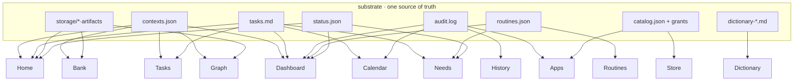

# Switchboard OS — system spec

**Status:** spec (system design) · supersedes the surface-by-surface framing in [`OS.md`](OS.md) ·
grounded in the real code (`packages/menubar/OSShellView.swift`, `OSSurface*.swift`) and the daemon
(`packages/sidekick/src`). Written because the OS grew screen-by-screen and reads as a pile, not a system.

## 0. The one idea — one substrate, many lenses

The OS is **not 13 apps.** It is **one source of truth** — your vault (`.md` files) plus the daemon's
`~/.relay` state — projected through **lenses**. A surface never owns or invents data; it *reads a slice*
of the substrate, optionally *writes back through the one owner of that slice*, and *links* to sibling
lenses by pointing at the same underlying record.

Everything below follows three laws:

1. **One writer per primary.** Each piece of truth has exactly one producer. Lenses read freely; writes go
   through the owner (or a declared, backed-up exception).
2. **Links are derived, never copied.** "A task appears on the calendar" is not duplication — Tasks and
   Calendar read the *same* `tasks.md`. If two surfaces show the same fact, they must read the same file.
3. **Every lens handles every state the same way.** empty · first-run · loading · error — one doctrine
   (§5), so no surface fabricates and none dead-ends.

If a change can't be phrased as "a lens over the substrate," it doesn't belong in the OS.

---

## 1. The substrate (the source of truth)

Every record, its shape, its **single** writer, and who reads it. Paths under `~/.relay/` unless noted.

### Projects & selection
| Record | Shape | Writer | Readers |
|---|---|---|---|
| `contexts.json` | `[{id,name,kind,data{…},source,updatedAt}]` | daemon `ContextLibrary.persist` **and** OS `bankMutateContexts/Create/Rename` (backs up `.os-bak`) ⚠️ **dual-writer** | Home, Bank, Tasks scope, Graph, Dashboard |
| `context-selection.json` | `{"*global*":id, "<origin>":id}` | daemon + OS `writeGlobalContext` (merge, never clobber per-origin) | active-project everywhere |

### Work you commit to
| `tasks.md` (per vault) | `- [ ]/[x] text @wrapp #project due:YYYY-MM-DD` | God **and** OS (`osToggleTask`, `osAppendTask`) | Tasks, Calendar, Needs, Home, Dashboard |

### Things you make
| `storage/<origin>/*.json` | wrapp blobs (`made` vs `working` by self-name) | daemon storage tool + wrapps | Home recent, Bank artifacts, Graph |
| `storage/<origin>/batch-state.json` | `{run:{answers[]}}` | the **batch** wrapp | Workflows (only) |
| vault `note-*.md` | front-matter + body | God + OS `bankCapture` | Bank brain |

### What happened
| `audit.log` | append-only JSONL `{ts,origin,kind,tool,outcome}` — **no prompt text** | daemon `AuditLog` | History, Calendar past-acts, Dashboard, Apps last-active |
| `guide-history.jsonl` | per-run `{title,outcome,passed,total,…}` | guide runtime | History |

### What runs without you
| `routines.json` | `{routines[],globalPaused,updatedAt}` | daemon `routines/registry` | Routines, Dashboard, Needs |
| `routines-control.json` | `{off:bool}` master switch | daemon + OS `routinesSetOff` | Routines, Needs, pending |
| `status.json` | `{connectors[],toolCount,backends[]}` | daemon `index.ts` | Needs, Dashboard, pending badge |
| `guide-suspended.json` | abandoned walkthrough | guide runtime | Needs, pending (resume → `guide-run.json`) |

### Capabilities you have
| `catalog.json` | `{listings:[…~76]}` | built by `build-catalog.mjs` + menubar live-merge (⚠️ **not** the daemon) | Apps, Store, launcher |
| `grants.json` | `[{origin,…}]` standing grants | daemon `GrantStore` | Apps (connected), grant badge |
| `storage-bindings.json` | `{"<origin>":{folder}}` | daemon storage | vault-folder resolution |

### What your words mean / who you are
| vault `dictionary-*.md` | front-matter `term/definition/scope/source` | God / manual (OS routes add → Bank) | Dictionary |
| `profile.json` | `{name,…}` | daemon `setProfile` / Settings | **now** Home greeting (`readUserName`) |

**Substrate anomalies to resolve (this is where "no thought" bites):**
- ⚠️ **`contexts.json` has two writers** (daemon + OS). Safe today only because the OS keeps a one-shot
  `.os-bak`. Invariant to declare: the OS writes contexts **only** through the daemon control channel, or a
  single audited merge path — never a blind overwrite.
- ⚠️ **`catalog.json` is not daemon-owned** — it's a build artifact the menubar merges into. Fine, but it
  means "installed apps" truth is split between `catalog.json` (what exists) and `grants.json` (what's
  connected). The spec treats **catalog = availability, grants = connection**; no surface should conflate them.
- **Identity is under-used** — `profile.json`/`identity.json` exist but only the greeting reads a name now.

---

## 2. The lenses (surfaces) — job · reads · writes · links

Each surface is defined by its **one job** and the slice it projects. The current 13, sharpened so their
jobs don't overlap (overlap is the main "pile" smell — see §4).

| Surface | One job (the *unique* one) | Reads | Writes | Links to |
|---|---|---|---|---|
| **Home** | Ground me in today, in one glance | contexts, recent (storage+audit), pending | selection (switch) | Bank, any app |
| **Bank** | The **model** — establish/edit a project's `.md` truth | contexts, vault `.md`, storage | **contexts, note-*.md** | Apps, Finder |
| **Tasks** | The board of everything I've committed to | all `tasks.md` | **tasks.md** (toggle/add) | wrapp / Bank |
| **Calendar** | The same tasks + activity on a **timeline** | `tasks.md due:`, audit past-acts | *(should: re-date → tasks.md)* | Tasks, wrapp |
| **Needs** | The **action inbox** — everything waiting on *me*, one action each | status, routines, suspended, overdue tasks | control, guide-run, panel | panel, Routines, Tasks, wrapp |
| **Dashboard** | System **health & throughput** (not my to-dos) | contexts, routines, history, status, sessions | — | drill: Bank/Routines/History/Needs |
| **Routines** | Things that run without me — manage/monitor | routines, control | **routines-control** | autopilot wrapp, History |
| **Workflows** | Multi-step **pipelines** (batch recipes) | `batch-state.json` | *(opens batch)* | batch wrapp, History |
| **History** | Every run as a **receipt** — find & reopen | audit, guide-history | — | reopen wrapp, Apps |
| **Graph** | How records **connect** — navigate by relationship | contexts, storage/vault artifacts | — | Bank, Dictionary, Apps |
| **Dictionary** | What my **words** mean | `dictionary-*.md` | *(should: inline add → dictionary-*.md)* | Bank, Graph |
| **Apps** | The tools I **have** — launch/understand | catalog, grants, sessions | — | Store, launch |
| **Store** | Find & add a **new** capability, honestly | catalog | — | native StoreFront, launch |

**Read-only that should write (the natural gap):** Calendar (re-date a task), Dictionary (add a term). These
are the F3b "rich interactions" — the spec's target end-state, deferred from launch but named here so the
lens model is complete.

---

## 3. The link graph (what's linked to what)

Two kinds of edge. **Data edges** = a shared substrate file read by multiple lenses (the real "linkage").
**Nav edges** = a surface hands off to another via `onNavigate`/`OSLaunch`.

**Canonical data edges (must always hold — same file, never copied):**
- `tasks.md due:` → **Calendar** (dated chips) · overdue → **Needs** + **Home** + **Dashboard**
- `tasks.md done` → **History**? *(gap — completing a task is not yet an audit receipt; see §4)*
- `audit.log` → **History** (receipts) + **Calendar** (past-acts) + **Dashboard** (activity) + **Apps** (last-active)
- `storage artifacts` → **Home** recent + **Bank** artifacts + **Graph** orbit
- `contexts.json` → **Home/Bank/Tasks-scope/Graph/Dashboard** (the active project scopes them all)
- `routines.json`/`status.json` → **Routines/Dashboard/Needs**

**Nav edges (hand-offs):** Home→Bank/app · OmniBar→project/app/file/surface/God · Tasks→wrapp|Bank ·
Calendar→wrapp|Tasks · Bank→Apps|Finder · Needs→panel|Routines|Tasks|wrapp · Routines/Workflows→wrapp|History ·
Dashboard tiles→Bank/Routines/History/Needs · History→reopen wrapp · Graph→Bank|Dictionary|Apps ·
Dictionary→Bank|Graph · Apps→Store · Store→StoreFront.

---

## 4. Diagnosis — why it reads as "no thought"

Concrete incoherences, ranked:

1. **Three surfaces answer "what needs me?"** — Home (NeedsStrip), **Needs**, and Dashboard all surface
   pending/overdue/failures. Overlap = no surface feels authoritative.
   → **Fix:** *Needs* is the single authority for "requires my action." *Dashboard* is health/throughput only
   (no to-dos). *Home* shows a **teaser** of Needs (top 1–2) that deep-links into it, never its own logic.
2. **Three surfaces replay activity** — History (receipts), Calendar (past-acts), Dashboard (activity feed).
   Legit as different *shapes* of `audit.log`, but only if framed: History = list, Calendar = timeline,
   Dashboard = counts. Today they feel redundant because none says what it's *for*.
3. **Tasks live in three places** — Tasks (board), Calendar (dated), Bank (per-project). Coherent *only* if
   framed as **one `tasks.md`, three scopes** (all / timeline / this-project). Make the framing explicit in-UI.
4. **Read-only lenses that beg to write** — Calendar can't re-date, Dictionary can't add. A lens that shows
   your data but can't touch it feels inert.
5. **A completed task leaves no trace** — toggling `[x]` rewrites `tasks.md` but writes no `audit.log`
   receipt, so History/Dashboard never reflect "I finished 4 things today." A missing canonical edge.
6. **Dual-writer on `contexts.json`** (§1) — a latent consistency bug, not yet felt.
7. **Graph is thin** — only project+artifact nodes exist; it advertised note/term/run nodes it never drew
   (removed this session). A "relationship" lens with two node types isn't yet a graph.

None of these is a rendering bug — they're **architecture**: unclear ownership, overlap, and missing edges.

---

## 5. States doctrine (systemic, not per-surface)

Every lens, same four states, no exceptions:
- **empty** — honest ("Nothing dated yet — give a task a due date"), never a fabricated sample.
- **first-run** (no substrate at all) — a single **Establish** CTA that routes into Bank; the OS's true
  onboarding root is `Bank → establish a project`.
- **loading** — the one mandated skeleton (`DotMatrix`), shown while a synchronous read runs; never a blank flash.
- **error** — an honest per-facet banner ("couldn't read tasks.md at …"), never a silent drop.

(The fabricated-data violations — fake project, fake dock, faked workflow "done", dead controls — were
removed in the honest-static pass; this doctrine is what keeps them from recurring.)

---

## 6. Proposed information architecture

The current grouping (Workspace / Automate / Knowledge / Do) is **defensible** — keep the four groups, but
sharpen membership so each maps to a substrate domain:

- **WORK** (your record): Home · Bank · Tasks · Calendar — *lenses on projects + tasks*
- **RUN** (autonomy): Needs · Routines · Workflows · Dashboard — *lenses on things that execute*
- **RECALL** (memory): History · Graph · Dictionary — *lenses on the past + relationships + meaning*
- **GET** (capability): Apps · Store — *lenses on the catalog*

**Surface-level moves (proposals, not yet built):**
- **Home** becomes strictly a *composed teaser* of other lenses (recents + a Needs peek + jump-back-in) — it
  owns no unique data, it's the front page.
- **Needs = the one authority** for "requires me"; Dashboard sheds to-dos and is health/throughput only.
- **Make Calendar & Dictionary write-capable** (re-date, inline add) — the deferred F3b work.
- **Emit an `audit.log` receipt on task completion** so RECALL reflects WORK (close edge #5).
- **Single contexts writer** — route OS project mutations through the daemon (close anomaly #6).
- **Grow Graph** to real note/term/run nodes once those are generated (or keep it honest & minimal).

---

## 7. Roadmap (phased)

- **P0 — honesty (DONE this session).** No fakes, real empty/error states, dead controls removed, greeting
  real, Tasks board real. The substrate is trustworthy.
- **P1 — coherence.** Resolve overlap: Home = teaser, Needs = authority, Dashboard = health. Frame the
  three task-scopes and three activity-shapes in-UI. Close the task-completion→audit edge.
- **P2 — write-back.** Calendar re-date, Dictionary inline add, single contexts writer.
- **P3 — depth.** Graph node kinds, richer cross-links, per-day calendar popovers.

Each phase is shippable; P0 is done, P1 is the next coherence pass, and none of it is a rewrite — it's
tightening ownership and edges on the substrate that already exists.
