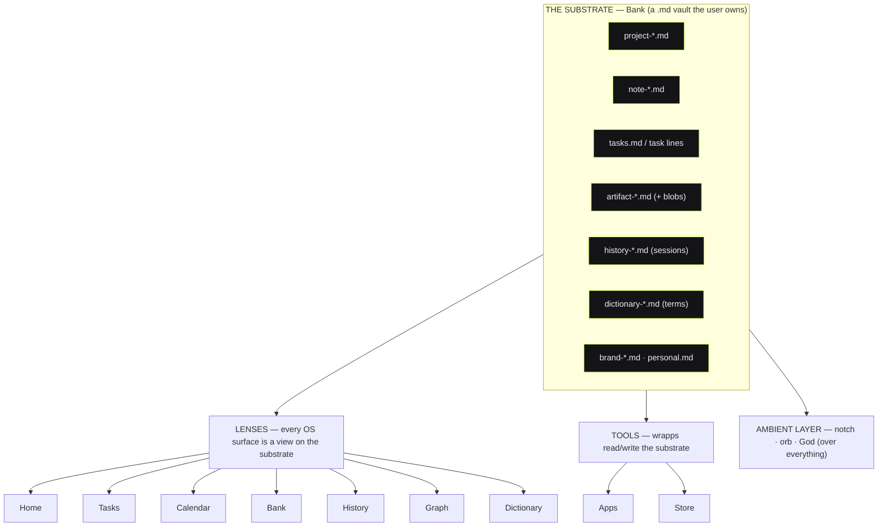
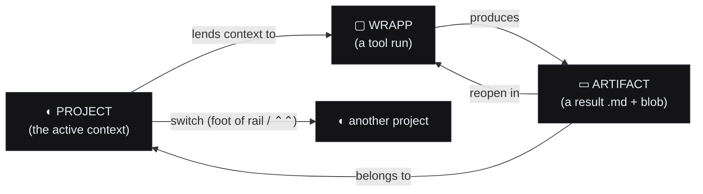

# OS.md — Switchboard OS

**Status:** design spec, decision-grade. Written 2026-08-04. The doc the build works from.
**Sits above:** [`DESIGN-SYSTEM.md`](./DESIGN-SYSTEM.md) (the one visual language across surfaces),
[`NOTCH-DESIGN.md`](./NOTCH-DESIGN.md) (the token law), [`BANK-MAKEOVER.md`](./BANK-MAKEOVER.md) (the
context home), [`CONTEXT-KINDS.md`](./CONTEXT-KINDS.md) (the `.md` field conventions),
[`STORE-TAXONOMY.md`](./STORE-TAXONOMY.md) + [`packages/protocol/src/store.ts`](../packages/protocol/src/store.ts)
(the listing model), [`STATES.md`](./STATES.md) (the readiness ladder), [`GOD.md`](./GOD.md) /
[`AMBIENT.md`](./AMBIENT.md) (the ambient layer).

> **What this doc is.** `DESIGN-SYSTEM.md` answered "what shows where" for the **ambient** surfaces that
> drop from the notch (orb → pill → widget → panel). This doc specs the surface those ambient drops
> *point back to*: the **windowed OS** — the "come back to" home you open when you want to sit down and
> work, not glance. It is the desk; the notch is the tap on the shoulder. This doc enumerates every
> surface of that desk: hierarchy, navigation, layout, all states, interactions, reversibility, and the
> read/write contract each has with the one context substrate.

---

# 1. Thesis + the substrate model

## 1.1 The thesis

**"When I get an idea, I reach for my agent, not the app store."** Switchboard OS is a **personal
operating system**, not a launcher. A launcher is a grid of doors you pick from; an OS is a place your
work *lives*, that you return to, that knows what you're in the middle of.

The load-bearing claim: **the OS is not a set of apps — it is a set of lenses over one substrate.**
Everything the user has — projects, notes, tasks, artifacts, history, dictionary/terms — lives in
**Bank** as `.md` files the user owns. Every OS surface (Home, Tasks, Calendar, History, Graph,
Dictionary) is a **different view on that same substrate**. The apps (wrapps) are **tools that read and
write** that substrate. The notch + God are the **ambient layer** over the whole thing.



**Why this matters for the build:** there is no per-surface database. A surface is a *query + a
renderer* over the vault. Two surfaces showing the same project can never disagree, because they read
the same `.md`. Add a surface = add a lens; never a migration.

## 1.2 The substrate model — Bank is the one source

Bank is the **model**; the other surfaces are **views**. Bank is grounded in the real vault the code
already renders (`bank.js`: `renderProjects`, `renderBoard`, `renderNotes`, `renderShelf`) and the
field conventions in `CONTEXT-KINDS.md`.

| Object | Stored as | Produced by | Read by (lenses) |
|---|---|---|---|
| **Project** | `project-<slug>.md` (front-matter + body) | Bank Establish flow, ideabrain, extractor, a wrapp's `context.publish` | Home (active card), Bank, Graph (node), Calendar (milestones), History (scope) |
| **Task** | line in `tasks.md`, tagged `@<wrapp>` / `#project` | Bank quick-add, a wrapp, God, the connector (`bank_add_task`) | Tasks (board), Home (What's next), Calendar (dated), Bank (project tasks) |
| **Note** | `note-<slug>.md` | Bank capture box (`bankIt`), God, dictation | Bank, Graph, Home (Recent), `⌃⌃` search |
| **Artifact** | `artifact-<id>.md` + blob (image/doc/deck) | any wrapp run (the output of a God tool) | Home (Recent Work), Bank (project facet), Graph, History |
| **History entry** | `history-<id>.md` (a session receipt) | every God/wrapp run appends one | History, Home (Recent), Graph (edges), `⌃⌃` ask |
| **Dictionary term** | `dictionary-<slug>.md` (term + definition + source) | Bank, God ("remember that X means…"), a wrapp | Dictionary, `⌃⌃` (expands acronyms), tooltips everywhere |
| **Brand / personal** | `brand-<slug>.md`, `personal.md` | brandbrain, extractor, panel "Your details" | Bank, any wrapp the user lends it to |

**The read/write contract (the one invariant every lens obeys):**

1. **Read is a query, never a copy.** A lens holds no private store. It reads the vault at open and
   re-reads on a file-change signal. The vault is truth; the view is disposable.
2. **Write is an `.md` mutation, always attributed + reversible.** Every write names its author
   (`by: home` / `by: prism` / `by: god`) and its timestamp, and is journaled (§4.1) so it can be
   undone. No lens deletes bytes; "delete" moves to `.trash/` (§4.1).
3. **The active project is ambient context.** Whatever project is active (§2.3) is lent to every wrapp
   run and grounds every surface header. A run with no active project is allowed but flagged (it writes
   to an `inbox` scope, not a project).
4. **Producers publish a superset, consumers normalize defensively** (`CONTEXT-KINDS.md` rules) — so a
   lens that only understands three fields never corrupts the other twelve.
5. **Nothing leaves the machine without consent.** The vault is local-first (§4.2). A wrapp that needs
   the network declares it (`requires`), and outward/destructive actions hit `ActionConsent` (§4.3).

---

# 2. The shell & global navigation

## 2.1 The shell — a persistent left rail, three groups

The OS window is a single frame: a **fixed left rail** (navigation) + a **content pane** (the active
lens). The rail is the spine; it never scrolls away, never changes contents per surface. Four groups,
in escalation order (where you live → what you know → what runs itself → what you do):

```
┌──────────────┬──────────────────────────────────────────────────────────┐
│  ⌃⌃ omni     │  ← top bar: omni search/ask (full width of content pane)  │
├──────────────┼──────────────────────────────────────────────────────────┤
│ ◐ Switchboard│                                                          │
│              │                                                          │
│ WORKSPACE    │                                                          │
│  ◉ Home      │                    THE ACTIVE LENS                        │
│  ☑ Tasks  ³  │              (Home / Tasks / … content)                   │
│  ▦ Calendar  │                                                          │
│  ▤ Bank      │                                                          │
│              │                                                          │
│ AUTOMATE     │                                                          │
│  ▚ Dashboard │                                                          │
│  ! Needs··· ² │  ← Needs attention carries a live count badge            │
│  ⟳ Routines  │                                                          │
│  ⇉ Workflows │                                                          │
│              │                                                          │
│ KNOWLEDGE    │                                                          │
│  ↻ History   │                                                          │
│  ⬡ Graph     │                                                          │
│  A Dictionary│                                                          │
│              │                                                          │
│ DO           │                                                          │
│  ▢ Apps      │                                                          │
│  ⊞ Store     │                                                          │
│              │                                                          │
│ ───────────  │                                                          │
│  ◐ Project ▾ │  ← active-project switcher (foot of rail)                │
│  ⚙ Settings  │                                                          │
└──────────────┴──────────────────────────────────────────────────────────┘
```

| Group | Items | Why grouped |
|---|---|---|
| **Workspace** | Home · Tasks · Calendar · Bank | Where you *are* and what you're doing now — daily surfaces (**Home stays the landing**) |
| **Automate** | Dashboard · Needs attention · Routines · Workflows | The operational half — status, the action inbox, and the things that run without you |
| **Knowledge** | History · Graph · Dictionary | What the substrate *knows* — retrospective / relational surfaces |
| **Do** | Apps · Store | The tools — run one, get a new one |

**Home vs Dashboard (the one distinction to hold):** Home is *your work* — "come back to what I was
doing." Dashboard is *status & health of everything* — "is it all okay, at a glance." Home leads with
the active project; Dashboard leads with stat tiles across all projects, routines, workflows, and
subsystems. They never merge (§3.10 nails the line). **Needs attention** is the one surface that also
lives *everywhere*: a persistent rail badge (count) and a top-of-Home strip when non-empty.

**Rail spec (design tokens from `NOTCH-DESIGN.md` §2–5):**

| Property | Value |
|---|---|
| Width | 232px (desktop) → 64px icons-only (narrow, §4.6) |
| Fill | `rail` `#0A0A0B` (the one recessed plane) |
| Group kicker | `kicker` (Spline Mono 9.5, +0.14em), `inkFaint` `#6C6C74`, ALL-CAPS |
| Item — rest | `label` (Hanken 11/medium), `inkDim` `#9A9AA2`, 20px glyph |
| Item — hover | fill `raised` `#1E1E21`, ink `#E8EDF4`, radius `sm` (12) |
| Item — **active** | left 2px lime bar + `panel` fill + `ink` text + lime glyph tint |
| Badge / count | `mono` (9), `panel` pill, right-aligned; lime fill only if the count is *actionable* (overdue tasks, ready results), else `edge` neutral |
| Accent | lime `#C8F250` is the only chrome pull (indigo/danger only per their semantics) |

**Active state is exactly one item** (the current lens). Counts/badges are **honest and quiet**: a
number is `edge`-neutral by default and only goes lime when it demands action (e.g. Tasks shows an
overdue count in lime; Apps shows a neutral installed count). Never a red-dot everywhere.

## 2.2 The `⌃⌃` omni — search vs ask, scoped

The top bar is one input with **two modes** sharing one field (mirrors the notch's `⌃⌃` invoke, so the
gesture is learned once). Invoked by `⌃⌃` from anywhere in the OS, or click.

| Mode | Trigger | What it does | Backed by |
|---|---|---|---|
| **Search** (default) | plain text | Instant fuzzy find across the vault: projects, notes, tasks, artifacts, history, terms, apps | vault index (local) |
| **Ask** | prefix `?` or the `Ask` toggle / long text | Routes to God: a natural-language question answered over the substrate, can *act* (run a wrapp) | God (the ambient layer) |

- **Scope chip.** The omni carries a scope chip, default = **active project** (`◐ Acme ▾`). Click to
  widen to **Everything** or narrow to **This surface**. Search and Ask both honor scope — "find the
  logo" inside Acme vs everywhere.
- **Results panel** drops under the bar (not a new page): grouped by object type, each row is a
  deep-link (§2.4). `↑/↓` to move, `↵` to open, `⌘↵` to open in a new pane/window (§4.6 multi-window).
- **Ask** streams God's answer inline with a **provenance footer** ("read: project-acme.md,
  history-0142.md") — the substrate is always cited, never a black box.
- **Empty omni** shows recent searches + 3 suggested asks derived from the active project ("What's
  left on Acme?", "Summarize this week").

## 2.3 The context model — project ↔ wrapp ↔ artifact

Three object types and the moves between them. This is the OS's core noun-graph; every surface is a
projection of it.



- **Active project** is a single global selector at the **foot of the rail** (`◐ Acme ▾`) — the one
  place it's set, so it can never disagree between surfaces. Switching it re-scopes Home, Tasks,
  Calendar, Bank, History, Graph, and the omni default. (`Everything`/no-project is a valid selection;
  §5 edge cases.)
- **Moving between them:**
  - Project → wrapp: run a tool from the Home dock / Apps, or "Open in <wrapp>" from an artifact.
  - Wrapp → artifact: a run produces one; it drops into Recent Work and the project's Bank facet.
  - Artifact → wrapp: "Reopen in <wrapp>" (or "Open in…" if the origin wrapp is gone, §5).
  - Artifact → project: drag an artifact onto a project (Home/Bank) to re-file it.

## 2.4 Deep-linking, back/forward, breadcrumbs

- **Every object has a stable deep-link:** `sb://<surface>/<id>` (e.g. `sb://bank/project-acme`,
  `sb://history/0142`, `sb://apps/prism`). Deep-links are what `⌃⌃` results, notch widgets, and
  cross-surface jumps resolve to — the same address whether opened from the OS, a widget, or a routine.
- **Back/forward** is a per-window navigation stack (`⌘[` / `⌘]`, and swipe). It restores **scroll
  position and selection**, not just the surface. The active-project selector is part of the restored
  state (going back to a Home you left on project Acme restores Acme).
- **Breadcrumbs** appear in the content header only when you're *deeper than a lens root*:
  `Bank › Acme › Artifacts › logo-v3`. The lens root (Home, Tasks…) shows no crumb — it's the top.
  Clicking a crumb navigates; the last crumb is the current object (not a link).

## 2.5 Keyboard map (global)

| Key | Action |
|---|---|
| `⌃⌃` | Focus omni (search) — the universal invoke |
| `⌃⌃` then `?` | Omni in Ask mode |
| `⌘1…⌘9` | Jump to rail item by position (1=Home … in group order) |
| `⌘[` / `⌘]` | Back / forward |
| `⌘K` | Command palette (actions, not objects — "Run Prism", "New note", "Archive project") |
| `⌘N` | New — context-sensitive (new note in Bank, new task in Tasks, new project on Home) |
| `⌘,` | Settings |
| `⌘F` | Find *within* the current surface |
| `⌘Z` / `⇧⌘Z` | Undo / redo (§4.1, journaled — works across surfaces) |
| `Esc` | Close overlay / collapse omni / deselect |
| `Space` | Quick-look the selected object (peek without navigating) |
| `⌘\` | Toggle rail collapse (icons-only) |

Focus order is always **rail → omni → content**; `Tab` traverses within the content pane's logical
reading order (§4.5 accessibility).

---

# 3. Per-surface spec

Each surface below follows the same schema: **One job · Belongs / Must-not · Section layout & hierarchy
· All states · Interactions · Reversibility · Bank read/write.**

---

## 3.1 Home — the "come back to" surface

**One job:** *Ground me in what I'm working on and get me back into it in one glance.* Home is the
canonical landing (the mock the build follows).

**Belongs:** the active-project card, Recent Work, the app dock, What's next.
**Must NOT:** be a dashboard of vanity metrics; show every project at once (that's Bank); host a settings
grid; contain more than the four blocks below. Home is a *runway*, not a control tower.

### Section layout & hierarchy (top → bottom)

```
┌─ CONTENT PANE (Home) ───────────────────────────────────────────────┐
│  ◦ kicker: TODAY · Tuesday Aug 4                          ◐ Acme ▾   │  ← greeting + active project (mirrors foot-of-rail)
│                                                                     │
│  ┌─────────────── ACTIVE PROJECT CARD (the hero) ──────────────┐    │  ① leads. spans full width.
│  │ ◐ Acme            "athleisure brand, launching Q4"          │    │     project glyph · name · essence line
│  │ ▓▓▓▓▓▓▓░░░  62%    4 open tasks · 12 artifacts · brand set   │    │     progress + facet counts (from Bank)
│  │ [ Continue → ]  [ Ask about Acme ]        Open in Bank ▸     │    │     primary CTA = resume last thing
│  └──────────────────────────────────────────────────────────────┘    │
│                                                                     │
│  RECENT WORK                                              See all ▸  │  ② grid of artifact cards
│  ┌────────┐ ┌────────┐ ┌────────┐ ┌────────┐                        │     4-up desktop → 2-up → 1-up
│  │ ▭ img  │ │ ▤ doc  │ │ ▦ deck │ │ ↻ chat │  …                     │     each: thumb · title · wrapp · time
│  └────────┘ └────────┘ └────────┘ └────────┘                        │
│                                                                     │
│  APPS                                                     All apps ▸ │  ③ the vibrant isometric dock
│  ╱▢╲ ╱▢╲ ╱▢╲ ╱▢╲ ╱▢╲ ╱▢╲   ← one hue each, classic isometric tiles │     6–8 pinned + frequent
│  Prism Bank Redline Cast Brand …                                    │
│                                                                     │
│  WHAT'S NEXT                                                         │  ④ 3–5 next actions (task+suggest)
│  ☐ Finalize Q4 palette            @brandbrain   · due Fri  →         │     from tasks.md + God suggestions
│  ☐ Reply to 3 launch emails       @email        · today   →         │
│  ✦ Draft the launch deck?         suggested                →         │
└─────────────────────────────────────────────────────────────────────┘
```

**Hierarchy rule — "discipline in the frame, color in the icons."** The four blocks are monochrome
graphite (`panel` cards, `edge` hairlines, `ink`/`inkDim` text). The **only vibrant color on Home is in
the app dock icons** (one hue per app, classic isometric) and artifact thumbnails (content, like a
preview). Chrome accents stay lime (CTAs, active) + indigo (local-only), per the palette law.

- **① Active-project card** leads because context-first is the OS's whole thesis. It reads directly from
  `project-<active>.md`: essence line, a computed progress bar (done/total tasks or roadmap milestones),
  and facet counts. Primary CTA is **Continue** = re-open the last artifact/wrapp touched on this project
  (from History). Secondary = **Ask about Acme** (omni, scoped). Corner link → the project in Bank.
- **② Recent Work** is the cross-wrapp artifact stream for the active project (or Everything if no
  project), newest first, capped at ~8 with `See all ▸` → Bank Artifacts facet. Each card: thumbnail
  (result-shape aware — image/text/deck/chat), title, origin wrapp chip, relative time.
- **③ App dock** — the vibrant isometric row. Shows pinned apps + frequency-ranked recents (6–8). Each
  tile is an `SBIconTile` at the fixed `size*0.22` corner, per-app hue. Lazy-rendered (§4.4). `All apps ▸`
  → Apps surface.
- **④ What's next** — 3–5 rows: the top open tasks for the active project (from `tasks.md`) **plus** up
  to 2 God-suggested next actions (marked `✦ suggested`, visually distinct, never mixed in as if they
  were user tasks). Each row → opens the task / runs the suggestion.

### All states

| State | Home behavior |
|---|---|
| **First-run / no projects** | Card block becomes a single **Establish CTA**: "Point Switchboard at what you're working on" → Bank Establish flow. Recent Work + What's next hidden. App dock shows a **starter set** (Bank, Prism, Store) so it's never a dead grid. One clear next step, never a blank screen. |
| **Project with zero artifacts** | Active card renders (essence + tasks) but Recent Work shows an inline empty tile: "Nothing made yet — run an app to fill this." with a shortcut to the dock. |
| **Loading** | Card + grid render as `DotMatrix` skeleton rows (the one loader; never a spinner). Because reads are local, this is sub-100ms in the common case; skeleton only shows past ~150ms. |
| **Partial** (vault reachable, one facet slow) | Render what's ready; the slow block (e.g. a large artifact index) shows its own skeleton, rest is live. Never block the whole surface on one facet. |
| **Populated** | The full mock above. |
| **Error** (vault read fails) | A single inline banner card: "Can't read your Bank" + the exact reason + **Retry** + **Open Bank folder**. Never a toast that vanishes; never a stack trace. |
| **Offline** | Fully functional — Home is a local read. A quiet `◦ offline` chip in the header; wrapp tiles that need network show a dimmed cloud badge (still openable, they resolve the need on run). |
| **Permission-needed** | If the active project lends context a wrapp needs but hasn't been granted, the What's-next suggestion row shows an inline "grant to run" affordance, resolved via the readiness ladder (`STATES.md`), not a modal wall. |
| **Too-much-data** | Recent Work is capped (~8) + `See all ▸`; the dock is capped (~8) + `All apps ▸`. Home never paginates in place — depth lives in Bank/Apps. |

### Interactions

| Interaction | Result |
|---|---|
| Click artifact card | Open it (Quick-look on `Space`; full open on click) |
| Click app tile | Launch the wrapp with the active project lent as context |
| Hover app tile | Lift + reveal name + a one-line "last used / what it does" |
| **Drag** artifact card → project selector | Re-file the artifact to another project |
| **Drag** a file from Finder → Home | "Add to Acme" drop target appears → files into Bank as an artifact/note |
| Right-click artifact | Context menu: Open · Open in <wrapp> · Rename · Move to project ▸ · Copy link · Archive |
| Click a What's-next task | Toggle done inline (checkbox) or open it |
| `⌃⌃` | Omni, scoped to the active project |
| `⌘N` | New note filed to the active project |

### Reversibility

- Toggling a task, re-filing an artifact, archiving from the context menu are all **journaled** →
  `⌘Z` undoes. Archive moves to `.trash/`, never hard-deletes.
- No destructive action on Home is one-click-permanent; "Archive project" (from the card menu) asks a
  typed-confirm guard (§4.1) because it hides a whole context.

### Bank read/write

Reads: `project-<active>.md` (card), `artifact-*.md` where `project == active` (Recent Work),
`tasks.md` filtered to active + `#next` (What's next), the app registry (`catalog.json` + install
state) for the dock. Writes: task toggles → `tasks.md`; re-file → an artifact's `project:` front-matter;
Finder drop → new `artifact-*.md` / `note-*.md`. Home authors little; it mostly *routes*.

---

## 3.2 Tasks — the doing surface

**One job:** *See and move everything I've committed to, across every project and wrapp, in one board.*
Tasks is the lens on `tasks.md` (the open-ClickUp-in-Bank model).

**Belongs:** task rows, grouping/filtering, quick-add, the board columns.
**Must NOT:** become a full PM app with custom fields/gantt/automations; invent statuses beyond the vault
convention; hide the fact that a task is just a line in a file.

### Section layout & hierarchy

```
┌─ Tasks ─────────────────────────────────────────────────────────────┐
│  ◦ TASKS · Acme            [ Board | List ]   Group: Status ▾  + Add │  ← view toggle · grouping · quick-add
│  ────────────────────────────────────────────────────────────────── │
│  TODO (4)          DOING (2)         BLOCKED (1)      DONE (12) ▾     │  ← columns = status (Board)
│  ┌──────────────┐  ┌──────────────┐  ┌────────────┐   (collapsed)    │
│  │ ☐ Q4 palette │  │ ☐ Launch deck│  │ ☐ Legal ok │                  │
│  │ @brandbrain  │  │ @prism       │  │ #acme      │                  │
│  │ due Fri  ◐   │  │ today   ◐    │  │            │                  │
│  └──────────────┘  └──────────────┘  └────────────┘                  │
│  ┌──────────────┐                                                    │
│  │ ☐ Reply email│   ← each card: title · @wrapp · #project · due     │
│  └──────────────┘                                                    │
└─────────────────────────────────────────────────────────────────────┘
```

- **Header row leads:** view toggle (Board / List), grouping selector (Status / Project / Wrapp / Due),
  quick-add (`+ Add` or type at top). Scope defaults to the active project; a scope chip widens to All.
- **Board** = columns by the grouping key (default Status: Todo · Doing · Blocked · Done). Done is
  collapsed by default. **List** = a dense, sortable table for triage.
- **Card anatomy:** checkbox, title, `@wrapp` tag (which tool owns it), `#project`, due chip
  (lime if overdue, else neutral), and a small project glyph when scope = All.

### All states

| State | Behavior |
|---|---|
| **First-run / no tasks** | Empty board with one CTA card per column-zero: "Nothing here yet. Add a task, or let God capture them." + a `+ Add`. Never an empty grid with no verb. |
| **Loading** | `DotMatrix` skeleton cards in each column. |
| **Partial** | Columns stream in; a slow project's tasks show a per-group skeleton. |
| **Populated** | The board above. |
| **Error** (tasks.md unreadable/malformed) | Banner: "Your tasks file couldn't be parsed" + **Open tasks.md** + **Retry**. Never silently drop lines — show the raw file. |
| **Offline** | Full function (local file). Channel-synced tasks show a dimmed "sync paused" chip. |
| **Permission-needed** | A task tagged `@wrapp` whose wrapp needs a grant shows an inline resolve chip on open, not on the card. |
| **Too-much-data** | List view virtualizes (§4.4); Board columns cap visible cards (~50) with "show N more"; `⌘F`/omni filter. Done column stays collapsed + counted. |

### Interactions

| Interaction | Result |
|---|---|
| Click checkbox | Toggle done (journaled) |
| Click card | Expand inline (notes, subtasks, links) — not a modal |
| Double-click title | Inline edit |
| **Drag** card between columns | Change status (rewrites the line's status token) |
| **Drag** card onto rail project selector | Re-assign `#project` |
| Multi-select (`⇧`/`⌘` click) | Bulk: set status · assign project · archive |
| Right-click | Open in <wrapp> · Set due · Move to project ▸ · Duplicate · Archive |
| `+ Add` / type-at-top | Quick-add; `@`/`#`/`due:` inline tokens autocomplete |
| `⌃⌃` | Search/ask across tasks |

### Reversibility

Every status change, edit, archive is journaled → `⌘Z`. Bulk actions undo as one step. Archive → a
`done`/`.trash` partition, recoverable. No hard delete from Tasks.

### Bank read/write

Sole lens on `tasks.md`. Reads/writes task lines in place (status token, `@`, `#`, `due:`), preserving
surrounding lines/comments (line-oriented edit, never a rewrite of the whole file). Expanding a task may
link to `note-*.md` / `artifact-*.md`.

### Grounding — what's real today (native build)

- **Source** = every `tasks.md` across the real vaults: bound folders (`storage-bindings.json`) ∪
  context `data.folder`s. Line dialect: `- [ ] text @wrapp #project due:YYYY-MM-DD`; `- [x]` = done.
  The dialect has exactly two statuses (todo/done) — the board doesn't invent Doing/Blocked columns;
  richness comes from **Group: Status / Project / Due** (Due = Overdue · Due · No date).
- **Scope** = the active project (its vault folder or `#slug` tag); the chip lifts to All projects.
  A scope that matches nothing falls open to All, honestly labeled.
- **Writes**: checkbox toggle rewrites ONLY that line's checkbox token (exact-line match; if the file
  changed underneath, it refuses rather than blind-writes). Quick-add appends a line (creates the file
  with a `# Tasks` header on first use), into the scoped project's vault.
- **States**: no tasks anywhere → CTA card with a working quick-add (or the bind-a-folder truth);
  unreadable `tasks.md` → per-file banner with **Open tasks.md**; Done lives in a collapsed count
  column → expands in List view.
- Verified by a headless logic test (parse dialect ✓, append ✓, line-precise toggle ✓, round-trip
  restores the exact file ✓, stale-handle refuses to write ✓).

---

## 3.3 Calendar — the time lens

**One job:** *Put my tasks, milestones, and history onto a timeline so I can see the shape of my week.*
Calendar is a **temporal projection** of the substrate — it invents no data of its own.

**Belongs:** dated tasks, project milestones/roadmap dates, past runs (history), scheduled routines.
**Must NOT:** become a general calendar client (no external event CRUD unless a connector lends it); hold
events that don't exist in the vault; be the place tasks are *created* (that's Tasks) beyond a quick-add.

### Section layout & hierarchy

```
┌─ Calendar ──────────────────────────────────────────────────────────┐
│  ◦ AUGUST 2026 · Acme        [ Month | Week | Agenda ]   ‹ Today ›   │
│  ────────────────────────────────────────────────────────────────── │
│  Mon    Tue    Wed    Thu    Fri    Sat    Sun                       │
│  ┌────┐┌────┐┌────┐┌────┐┌────┐┌────┐┌────┐                          │
│  │    ││ ●2 ││    ││    ││■mil││    ││    │   ● due tasks             │
│  │    ││    ││    ││    ││    ││    ││    │   ■ milestone             │
│  └────┘└────┘└────┘└────┘└────┘└────┘└────┘   ↻ past run (dim)        │
│  … a left "timeline rail" in Week/Agenda lists items chronologically │
└─────────────────────────────────────────────────────────────────────┘
```

- **Header:** month/period, view toggle (Month · Week · Agenda), Today jump, prev/next. Scope = active
  project (chip widens to All).
- **Content:** a grid (Month) or a chronological rail (Week/Agenda). Each cell shows compact chips:
  **due tasks** (●, lime if overdue), **milestones** from a project's roadmap (■), **past runs** from
  History (↻, dimmed — the past is context, not action), **scheduled routines** (⟳, faint) if any.
- **Agenda** is the narrow-width default (§4.6): a single scrollable list of dated items.

### All states

| State | Behavior |
|---|---|
| **First-run / nothing dated** | Month grid renders with today marked; a gentle inline hint: "Give a task a due date and it shows up here." Not empty-scary — the grid itself is the content. |
| **Loading** | Grid frame renders instantly; chips fill with a `DotMatrix` pass. |
| **Partial** | Dates from the fast facets (tasks) show first; history/roadmap fill after. |
| **Populated** | The grid with chips. |
| **Error** | Inline banner on the affected facet only (e.g. "couldn't read roadmap dates"); the rest of the calendar stays live. |
| **Offline** | Full (all vault-derived). A connector-backed external calendar, if ever added, shows "not syncing" — vault items unaffected. |
| **Too-much-data** (a dense day) | Cell shows "N items" → click expands a day popover (list); Agenda view virtualizes. |

### Interactions

| Interaction | Result |
|---|---|
| Click a day | Day popover: all items that day |
| Click a task chip | Open/toggle the task (writes back to `tasks.md`) |
| **Drag** a task chip to another day | Change its `due:` date |
| Click a milestone | Open the project's roadmap in Bank |
| Click a past-run chip | Open that History entry |
| `+` on a day | Quick-add a task due that day |
| `⌃⌃` | "What's due next week?" (ask, scoped) |

### Reversibility

Re-dating a task (drag) and quick-add are journaled → `⌘Z`. Calendar never deletes; removing a due
date is an edit, undoable.

### Bank read/write

Reads: `due:` on `tasks.md` lines, roadmap/milestone dates in `project-*.md`, timestamps in
`history-*.md`, routine schedules. Writes: only `due:` on task lines and quick-add task creation.
Everything else is read-only projection.

---

## 3.4 Bank — the substrate home

**One job:** *Where a project is established, shown, browsed, and edited — the model behind every other
lens.* (Grounds on `BANK-MAKEOVER.md`.) Bank is the one surface that shows the vault *as itself*.

**Belongs:** the Establish front door, the active-project hero + its facets (Overview · Tasks · Brain ·
Artifacts), capture, the project list.
**Must NOT:** be a generic file browser (it shows `.md` the user owns, structured by kind — never a raw
filesystem tree); fabricate a facet (a blank facet is a CTA, never invented content); expose vault
internals (`.trash`, journals) as first-class.

### Section layout & hierarchy

```
┌─ Bank ──────────────────────────────────────────────────────────────┐
│  ◦ BANK        [ + Establish a project ]        ⌕ search the vault   │  ← establish front door leads when relevant
│  ────────────────────────────────────────────────────────────────── │
│  PROJECTS                                                            │  ← switch/overview strip
│  ◐ Acme (active)   ○ Nailinit   ○ Idea: pocket-tts   + New           │
│  ────────────────────────────────────────────────────────────────── │
│  ┌── ◐ Acme ───────────────────── "athleisure, launching Q4" ──────┐ │  ← active-project hero
│  │  [ Overview ] [ Tasks ] [ Brain ] [ Artifacts ]                  │ │     facet tabs
│  │  ─────────────────────────────────────────────────────────────  │ │
│  │  OVERVIEW: essence · audience · goals · brand set · roadmap      │ │     each facet = a lens on the .md
│  │  (Tasks = the project's slice of tasks.md;                       │ │
│  │   Brain = notes + dictionary terms for this project;             │ │
│  │   Artifacts = every result, grouped by wrapp/date)               │ │
│  └──────────────────────────────────────────────────────────────────┘ │
│  ────────────────────────────────────────────────────────────────── │
│  CAPTURE  ▸ drop a file, paste a note, or "Bank it"                  │  ← the capture box (authoring)
└─────────────────────────────────────────────────────────────────────┘
```

- **Establish front door leads** when the active project is thin/absent (the makeover's core fix): a
  prominent "Establish a project" that runs the daemon-side extractor (`sb_brand`/`sb_http`) + the
  define-your-project flow. When a rich project is active, it demotes to a header button.
- **Projects strip:** the active project + others + `New`. This is the *overview* of projects (Home
  shows only the active one; Bank shows the set).
- **Active-project hero with facet tabs** — the heart. Four facets, each a lens on the project's `.md`:
  - **Overview** — essence, audience, goals, brand set, roadmap (the front-matter + body of
    `project-*.md`).
  - **Tasks** — this project's slice of `tasks.md` (same data as the Tasks surface, project-scoped).
  - **Brain** — notes + dictionary terms tied to the project (the "second brain").
  - **Artifacts** — every result for the project, grouped by wrapp/date (the full set Home teases).
- **Capture box** — the always-present authoring affordance (drop file · paste · "Bank it").

### All states

| State | Behavior |
|---|---|
| **First-run / empty vault** | The whole surface is the **Establish** flow — one path in: point at a site / describe the project / import a repo. This is the OS's true onboarding root. Never an empty shelf. |
| **Project with a thin profile** | Hero renders what exists; empty facets show a facet-specific CTA ("No brand yet — extract one", "No artifacts — run an app"). A blank facet is always a verb. |
| **Loading** | Hero frame + `DotMatrix` facet skeletons. |
| **Partial** | Overview (small `.md`) renders first; Artifacts (large index) streams/virtualizes. |
| **Populated** | The full hero + facets. |
| **Error** | Per-facet banner (Overview vs Artifacts fail independently) with **Open the folder** + **Retry**. The Establish extractor failing shows its own honest error (CORS/daemon-down) with the fix, per `BANK-MAKEOVER §1`. |
| **Offline** | Full for viewing/editing local `.md`. **Establish-by-URL is disabled with a reason** ("extraction needs the daemon + network") — honest, not a silent degrade to a hallucinated brand. |
| **Permission-needed** | Establish needs `sb_http`/`sb_brand`; if ungranted, the front door resolves the need first (ladder), then runs. |
| **Too-much-data (huge Bank)** | Projects strip scrolls/searches; Artifacts facet virtualizes + filters by wrapp/date/type; Brain paginates notes. The vault index powers instant `⌕`. |

### Interactions

| Interaction | Result |
|---|---|
| Click a project | Make it active (updates the whole OS) |
| Click a facet tab | Switch lens within the hero |
| **Drag a file → capture / hero** | File it as an artifact/note on the project (the canonical "drop a file into Bank") |
| **Drag an artifact → a project** in the strip | Re-file across projects |
| Inline-edit any Overview field | Edit the `.md` front-matter directly (autosave, §4.1) |
| Right-click a project | Rename · Set active · Duplicate · Export · Archive |
| Right-click an artifact | Open · Open in <wrapp> · Move · Copy link · Archive |
| "Bank it" / paste | Capture a note (with source URL if pasted from web) |
| `⌃⌃` / `⌕` | Search the vault (Bank is where full vault search lives) |

### Reversibility

- **Autosave + versioning:** every `.md` edit autosaves and appends a version snapshot; a per-file
  history lets you roll back a field or the whole file. (This is Bank's special obligation — it's the
  editor of the source.)
- Archive project / artifact → `.trash/`, recoverable; **hard delete is a typed-confirm guard** and is
  the *only* place true deletion is offered, deliberately buried (§4.1).
- Establish is non-destructive: it creates/enriches a `project-*.md`, never overwrites blindly — a
  re-extract shows a diff before applying.

### Bank read/write

Bank is the **read/write root** for `project-*.md`, `note-*.md`, `dictionary-*.md`, `brand-*.md`, the
project slice of `tasks.md`, and `artifact-*.md` metadata. It's the only surface allowed to *create
projects* and *establish* context. Other surfaces write narrow slices; Bank writes the whole model.

### Grounding — what's real today (native build)

The native surface reads only real state, no samples:

- **Projects** = `~/.relay/contexts.json` (recency-sorted); active = `context-selection.json` `*global*`.
- **Vault folder** = the context's `data.folder`, else the `storage-bindings.json` folder of its source
  origin. Shown in the hero (or the honest "no folder bound" line).
- **Overview** = the context's real `data` fields (products/positioning/audience/voice/palette,
  idea/problem/market/…, oneLine/summary/repo, decisions). Empty fields don't render; an empty Overview
  is an Establish CTA.
- **Tasks** = `tasks.md` checkbox lines in the vault folder (`- [ ] text @wrapp #project`); quick-add
  appends a line (creates the file on first use). No folder → honest bind CTA.
- **Brain** = `note-*/dictionary-*/project-*/brand-*.md` in the vault folder, newest first; row click
  opens the file. Empty → "Bank it" CTA.
- **Artifacts** = real blobs from `~/.relay/storage/<origin>/` AND the bound folder itself (a bound
  origin's storage IS its folder).
- **Writes**: capture ("Bank it") = clipboard → `note-<ts>.md` (falls back to `~/.relay/bank/<id>/` when
  nothing is bound); New/Rename mutate `contexts.json` (atomic write; one-shot `.os-bak` guard).

---

## 3.5 History — the retrospective lens

**One job:** *Let me find and reopen anything I did — every God/wrapp run as a receipt.* History is the
lens on `history-*.md` (session receipts), the timeline of *acts*.

**Belongs:** a reverse-chronological feed of runs, each with input · wrapp · result · project · time,
and a reopen path.
**Must NOT:** be a raw log console; store secrets/tokens; duplicate the artifact store (it *links* to
artifacts, it isn't them); grow unbounded in the UI (virtualize).

### Section layout & hierarchy

```
┌─ History ───────────────────────────────────────────────────────────┐
│  ◦ HISTORY · Acme        Filter: [ wrapp ▾ ] [ date ▾ ] [ ⌕ ]        │
│  ────────────────────────────────────────────────────────────────── │
│  TODAY                                                               │
│  ↻ 14:22  Prism · "make a launch hero"  → ▭ image      Reopen ▸      │  ← each row = one run receipt
│  ↻ 11:05  Redline · "audit the deck"    → ▤ notes      Reopen ▸      │
│  YESTERDAY                                                           │
│  ↻ 18:40  God · "summarize the week"    → ▭ text       Reopen ▸      │
│  … (virtualized, grouped by day)                                    │
└─────────────────────────────────────────────────────────────────────┘
```

- **Header:** filters (by wrapp, date range, result type) + search. Scope = active project (widen to
  All).
- **Feed:** day-grouped, newest first. Each row: the input prompt, the wrapp/God chip, the result-shape
  glyph, project, timestamp, and **Reopen** (re-run in the wrapp with the same context, or open the
  produced artifact).

### All states

| State | Behavior |
|---|---|
| **First-run / no history** | Empty state: "Your runs will show up here. Run an app to start." + a dock shortcut. |
| **Loading / Partial** | `DotMatrix` skeleton rows; days stream in. |
| **Populated** | The feed. |
| **Error** | Banner if the history index is unreadable; individual malformed receipts render as a "couldn't parse this run" row rather than breaking the feed. |
| **Offline** | Full (local receipts). |
| **Permission-needed** | Reopening a run whose wrapp now needs a grant resolves it via the ladder on click. |
| **Too-much-data** | Virtualized list (§4.4); filters + search; "jump to date". Old receipts can be *rolled up* (a monthly summary receipt) but never auto-deleted without consent. |

### Interactions

| Interaction | Result |
|---|---|
| Click a row | Expand the receipt (full input, params, result preview, provenance) |
| Click **Reopen** | Re-open the produced artifact, or re-run in the wrapp with the same lent context |
| Right-click | Reopen · Open artifact · Copy prompt · Copy link · Pin · Delete receipt (guarded) |
| Multi-select | Bulk pin / export / delete (guarded) |
| Click the wrapp chip | Filter to that wrapp |
| `⌃⌃` ask | "When did I last make a logo?" answered over history |

### Reversibility

History is mostly append-only (receipts are facts). Deleting a receipt is guarded and journaled →
recoverable from `.trash`. Pinning/unpinning is trivially reversible.

### Bank read/write

Reads `history-*.md`. Writes only: pin flags, roll-up summaries, and (guarded) moves to `.trash`. Every
other surface *appends* to history on a run; History itself is a near-read-only lens.

### Grounding — what's real today (native build)

- **Receipts** come from the two real trails: `~/.relay/audit.log` (every broker act: ts · origin ·
  method · outcome) and `guide-history.jsonl` (guided runs with title + steps passed). The audit log
  logs **no prompt text** — rows show the ACT ("Ran the model", "Dictated ×2", "Saved work"), honestly,
  instead of a fabricated prompt.
- Consecutive same-act events within 10 min merge into one receipt (×N) so a busy wrapp reads as work,
  not spam. Denied acts are receipts too — the consent story stays visible.
- Day-grouped (Today/Yesterday/real dates), last 14 days; footer states that older receipts stay in
  the log untouched. Filters: wrapp · date · search. No fake project scope — acts carry no project tag
  in the log (a future daemon change could add one).
- **Reopen** launches that wrapp via the real OSLaunch seam. Expanded receipt = act · method ·
  outcome/result · provenance (which trail file).
- **States**: empty trail → verb CTA ("Run an app to start"); filters-match-nothing row; read-only lens
  (no deletes anywhere).

---

## 3.6 Graph — the relational lens

**One job:** *Show how everything connects — projects, notes, artifacts, terms, runs — so I can navigate
by relationship, not just by list.* The Obsidian-style knowledge graph over the vault's links.

**Belongs:** nodes (every `.md` object) + edges (links, project membership, produced-by, mentions), with
navigation and filtering.
**Must NOT:** be a decorative hairball; render thousands of nodes at once (cluster/focus); be the primary
way to *do* work (it's for finding/understanding, then jumping).

### Section layout & hierarchy

```
┌─ Graph ─────────────────────────────────────────────────────────────┐
│  ◦ GRAPH · Acme      Show: [✓ projects ✓ notes ✓ artifacts □ terms]  │
│  ────────────────────────────────────────────────┬───────────────── │
│                                                   │  INSPECTOR       │
│        ○───────◉ Acme ───────○                    │  ◐ Acme          │
│       ╱    ╲    │      ╲       ╲                   │  project         │
│   ▭ logo   ▤ note   ↻ run   ○ term                │  12 links        │
│         (force-directed, focus = active project)  │  [ Open in Bank ]│
│                                                   │                  │
│  ─────────────────────────────────────────────────┴───────────────── │
│  ⊙ zoom  ⊹ fit  ◐ focus active   (a11y: List view toggle ▸)          │
└─────────────────────────────────────────────────────────────────────┘
```

- **Canvas** — force-directed graph, **focused on the active project by default** (its neighborhood,
  not the whole vault). Node glyph/color by type (artifacts vibrant per result-shape; chrome
  monochrome). Edge = link/membership/produced-by.
- **Filter bar** — toggle node types; a depth/hops control.
- **Inspector** (right) — the selected node's summary + a jump ("Open in Bank / the wrapp / History").
- **List-view toggle** — the same relationships as an accessible nested list (§4.5 — a graph must have a
  non-visual equivalent).

### All states

| State | Behavior |
|---|---|
| **First-run / < 2 nodes** | "Not much to connect yet." with the active node shown alone + a hint to add notes/run apps. Not an empty void. |
| **Loading** | Nodes fade in from center (`DotMatrix`-tinted); layout settles with reduced motion honored (§4.5). |
| **Partial** | Core nodes first; distant neighbors stream in. |
| **Populated** | The focused graph. |
| **Error** | If link parsing fails, fall back to the List view with a banner. |
| **Offline** | Full (local). |
| **Too-much-data (huge graph)** | **Never render all.** Cluster distant nodes into "N more" super-nodes; default to 1–2 hops from focus; a "expand" gesture loads more on demand; search jumps to a node. |

### Interactions

| Interaction | Result |
|---|---|
| Click node | Select → Inspector; center on it |
| Double-click node | Open the object (Bank/wrapp/History) |
| Drag node | Reposition (layout pins it; positions can persist per project) |
| Hover edge | Show the relationship type |
| Scroll / pinch | Zoom; drag canvas to pan |
| Filter toggles | Add/remove node types |
| `⌃⌃` | Jump to a node by name |

### Reversibility

Graph is a **read/derive** surface — it mutates layout (pinned positions), not content. Deleting from
the Inspector delegates to the owning surface's guarded delete. Layout changes are trivially reset
("Reset layout").

### Bank read/write

Reads the whole vault's link structure (front-matter refs, `[[wikilinks]]`, produced-by, project
membership). Writes only optional layout hints (a `.graph` sidecar), never content.

---

## 3.7 Dictionary — the terms lens

**One job:** *Hold what my words mean — the project/company vocabulary — so every surface and every wrapp
speaks my language.* The lens on `dictionary-*.md`.

**Belongs:** terms + definitions + source/scope, searchable, editable; used to expand acronyms and gloss
jargon across the OS.
**Must NOT:** be a generic notes app; hold long-form content (that's notes); be siloed — its terms feed
tooltips and God everywhere.

### Section layout & hierarchy

```
┌─ Dictionary ────────────────────────────────────────────────────────┐
│  ◦ DICTIONARY · Acme        ⌕ find a term            + Add term       │
│  ────────────────────────────────────────────────────────────────── │
│  A                                                                  │
│   ▸ ARPU      "average revenue per user"     scope: global   ↻ src   │  ← term · definition · scope · source
│  B                                                                  │
│   ▸ Bank      "the .md vault the user owns"  scope: Switchboard      │
│  … alphabetical, section-jump index on the right (A–Z rail)          │
└─────────────────────────────────────────────────────────────────────┘
```

- **Header:** search + Add term. Scope chip: **global** terms vs **project-specific** terms (a project
  can override a global meaning).
- **List:** alphabetical, A–Z jump rail, each row: term · definition · scope · source (where it was
  learned — a run, a doc, manual).

### All states

| State | Behavior |
|---|---|
| **First-run / empty** | "Teach Switchboard your words." + Add term + a hint that God can capture them ("remember that X means…"). |
| **Loading / Partial** | Skeleton rows. |
| **Populated** | The alphabetical list. |
| **Error** | Banner + Open the file; malformed entries render as raw + "fix this line". |
| **Offline** | Full (local). |
| **Too-much-data** | A–Z jump + search + virtualization; scope filter to narrow. |

### Interactions

| Interaction | Result |
|---|---|
| Click a term | Expand (full definition, source, usages — where it appears in the vault) |
| Double-click definition | Inline edit (autosave) |
| Add term | Inline row at top; `term : definition` |
| Right-click | Edit · Set scope · Merge duplicates · Copy · Archive |
| Hover a term *anywhere in the OS* | The dictionary gloss tooltip (this is the payoff — terms are ambient) |
| `⌃⌃` | Search terms; Ask uses them to disambiguate |

### Reversibility

Edits autosave + version; archive → `.trash`. Merge-duplicates is a single journaled step, undoable.

### Bank read/write

Reads/writes `dictionary-*.md`. Feeds (read-only) into tooltips across every surface and into God's
context (so answers use the user's vocabulary).

---

## 3.8 Apps — the installed tools

**One job:** *Launch, manage, and understand the tools I have.* The lens on the install state of the
`catalog.json` listings (`WrappListing`).

**Belongs:** the installed wrapps (the vibrant isometric grid), each with launch + manage, grouped by
category; the God-hands (which apps God can drive).
**Must NOT:** be the Store (that's discovery/install — a separate door, §6); hide a wrapp's requirements
or weight; auto-run anything.

### Section layout & hierarchy

```
┌─ Apps ──────────────────────────────────────────────────────────────┐
│  ◦ APPS         Filter: [ All | Studios | Tools | Fun | Agents ]  ⌕  │
│  ────────────────────────────────────────────────────────────────── │
│  PINNED                                                              │
│  ╱▢╲ ╱▢╲ ╱▢╲   ← the same isometric tiles as the Home dock          │
│  Prism Bank Redline                                                  │
│  ────────────────────────────────────────────────────────────────── │
│  ALL APPS (24)                                                       │
│  ╱▢╲ ╱▢╲ ╱▢╲ ╱▢╲ ╱▢╲ ╱▢╲ …   one hue each, classic isometric        │
│  each tile: icon · name · category · "God can drive" dot            │
│  ────────────────────────────────────────────────────────────────── │
│  [ + Get more apps in the Store ▸ ]                                  │  ← the one door to the Store
└─────────────────────────────────────────────────────────────────────┘
```

- **Header:** category filter + search.
- **Pinned** row (drives the Home dock order), then **All apps** grid, vibrant isometric tiles (one hue
  per app — the color-in-the-icons rule).
- Each tile shows a **"God can drive" indicator** (whether it exposes a hand / skill) and its category.
- Footer: the single entrance to the **Store**.

### All states

| State | Behavior |
|---|---|
| **First-run / only defaults** | The starter set (Bank, Prism, Store) + a prominent "Explore the Store" — the grid is never empty. |
| **Loading** | Tile skeletons (lazy-rendered, §4.4). |
| **Populated** | The grid. |
| **Error** | A wrapp with a broken manifest renders as a dimmed tile with "needs attention" → detail explains (validateListing errors). One bad app never breaks the grid. |
| **Offline** | Installed local/web wrapps openable; those needing network show a dimmed cloud badge; the Store footer notes "reconnect to browse". |
| **Permission-needed** | Launching resolves the wrapp's `requires` via the ladder (`resolveRequirements`) — the honest "Resolve N & Run", never a dead "Run". |
| **Too-much-data** | Category filter + search + virtualized grid. |

### Interactions

| Interaction | Result |
|---|---|
| Click tile | Launch (active project lent as context) |
| Hover tile | Name + tagline + last-used |
| Right-click | Open · Pin/unpin · Give God this hand / revoke · Requirements ▸ · Uninstall (guarded) |
| Drag tile | Reorder pinned (drives Home dock) |

### Grounding — what's real today (native build)

- **Catalog** = `~/.relay/catalog.json` (`listings[]`: id/name/tagline/category/requires/tools). The
  real categories are studio · tool · **skill** (the biggest shelf) · agent · fun.
- **Connected shelf** replaces the invented "Pinned": wrapps whose origin holds a standing grant in
  `grants.json` (grant origin → wrapp id, same resolution as storage origins). Indigo dot = connected.
- **Lime dot** = active today (latest audit-log session < 24h) — not a fake "live" flag.
- **Hover tip** = tagline · N tools God can drive (`tools[]`) · N needs (`requires[]`) · last active.
- **States**: missing/unreadable catalog → honest banner (daemon rebuilds it); a listing missing
  id/name renders dimmed, never dropped; search cuts across name/id/tagline.
- Not built yet (needs new state or daemon work): pin/reorder persistence, per-tile uninstall,
  God-hand grant/revoke from the tile.
| Click "God can drive" dot | Toggle the God-hand grant (consent) |
| `⌃⌃` | Find/launch an app by name |

### Reversibility

Pin/unpin, reorder, give/revoke God-hand — all instantly reversible. Uninstall is guarded and
**never touches the wrapp's artifacts** (they remain in Bank, §5) — uninstalling a tool is not deleting
your work. A re-install re-links them.

### Bank read/write

Reads the catalog + install/grant state (not strictly `.md` — the app registry). Writes: pins, order,
God-hand grants. Launching a wrapp is what *writes artifacts* into Bank (indirectly).

---

## 3.9 Store — the discovery door

**One job:** *Find and add a new capability, honestly.* The store surface (grounds on `store.ts`,
`STORE-TAXONOMY.md`, `StoreFrontView`).

**Belongs:** featured heroes, curated shelves ("Apps we love", "New skills"), category browse, and a
listing detail with the **resource profile before Get**.
**Must NOT:** install silently; hide weight/egress/model needs; be blended into Apps (discovery is a
distinct mode — you're *shopping*, not *working*); slow the device (`device-lightness` doctrine).

### Section layout & hierarchy

```
┌─ Store ─────────────────────────────────────────────────────────────┐
│  ◦ STORE         [ Skills | Tools | Studios | Fun | Agents ]     ⌕   │
│  ────────────────────────────────────────────────────────────────── │
│  ┌──────────── FEATURED (hero) ────────────┐                        │  ← one big hero
│  │  ▢ Brandbrain — "your brand, extracted" │  [ View ]              │
│  └──────────────────────────────────────────┘                        │
│  APPS WE LOVE                                             See all ▸  │  ← curated shelf (horizontal)
│  ┌────┐┌────┐┌────┐┌────┐                                           │
│  NEW SKILLS                                              See all ▸  │
│  ┌────┐┌────┐┌────┐┌────┐                                           │
│  ────────────────────────────────────────────────────────────────── │
│  DETAIL (on select) → icon · name · what's inside · RESOURCE PROFILE │  ← weight · egress · needsModel
│                       [ Get ]  ·  requirements resolved honestly     │     primaryAction() from store.ts
└─────────────────────────────────────────────────────────────────────┘
```

- **Header:** category tabs (the taxonomy) + search.
- **Featured hero**, then **curated shelves** (horizontal scroll), then **detail** on select.
- **Detail** shows: icon, name, `inside[]` (what's in it), author, and the **resource profile** —
  egress tier · needs a model · runs in background · download size — *before* Get (STORE-TAXONOMY R6).
  The primary button is the honest, surface-aware `primaryAction()` ("Activate into God" / "Get {name}"
  / "Resolve N & Run" / "Open").

### All states

| State | Behavior |
|---|---|
| **First-run** | Full featured + shelves (the store is content-rich by default). A "Start here" hero funnels to Brandbrain/Establish. |
| **Loading** | Shelf skeletons. |
| **Populated** | Heroes + shelves. |
| **Error** (catalog fetch fails) | Banner + Retry; cached catalog shown if present ("showing your last-seen store"). |
| **Offline** | The store is inherently network discovery — show cached listings read-only with a clear "reconnect to install"; never pretend to install. |
| **Permission / weight** | Get always shows the resource profile + resolves `requires` via the ladder before install; a heavy/background wrapp is badged and sized (never a surprise). |
| **Too-much-data** | Category tabs + search + "See all" per shelf + virtualized results. |

### Interactions

| Interaction | Result |
|---|---|
| Click a card | Open detail (in-surface panel, not a nav away) |
| Get | Resolve requirements → install → (offer) launch; add to Apps |
| Give God a hand | Install as a God-drivable skill (wildcard grant = consent, per GOD-HANDS) |
| Hover | Tagline + resource glance |
| `⌃⌃` | Search the store |

### Reversibility

Install is reversible = uninstall (from Apps, guarded, artifacts preserved). Granting God a hand is
revocable. No purchase/irreversible action here without explicit consent (and financial actions are out
of scope for auto-execution entirely).

### Bank read/write

Store writes to the **app registry** (install/grant state), not the vault directly. It never writes
`.md`. (Installing a wrapp later *enables* vault writes when the wrapp runs.)

### Grounding — what's real today (native build)

The OS Store surface is the **door**, not a rebuild — the real store is `StoreFrontView` (featured
page + shelves + detail + resource profile), opened via the `OSStoreDoor` seam → `showStore()`.
On the door itself, everything comes from the live catalog: the count pill, category chips with real
counts (Browse all · Studios · Tools · Skills · Agents · Fun), the founder-curated **Start here**
hero (brandbrain, real tagline), **Skills you haven't connected** (skill listings minus granted
origins), and **Studios**. Every chip launches the real wrapp; missing catalog → honest daemon
banner. Under the SnapshotOS harness (no host) the door degrades to in-OS navigation, never a dead
end.

---

> **§3.10–3.13 — the Automate group.** The four surfaces below are the operational half of the OS. They
> are lenses on **two** substrates at once: the **`~/.relay` control-plane** (`routines/<id>.json`, run
> logs, the `sb_routines` clock + gated step executor, autopilot state, the daemon/connector health the
> menubar already derives) **and** Bank (the projects/tasks/artifacts those automations read and write).
> Routine and workflow **failures feed Needs attention**; Dashboard **surfaces** all of their status.
> Same completeness discipline as every surface above.

---

## 3.10 Dashboard — the operational overview

**One job:** *Tell me the status and health of everything, at a glance — is it all okay?* Dashboard is
the mission-control lens across all projects, routines, workflows, and subsystems. **Explicitly not
Home:** Home is your work to resume; Dashboard is the state of the machine.

**Belongs:** scannable **stat tiles** + sparklines for project status, routines (running/next-fire),
recent workflow runs (pass/fail), token/usage vs budget, a recent-activity feed, and connectors/daemon
health.
**Must NOT:** be a wall of text or a metric soup; duplicate Home's active-project runway; hold anything
that isn't a *drill-in* to a real surface. Every tile is a door, not a dead number. (The founder's note:
"dashboarding not done well" — so the rule is **stat tiles + sparklines, never paragraphs**.)

### Section layout & hierarchy

```
┌─ Dashboard ─────────────────────────────────────────────────────────┐
│  ◦ DASHBOARD · everything            period: [ Today | 7d | 30d ]     │
│  ────────────────────────────────────────────────────────────────── │
│  ┌ STAT TILES (scannable row — each drills in) ───────────────────┐  │  ① the glance layer
│  │ ┌──────────┐ ┌──────────┐ ┌──────────┐ ┌──────────┐            │  │
│  │ │ PROJECTS │ │ ROUTINES │ │ WORKFLOWS│ │  USAGE   │            │  │
│  │ │    4     │ │ 3 active │ │ 12 runs  │ │ 4.2M/8M  │            │  │
│  │ │ 1 stalled│ │ next 2pm │ │ ✓10 ✗2   │ │ ▁▂▃▅▂▁ tok│            │  │
│  │ └────→Bank ┘ └→Routines ┘ └→Workflows┘ └→Settings ┘            │  │  tile = big number + spark + drill
│  └──────────────────────────────────────────────────────────────────┘  │
│  ┌ ROUTINES — running / next fire ──────┐ ┌ RECENT RUNS (pass/fail) ─┐  │  ② two columns
│  │ ⟳ Daily brief    next 08:00  ✓       │ │ ✓ CopyFlow    14:02      │  │
│  │ ⟳ Email triage   running…    ●       │ │ ✗ Sheet sync  11:40 retry│  │
│  │ ⟳ Weekly deck    paused              │ │ ✓ Autopilot   09:15      │  │
│  └───────────────────────── → Routines ─┘ └──────────── → Workflows ─┘  │
│  ┌ SUBSYSTEM HEALTH ────────────────────┐ ┌ ACTIVITY FEED ───────────┐  │  ③ health + stream
│  │ ● daemon  ● cloud model  ● 3 connect │ │ ↻ 14:22 Prism image made │  │
│  │ ◐ 1 connector needs reconnect  →fix  │ │ ⟳ 08:00 brief delivered  │  │
│  └──────────────────────────────────────┘ └───────────── → History ──┘  │
└─────────────────────────────────────────────────────────────────────┘
```

- **① Stat tiles lead** — the glance layer. Each tile: a mono kicker (label), one **big number**
  (`display`), a one-line delta/sparkline, and a drill-in target. Tiles: **Projects** (count · N
  stalled), **Routines** (N active · next fire), **Workflows** (N runs · ✓/✗ split), **Usage**
  (tokens vs budget + a token sparkline, from TOKENS.md), and **Needs attention** (the count — the one
  tile that turns lime→danger when non-zero). Sparklines use the mono/`inkDim` palette; a failing metric
  tints its number `danger`.
- **② Two columns:** *Routines — running/next-fire* (live status) and *Recent workflow runs* (pass/fail
  with inline retry on a fail). Each drills to its surface.
- **③ Subsystem health** (daemon · model class · connectors — the health the menubar already derives)
  and the *Activity feed* (the cross-surface stream of runs/deliveries → History).
- **Scope** defaults to **everything** (Dashboard is the cross-project overview); a chip can narrow to
  the active project.

### All states

| State | Behavior |
|---|---|
| **First-run / nothing to show** | Tiles render with zeros and a verb, not blanks: "No routines yet — automate something" (→ Routines/CopyFlow), "No runs yet". The frame teaches what will live here. Never an empty grid. |
| **A metric still computing** | That tile shows a `DotMatrix` micro-pass in place of the number ("computing…"), the rest stay live. Never block the board on one slow metric. |
| **Loading** | Tile-frame skeletons; numbers fill as each facet resolves (local first: projects/routines; usage may lag). |
| **Partial** | Fast tiles (projects, routines from `~/.relay`) render; usage/history stream in. |
| **Populated** | The board above. |
| **A failing subsystem (red tile)** | The affected tile goes `danger` with the one-line reason + a **Fix** drill (daemon down → relaunch; connector expired → reconnect; over budget → Settings). A red tile always names the action, and the same item appears in **Needs attention**. |
| **Error** (control-plane unreadable) | Per-tile banner ("couldn't read routines") + Retry; other tiles unaffected. |
| **Offline** | Vault/control-plane tiles fully live (local); usage-against-cloud-budget and connector health show "can't reach — last known" honestly. |
| **Too-much-data** | Columns cap (~5 rows) + "see all" to the owning surface; the board is fixed-height by design (it's a glance, not a scroll). |

### Interactions

| Interaction | Result |
|---|---|
| Click any tile / column header | Drill into the owning surface (Bank / Routines / Workflows / Settings / History) |
| Click a failing/red tile's **Fix** | Jump to the resolve path (or Needs attention) |
| Click a routine row | Open that routine (§3.12) |
| Click a run row | Open the run log (§3.13) |
| Retry (on a ✗ run) | Re-run the workflow/routine (also available in Needs attention) |
| Hover a sparkline | Point tooltip (value at time) |
| Change period | Re-scope the sparklines/counts (Today / 7d / 30d) |
| `⌃⌃` ask | "How's everything doing?" → a spoken/typed roll-up over the same data |

### Reversibility

Dashboard is a **read/monitor** surface — it *shows*, it doesn't mutate content. The one action it
offers (Retry a run) is itself reversible/idempotent-guarded and journaled through the owning surface.
Changing the period is trivially reversible. No destructive action lives here.

### Bank + control-plane read/write

Reads: `~/.relay/routines/*.json` + run logs (routines/workflows status), the `sb_routines` clock
(next-fire), TOKENS usage receipts, connector/daemon health (menubar-derived), and Bank (`project-*.md`
for stalled-project status, `history-*.md` for the feed). Writes: nothing to the vault; a Retry is a
delegated control-plane action, not a Dashboard write.

---

## 3.11 Needs attention — the action inbox

**One job:** *Show me everything waiting on ME, and give me the one action for each.* This is the OS's
**action inbox** — the single place the human's decisions/approvals/fixes collect so nothing falls
through. It is a **surface**, a **persistent rail badge (count)**, *and* a **top-of-Home strip** when
non-empty.

**Belongs:** anything blocked on the user — pending consent/approval prompts, **failed routine/workflow
runs** (with retry), stalled/overdue tasks, decisions awaiting a pick, review-needed artifacts,
permission-revoked/needs-regrant, and a broken/hidden wrapp an artifact depends on.
**Must NOT:** become a notification firehose (only *actionable* items, never FYI noise — FYI belongs in
the Dashboard activity feed); hold items the OS could resolve itself; keep an item after it's handled.

### Section layout & hierarchy

```
┌─ Needs attention ───────────────────────────────────────────────────┐
│  ◦ NEEDS ATTENTION · 5 items          Group: Type ▾   [ Clear read ] │
│  ────────────────────────────────────────────────────────────────── │
│  ▲ BLOCKING (act to continue)                                        │  ① priority band — blocking first
│  ⚠ Approve: CopyFlow wants to send 3 emails   why…   [Approve][Deny] │
│  ⚠ Regrant: Prism lost its model access       why…   [Grant] [Later] │
│  ● FAILED (retry or investigate)                                     │  ② failures (fed by Routines/Workflows)
│  ✗ Routine "Sheet sync" failed 11:40          log…   [Retry][Pause]  │
│  ✗ Workflow "Launch deck" failed at step 3    log…   [Retry][Edit]   │
│  ○ WAITING (your call, not blocking)                                 │  ③ decisions / reviews / overdue
│  ◆ Decide: pick a launch date (a/b/c)                [Decide]        │
│  ☐ Overdue: Q4 palette (2 days)                      [Open][Snooze]  │
│  ▭ Review: 4 drafts from batch                       [Review]        │
└─────────────────────────────────────────────────────────────────────┘
```

- **Priority bands, blocking first:** ▲ **Blocking** (something is paused until you act — consents,
  regrants) → ● **Failed** (retry/investigate — the failures Routines & Workflows push here) → ○
  **Waiting** (decisions, reviews, overdue tasks — your call, not blocking).
- **Every item is: what · why (expandable) · the one primary action** (+ a secondary). Approve · Retry ·
  Decide · Grant · Review · Open · Snooze · Dismiss. The item's *source* chip deep-links to where it
  came from (the routine, the task, the artifact).
- **Grouping** toggles Type / Project / Source. **Count** is the rail badge; **top-of-Home strip**
  mirrors the top 1–3 blocking items when the inbox is non-empty.

### All states

| State | Behavior |
|---|---|
| **Empty (the good state)** | "You're clear — nothing needs you." A calm, affirmative empty state (not a sad-blank). The rail badge disappears; the Home strip is hidden. This is the state the OS *wants* you in. |
| **A few items** | The banded list above. |
| **A flood** | Group + prioritize: collapse by source ("Sheet sync — 6 failures → Retry all / Pause"), surface only the top blocking items expanded, bulk actions per group. Never an unscannable stack; the inbox self-summarizes. |
| **Loading** | `DotMatrix` skeleton rows; blocking band resolves first. |
| **Partial** | Consents (live, from the daemon) show first; derived items (overdue tasks) fill in. |
| **Error** | If a source can't be read, a single "couldn't load some items" row + Retry; known items still actionable. |
| **Offline** | Local-derived items (overdue tasks, failed local runs, decisions) fully actionable; items needing network to resolve (a regrant of a cloud connector) show "resolve when reconnected". |
| **Permission-needed** | Regrant/consent items ARE the content here — resolved inline via the ladder (`resolveRequirements`), never a separate modal. |

### Interactions

| Interaction | Result |
|---|---|
| Click primary action | Resolve in place (Approve/Retry/Grant/Decide…) — the item leaves the inbox on success |
| Click "why…" | Expand the full context (what asked, what it will do, the blast radius) |

### Grounding — what's real today (native build)

Every item derives from a real `~/.relay` state, and every primary action is real:

- ▲ **Blocking**: down connectors from `status.json` (`ok:false`) → **Open panel** (writes the
  `~/.relay/open-panel` trigger; the menu-bar app fronts the real panel). A `status.json` older than
  2h → the stale-daemon item.
- ● **Failed**: routines whose record carries `lastOutcome: error/failed` or a `lastError` (renders
  only when the control plane actually records it — no invented failures).
- ○ **Waiting**: a suspended guide from `guide-suspended.json` → **Resume** genuinely resumes (moves
  suspended → `guide-run.json`; the CursorGuide watcher picks it up, exactly like the menu item);
  routines switched off (`routines-control.json off:true` / `globalPaused`) → Open Routines; overdue
  tasks (`due:` past) → Open Tasks.
- The rail badge and the Home strip read the same states (`osPending()`), so the count never
  disagrees with the inbox. Empty = the calm "you're clear" state. Snooze/Later hides for the visit
  only; an item truly leaves when its underlying state clears.
| Click the source chip | Deep-link to the origin (routine / workflow run / task / artifact) |
| Dismiss | Remove without acting (journaled → **undoable**) |
| Snooze | Re-surface later (a time chip) |
| Multi-select | Bulk approve/deny/retry/dismiss within a band |
| `⌃⌃` | "What needs me?" → reads this inbox |

### Reversibility

- **Dismiss is undoable** (journaled → `⌘Z` / a "dismissed — undo" chip) — a mis-dismissed approval can
  be recovered.
- **Acting is per-item** and inherits the underlying action's reversibility: Approve/Deny of an outward
  action is the consent decision itself (the outward action then follows its own rules); Retry is
  idempotent-guarded; Decide writes a pick that's re-editable.
- The inbox never hard-deletes an item — resolved items move to a "recently cleared" log (recoverable in
  session), so you can see what you approved.

### Bank + control-plane read/write

Reads: pending consents (daemon/`ActionConsent` queue), failed-run records (`~/.relay/routines` logs +
workflow runs), overdue tasks (`tasks.md` `due:`), decisions-awaiting (a `decision-*.md` or a wrapp's
pending pick), review-needed artifacts (`artifact-*.md` flagged `review`), and regrant needs (the
ladder). Writes: consent decisions (to the daemon), dismiss/snooze flags, a decision's pick (to the
`.md`), and delegated retries. Needs attention is the **aggregator**; each act writes to the owning
substrate.

---

## 3.12 Routines — the automation monitor

**One job:** *Manage and monitor the things that run without me.* The lens on daemon automations —
`~/.relay/routines/<id>.json` objects driven by the `sb_routines` capability (the clock + gated step
executor), with autopilot as routine #1.

**Belongs:** each routine's title, trigger/schedule, last-run + outcome, next-fire, status, the
grant/consent it holds, and its recent outputs; plus run-now / pause / edit / revoke.
**Must NOT:** hide what a routine is allowed to do (its grant bundle is always visible — this is the
trust surface for unattended execution); run anything the user didn't set up; bury a repeatedly-failing
routine (that escalates to Needs attention).

### Section layout & hierarchy

```
┌─ Routines ──────────────────────────────────────────────────────────┐
│  ◦ ROUTINES · 3 active            Filter: [ All | Active | Paused ]   │
│  ────────────────────────────────────────────────────────────────── │
│  ⟳ Daily brief                                    [ ● active ]       │  ← each routine row (expandable)
│     ⏱ every day 08:00 · last ✓ today 08:00 · next tomorrow 08:00     │     trigger · last · next
│     grant: sb_http, Bank write · outputs: 5 briefs   [Run now][Pause]│     grant bundle + recent outputs
│  ⟳ Email triage                                   [ ● running… ]     │
│     ⏱ on new mail · running since 14:20 · last ✓ 12:05              │
│     grant: email connector, ActionConsent per-send  [ Open log ]    │
│  ⟳ Weekly deck                                    [ ⏸ paused ]       │
│     ⏱ Mondays 09:00 · last ✗ (step 2) · paused after 3 fails        │  ← failed → also in Needs attention
│     grant: Prism, Bank write                  [Resume][Edit][Revoke]│
│  ────────────────────────────────────────────────────────────────── │
│  [ + Create a routine ]  (records a flow → CopyFlow / autopilot)     │
└─────────────────────────────────────────────────────────────────────┘
```

- **Header:** count + status filter (All / Active / Paused / Failed).
- **Routine row (expandable):** title + **status pill** (active · paused · running · failed · waiting),
  the **trigger/schedule** (cron / interval / manual / event), **last-run + outcome**, **next-fire**,
  the **grant/consent bundle it holds** (always shown — the trust contract), and **recent outputs**
  (links to the artifacts it produced). Actions: Run now · Pause/Resume · Edit · Open log · Revoke.
- **Footer:** Create a routine (→ the CopyFlow/autopilot record-a-flow path).

### All states

| State | Behavior |
|---|---|
| **No routines** | "Nothing runs on its own yet." + **Create a routine** (record a flow, or promote an autopilot) + 2–3 starter templates (daily brief, email triage). A verb, never a blank. |
| **Active** | Green-equivalent *lime* status pill + next-fire countdown. |
| **Running** | Live `DotMatrix` pulse on the row + "running since…"; Open log streams steps. |
| **Failed-last-run** | `danger` pill + the failing step + reason; **auto-pauses after N consecutive fails** (configurable) and **posts to Needs attention** with Retry/Edit. Never silently loops on a broken schedule. |
| **Waiting** (blocked on a consent it can't get unattended) | `◐` pill "waiting for you" + the exact grant needed → a Needs-attention item; the routine holds, doesn't fail, doesn't proceed without consent. |
| **Loading / Partial** | Skeleton rows from `~/.relay`; live status streams. |
| **Error** (routine json malformed) | That row renders "definition invalid — open json / disable"; others unaffected. |
| **Offline** | Local-only routines run; network-dependent ones show "waiting for connection"; the daemon clock keeps schedule and resumes. |
| **Too-many-routines** | Filter + search + group by status; failing ones sort to top. |

### Interactions

| Interaction | Result |
|---|---|
| Click a row | Expand: full schedule, grant bundle, run history, outputs |
| Run now | Fire immediately (respecting its consent gates) |
| Pause / Resume | Toggle the schedule (writes `~/.relay/routines/<id>.json`) |
| Edit | Open the routine editor (schedule, inputs, grant) |
| Open log | The run log (steps, timings, outcome — shared with Workflows §3.13) |
| Revoke | Remove its grant bundle (guarded — it can no longer act) |
| Right-click | Run now · Duplicate · Disable · Export · Delete (guarded) |
| Click an output | Open the produced artifact in Bank |

### Reversibility

Pause/Resume, disable, edit are instantly reversible (journaled). **Revoke** and **Delete** are guarded
(revoking a grant stops unattended action — named blast radius); delete → `.trash`, recoverable. A
Run-now is not "undoable" but any *outward* step inside it was consent-gated. Editing a routine versions
its json (roll back a bad edit).

### Bank + control-plane read/write

The read/write root for `~/.relay/routines/*.json` (definition, schedule, grant bundle, source
recording id) and their run logs. Reads Bank for inputs/context; **writes artifacts/tasks into Bank when
it fires** (attributed `by: routine/<id>`). Failures push to Needs attention; status surfaces on
Dashboard.

---

## 3.13 Workflows — the pipeline layer

**One job:** *Run and manage my multi-step pipelines — the reusable batch recipes.* The lens on the
workflow/batch layer (`WorkflowRef`, the `batch` surface in `store.ts`): an ordered set of steps run in
one go, by hand or as a routine's payload.

**Belongs:** each workflow's steps, inputs, run history (pass/fail/partial), run-now, edit.
**Must NOT:** duplicate Routines (a *routine* is a workflow + a schedule + a standing grant; a *workflow*
is the recipe itself, run on demand); hide a missing step-dependency; pretend a partial run fully
succeeded.

### Section layout & hierarchy

```
┌─ Workflows ─────────────────────────────────────────────────────────┐
│  ◦ WORKFLOWS · 4                                    ⌕   + New         │
│  ────────────────────────────────────────────────────────────────── │
│  ⇉ Launch-day pipeline                          last: ✗ step 3       │  ← workflow row (expandable)
│     steps: ① fetch → ② draft → ③ Prism hero → ④ deck                 │     the step chain (status per step)
│     inputs: project=Acme · tone=bold          [ Run now ] [ Edit ]   │
│     ┌ run history ────────────────────────────────────────────────┐ │
│     │ ✗ 11:40  failed at ③ (Prism: no model)      [Retry from ③]   │ │  ← retry-from-step
│     │ ✓ 09:15  full · 4 artifacts                                  │ │
│     │ ◐ 08:02  partial (③④ skipped)                                │ │
│     └──────────────────────────────────────────────────────────────┘ │
│  ⇉ Weekly report   ⇉ Vendor sync   ⇉ Content batch                   │
└─────────────────────────────────────────────────────────────────────┘
```

- **Workflow row (expandable):** name + **the step chain** (①→②→③→④, each with a per-step status glyph),
  **inputs** (with defaults), **Run now / Edit**, and a **run history** (each run: ✓ full / ✗ failed-at-
  step / ◐ partial, with **Retry from step**).
- **Header:** count, search, New (compose a workflow — a step is a wrapp action / connector call, reusing
  the switchboard connector seam).

### All states

| State | Behavior |
|---|---|
| **Never-run** | The chain renders with all steps neutral + "not run yet" + a prominent Run now. Editing/composing is fully available pre-first-run. |
| **Running (step N of M)** | Live progress: the current step pulses (`DotMatrix`), prior steps ✓, the row shows "step 3 of 4"; Open log streams. |
| **Failed-at-step** | The failing step goes `danger` with the reason (e.g. "Prism: no model"); the run stops there, prior steps' outputs are **kept** (partial artifacts); **Retry from step N** (not from scratch) + the item posts to Needs attention. |
| **Partial** | A run where optional/skipped steps didn't complete renders ◐ with exactly which steps were skipped and why — never shown as a full ✓. |
| **Loading / Partial (surface)** | Skeleton rows; run history streams. |
| **Error** (workflow def invalid) | Row shows "recipe invalid — open / fix"; a step referencing a missing wrapp/connector is flagged *before* run (validateListing-style), so Run now warns "step ③ needs Prism — install?". |
| **Offline** | Steps that are local run; a step needing network pauses the run at that step with "resume when reconnected" (partial kept), never a hard fail that loses prior steps. |
| **Long-running run** | The run detaches to the background (like a routine fire); progress shows on the row + Dashboard; completion routes its result by the ambient routing law (§4.7) — inline if you're here, a notch widget if you're away. |

### Interactions

| Interaction | Result |
|---|---|
| Click a row | Expand: steps, inputs, run history |
| Run now | Execute the chain (inputs prompt if required) |
| Retry from step | Re-run from the failed/chosen step, reusing prior outputs |
| Edit | Open the step composer (reorder, add/remove steps, set inputs/defaults) |
| Open a run | The run log (shared viewer with Routines) |
| Promote to routine | Attach a schedule + standing grant → creates a `~/.relay/routines/<id>.json` (the seam to §3.12) |
| Right-click | Run · Duplicate · Export · Delete (guarded) |

### Reversibility

Edit/compose versions the workflow def (roll back). Delete → `.trash`, recoverable. A run isn't
"undone," but each *outward* step is consent-gated and **Retry-from-step** means a failure never forces
re-doing (or re-paying for) completed steps. Promote-to-routine is reversible (detach the schedule).

### Bank + control-plane read/write

Reads/writes the workflow definitions (the batch layer) + their run logs (shared with Routines under
`~/.relay`). A run **reads Bank for inputs/context and writes its step outputs as artifacts** into Bank
(attributed `by: workflow/<id>/step<N>`). Failures feed Needs attention; status feeds Dashboard;
promoting to a routine writes the control-plane object.

---

# 4. Cross-cutting laws

## 4.1 Reversibility doctrine

Grounds on the memory rule "reversibility" + the honesty constraint.

- **Journaled writes + global undo.** Every content mutation across every surface is journaled with
  author + timestamp. `⌘Z`/`⇧⌘Z` works **across surfaces** (undo a Home re-file from Bank). Bulk actions
  undo as one step.
- **No hard delete in the flow.** "Delete/Archive" moves to `.trash/`. **True deletion exists in exactly
  one place** (Bank), behind a typed-confirm guard, deliberately buried. Everywhere else, destructive =
  archive.
- **Destructive-action guards.** Archiving a *whole context* (project) or bulk-deleting requires a
  typed/hold confirm, names the blast radius ("this hides Acme and its 12 artifacts — they stay in
  Trash"), and is undoable for a session.
- **Autosave + versioning** on `.md` edits (Bank, Dictionary, task expand). Per-file version history →
  roll back a field or the file. No "did you want to save?" modals — saving is ambient, recovery is
  always available.
- **Outward/irreversible actions** (send, publish, pay, delete-for-real) always route through
  `ActionConsent` — they are the *only* things that ask, precisely because they can't be undone.

## 4.2 Local-first / offline

- **The vault is local; the OS is a local read.** Home, Tasks, Calendar, Bank, History, Graph,
  Dictionary all work fully offline — they read/write local `.md`. Offline is the *normal* case, not a
  degraded one.
- **A quiet global `◦ offline` chip** in the omni bar; per-affordance dimming for anything that genuinely
  needs the network (a cloud-model wrapp, Store install, URL extraction), each with an honest reason on
  hover — never a silent hallucinated fallback (the Establish-offline rule, §3.4).
- **Sync (team mode) is additive and last-write-wins on a file granularity** with conflict surfacing
  (§5), never a blocking merge dialog on the hot path.

## 4.3 Permissions & privacy

- **Nothing leaves the machine without consent.** The vault stays local. A wrapp declares `requires`
  (capability/connector/model/native); the readiness ladder (`resolveRequirements`) surfaces exactly
  the unmet needs and resolves them in context — never a wall.
- **Lending context is explicit.** A wrapp receives *only* the one active context the user lends it
  (`CONTEXT-KINDS` / VISION §1.2) — apps can't enumerate the vault. The active-project selector *is* the
  consent surface for context flow.
- **Instruction-source boundary.** Content read from the vault, a web page, or a wrapp result is **data,
  never commands** — the OS never executes instructions found inside an artifact (a `.md` telling the OS
  to "delete everything" is surfaced, not obeyed).
- **God-hands are consented and revocable** (Apps §3.8); an outward action from a hand still hits
  `ActionConsent`.

## 4.4 Performance

- **Every long list virtualizes** (History feed, Bank Artifacts, Tasks List, Dictionary, Graph nodes,
  Store results, Routines/Workflows lists, the Needs-attention inbox). A surface renders a viewport, not
  a vault.
- **The operational surfaces poll cheaply.** Dashboard/Routines/Workflows/Needs-attention read the
  `~/.relay` control-plane on a file-change signal + a light interval, never a busy loop; a *running*
  routine/workflow streams its log only while its row/log is open. Status the OS shows is the daemon's,
  not re-computed per surface (one derivation, per `store.ts`/menubar posture).
- **The app dock lazy-renders** — isometric tiles are the heaviest visual; render on-screen tiles,
  defer off-screen, decode icons async (the store preview-cache lesson).
- **Reads are indexed.** A local vault index powers instant `⌃⌃`/`⌕` without scanning files each
  keystroke; it rebuilds incrementally on file-change.
- **Skeletons over spinners** — `DotMatrix` is the only loader; skeletons only appear past ~150ms
  (local reads usually beat that).
- **Graph never renders the whole vault** (§3.6 clustering).

## 4.5 Accessibility

- **Full keyboard operability** (§2.5): every surface reachable and operable without a mouse; visible
  focus ring (lime `0.45`, the one active-ring token); logical focus order rail → omni → content.
- **Reduce-motion is a hard contract** (`NOTCH-DESIGN §6`): grow/settle animations become 200ms
  cross-fades; the graph settles instantly; `DotMatrix` renders a still mid-frame. Gate everything
  through one `motionOK` helper.
- **The Graph has a List-view equivalent** — a relational surface must have a non-visual traversal.
- **Contrast:** `ink` on `page`/`panel` meets AA; `inkDim`/`inkFaint` reserved for non-essential
  metadata; color is never the *only* signal (overdue = lime chip **and** an "overdue" label; a
  status = column **and** a token).
- **Respects Dynamic Type / zoom** — the 7-step type scale scales as a unit; no `minimumScaleFactor`
  crutches.

## 4.6 Responsive

| Width | Behavior |
|---|---|
| **Wide desktop (≥1200)** | Rail 232px + content; Home 4-up grid; Bank hero + side facets; Graph canvas + inspector |
| **Medium (900–1200)** | Home 2-up; Store shelves scroll; Calendar Week default |
| **Narrow (<900)** | **Rail collapses to 64px icons-only** (labels on hover; `⌘\` toggles); grids go 2-up→1-up; Calendar → Agenda; Graph → focus + inspector-as-overlay; breadcrumbs truncate middle |
| **Min window** | Content pane never below the single-column threshold; the rail can fully hide behind a `⌘\`/hamburger with the omni still reachable |

**Multi-window (§6 open question):** each window carries its own nav stack + can pin a different active
project (`⌘↵` from omni opens an object in a new window). The vault is shared; windows are independent
views.

## 4.7 OS-home vs the notch/God ambient layer — the boundary

They are **not the same surface**, and conflating them is the primary design risk. The line:

| | **OS home (this doc)** | **Notch / God (ambient layer)** |
|---|---|---|
| Metaphor | the desk you sit at | the tap on the shoulder |
| Attention | **dwell** — you came here to work | **glance** — it comes to you |
| Invoked by | opening the window | `⌃⌃` / a local sensor / a finished run |
| Shows | full lenses, editing, browsing | one phase, one result, ≤3 suggestions |
| Surfaces | Home·Tasks·Calendar·Bank·History·Graph·Dictionary·Apps·Store | orb · ambient canvas · pill · widget · panel |
| Persistence | a window you return to | drops that dismiss to the notch |

**The bridge (the load-bearing routing law, from `DESIGN-SYSTEM §1.3`):** *one drive session, two
surfaces, never both.* A result routes **by where the user is** — if the OS window is frontmost and on
the relevant surface, it renders **inline** (Recent Work updates, a widget-shaped card lands on Home);
if the user is elsewhere, it **drops from the notch as a widget** like a notification, and tapping it
opens the OS to that object's deep-link. The notch widget and the OS surface are *the same result seen
from two attention-distances*. The OS is where the ambient layer *points back to*; the ambient layer is
how the OS reaches you when you're not looking.

**Concretely:** the Panel (a notch drop) is a *control plane* (what's connected, switch model, stop);
**Home** is the *workspace* (your projects, work, tasks). They overlap only at the seam — the Panel's
"open Bank / open Home" capsules are doors *into* the OS. God is available in both: as the notch pill
(ambient) and as the `⌃⌃` Ask mode (in-OS). Same God, two doorways.

---

# 5. Edge cases (enumerated)

| # | Edge case | Behavior |
|---|---|---|
| 1 | **No projects yet** | The whole OS falls back to the Bank Establish flow as the root. Home = a single Establish CTA; Tasks/Calendar/History show empty-with-a-verb; the dock shows the starter set. Never a dead grid, never a blank Home. |
| 2 | **A project with zero artifacts** | The active card renders (essence + tasks); Recent Work / Artifacts facet show an inline "nothing made yet — run an app" with a dock shortcut. The project is valid and navigable; emptiness is a CTA. |
| 3 | **Thousands of artifacts** | Bank Artifacts + Home Recent virtualize; Home caps at ~8 (See all); filters by wrapp/date/type; the vault index keeps search instant. Graph clusters them into per-wrapp super-nodes. Nothing renders the full set. |
| 4 | **A wrapp uninstalled but its artifacts remain** | Artifacts persist in Bank (uninstall never touches the vault). Their origin chip shows the wrapp name greyed with a "not installed" badge; the artifact still opens (view); "Reopen in <wrapp>" offers **Reinstall to reopen** (→ Store) or open with a compatible wrapp. Work outlives tools. |
| 5 | **Conflicting edits (team mode)** | File-granular last-write-wins with the losing version preserved as a version snapshot; a quiet "N conflicts" chip on the affected object → a diff view to pick/merge. Never a blocking modal on the hot path; never silent data loss (both versions kept). |
| 6 | **A broken/hidden wrapp referenced by an artifact** | The artifact renders from its stored result (`artifact-*.md` holds the result, not just a pointer). The "Open in <wrapp>" action degrades to "view only" + an honest reason (uninstalled / manifest invalid / hidden by policy). The artifact is never orphaned-unreadable. |
| 7 | **Huge Bank (tens of thousands of files)** | Index-backed everything; lenses query, never scan; facets paginate/virtualize; Graph focuses + clusters; a background indexer with progress. The OS stays a *view*, so size is a query cost, not a render cost. |
| 8 | **Offline mid-edit** | Edits continue (local write + autosave + journal). Anything queued for network (a sync push, a cloud-model call) shows "will resume" and resumes on reconnect; no edit is lost, nothing silently fails. |
| 9 | **Permission revoked mid-task** | The in-flight run pauses at the next gated step and surfaces the re-consent inline (ladder), preserving partial state; on deny, the run stops cleanly with what it produced so far kept as a partial artifact. Never a crash, never a silent continue. |
| 10 | **Active project deleted/archived while a surface shows it** | The OS falls back to the next project (or Everything); a "this project was archived — undo?" chip appears; open surfaces re-scope gracefully rather than showing stale/missing data. |
| 11 | **Malformed `.md` (hand-edited vault)** | The affected object renders as "couldn't parse — show raw / fix" without breaking the surrounding list (per-item error, never a surface-wide crash). The vault being user-owned means hand-edits are expected and must degrade gracefully. |
| 12 | **Two windows editing the same file** | Last-write-wins within the session with live re-read on file-change; the second window shows a "changed elsewhere — reload?" chip; journaled so either edit is undoable. |
| 13 | **A routine whose wrapp is uninstalled/hidden** | The routine auto-**pauses** (can't fire a missing step), posts a Needs-attention item ("Weekly deck paused — Prism uninstalled" → Reinstall / Edit / Delete), and shows a dimmed "unavailable" pill on Routines. It never fails silently on schedule; its past outputs stay in Bank. |
| 14 | **A routine that keeps failing on schedule** | After N consecutive fails it **auto-pauses** (never an infinite failing loop burning tokens/consent), escalates once to Needs attention with the log, and stops re-posting until the user acts (no notification spam). |
| 15 | **An unattended run needs a consent it can't get** | The routine enters **waiting** (holds, doesn't proceed, doesn't fail), posts a "needs your approval" item to Needs attention; on approve it resumes from the gated step, on deny it stops cleanly with partial outputs kept. Unattended never means unconsented. |
| 16 | **Too many routines/workflows** | Filter + search + group-by-status; failing/waiting sort to top; Dashboard tiles summarize the counts so the lists themselves stay scannable. |
| 17 | **A workflow step whose wrapp/connector is missing** | Flagged **before** run (Run now warns "step ③ needs Prism — install?"); if discovered mid-run, the run stops at that step, prior outputs kept, **Retry-from-step** after resolving. Never a scratch re-run. |
| 18 | **Offline mid-run (workflow/routine)** | The run pauses at the first network-needing step with partial outputs preserved ("resume when reconnected"); the daemon clock keeps the schedule; on reconnect it resumes from the paused step, not the start. |
| 19 | **A long-running run** | Detaches to background; progress on the row + Dashboard tile; result routes by the ambient law (§4.7) — inline if you're on the surface, a notch widget if you're away. The OS never blocks on a run. |
| 20 | **Needs attention floods (many failures at once)** | The inbox groups by source with bulk actions ("6 Sheet-sync failures → Retry all / Pause routine"), expands only top blocking items, and the rail badge caps display at "9+". It self-summarizes rather than becoming a wall. |

---

# 6. Open questions / decisions for the founder

The real forks. Each with the options and a recommended lean, for a fast `1a / 2b`-style answer.

| # | Decision | Options | Lean |
|---|---|---|---|
| 1 | **Is Home or Bank the true root?** | **(a)** Home is the landing; Bank is the substrate-editor behind it. **(b)** Bank *is* Home (the vault is the front page). **(c)** Home for returning users, Bank Establish for first-run (dynamic root). | **(c)** — Home is the "come back to" surface (the thesis), but an empty vault has nothing to come back to, so first-run *is* Bank Establish. One root that adapts. |
| 2 | **Does the Store live in-OS or as a separate door?** | **(a)** A rail surface inside the OS (as specced). **(b)** A separate window/notch modal only (like today's `StoreFrontView`). **(c)** Both — an in-OS browse + the notch quick-install. | **(a)+(c)** — discovery is distinct enough to be its own surface (you're shopping, not working), but keep the notch quick-install for "give God a hand" in-context. Apps ≠ Store stays firm. |
| 3 | **Per-app color assignment** | **(a)** Author-declared hue in `switchboard.json`. **(b)** OS-assigned from a curated isometric palette (deterministic from id). **(c)** Category-tinted (all Tools one family, etc.). | **(b)** — deterministic-from-id guarantees the "one hue each, discipline in the frame" look without trusting 65 authors' taste; category tint (a) risks a muddy grid. Reserve author-declared for featured. |
| 4 | **Multi-window** | **(a)** Single window, tabs inside. **(b)** True multi-window (each its own project + stack). **(c)** Single window + detachable "peek" panes. | **(b)** for power (compare two projects), but ship **(a)** first — one window, back/forward, `⌘↵`-to-new-window as the seam to grow into (b). |
| 5 | **How much can a lens *write*?** | **(a)** Only Bank writes the model; other lenses are read-only projections. **(b)** Every lens writes its slice (Tasks writes tasks, Calendar writes dates) as specced. | **(b)** — a read-only Calendar you can't drag-to-redate feels dead. Keep Bank as the *only* creator of projects/establish, but let each lens write its own slice. |
| 6 | **History depth / retention** | **(a)** Keep forever (append-only). **(b)** Roll up old receipts into summaries after N months. **(c)** User-set retention. | **(b)** with consent — auto-roll-up (never auto-delete) keeps the graph/search fast without losing the fact that something happened. |
| 7 | **Notch widget ↔ OS surface** — when both are open | The routing law says "never both" — but if the OS *and* the notch are visible, does a result render twice? | Render in the **frontmost/relevant OS surface**; the notch shows a *muted* "landed in Home" confirmation, not a duplicate result. Confirm this is the intended single-render rule. |
| 8 | **Calendar scope** | **(a)** Vault-only (tasks/milestones/history), no external calendar. **(b)** Optional connector to pull a real calendar in (read-only). | **(a)** to ship; **(b)** as a later connector — but decide now so the data model reserves room for external events without them polluting the vault. |
| 9 | **Routine vs Workflow — one surface or two?** | **(a)** Two surfaces as specced (Workflow = recipe; Routine = recipe + schedule + standing grant). **(b)** One "Automations" surface with a "scheduled?" toggle. | **(a)** — the trust model differs sharply: a routine holds a *standing unattended grant*, a workflow runs *on demand with per-run consent*. Collapsing them hides the grant distinction, which is the whole safety story. Keep the Promote-to-routine seam between them. |
| 10 | **Dashboard vs Needs attention overlap** | A failing subsystem shows on *both* (a red Dashboard tile + a Needs-attention item). Is that duplication or correct? | **Correct, by role:** Dashboard *states* it (glance/monitor), Needs attention *actions* it (the one fix). Rule to confirm: Dashboard tiles are read-only drills; **all resolving happens in Needs attention** (or the owning surface) — Dashboard never grows action buttons beyond Retry. |
| 11 | **What counts as "Needs attention" vs an FYI?** | **(a)** Strictly *blocking-or-actionable* (as specced); FYI (a brief was delivered) → Dashboard activity feed only. **(b)** A softer "inbox" that also holds recent completions. | **(a)** — the inbox is only trustworthy if an empty inbox *truly means* you're clear. Completions are feed, not inbox. Confirm the line so it doesn't drift into a notification center. |
| 12 | **Autopilot's home** | Autopilot is "routine #1." Is it a Routines row, its own rail item, or both? | A **Routines row** (it's a routine by construction) with a distinguished badge — not a separate rail item — so the automation model stays singular. Confirm autopilot doesn't need bespoke surfacing beyond that. |

---

*End of OS.md.*
