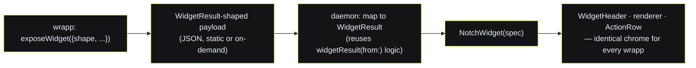
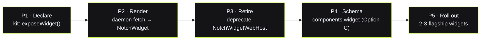

# WIDGETS.md — a widget is a *glance*, not a shrunk app

**Status:** design spec, decision-ready. Written 2026-08-03 as a companion to
[`DESIGN-SYSTEM.md`](./DESIGN-SYSTEM.md) (§2.4 result shapes, §3 the manifest contract) and grounded in
`GodWidgetKit.swift` (the native widget kit), `GodWebWindow.swift` (`NotchWidgetWebHost`),
`RelayMenuBar.swift` (`showNotchWidgetWeb` / `widgetResult(from:)`), and `packages/protocol/src/store.ts`
(the `WrappListing` model). Diagrams and tables carry the spec; prose only names what a picture can't.

> **The founder's bar, verbatim:** *"WIDGETS must be REAL widgets, not a responsive view of the full
> wrapp page. The current `NotchWidgetWebHost` just loads the whole app (e.g. brandbrain) squeezed into
> the notch."*

This doc says exactly what a widget IS here, diagnoses why the current path is wrong, and proposes —
decision-ready — how a wrapp should DECLARE a widget. The punchline up front: **the native kit that
renders a real widget already exists and is already wired end-to-end. The web host is the redundant path
to retire, not a foundation to build on.**

---

## 1. Diagnosis — what `NotchWidgetWebHost` does today, and why it's wrong

### 1.1 What it does (grounded)

`showNotchWidgetWeb(url:widgetId:title:)` (`RelayMenuBar.swift:3475`) mounts a `NotchWidgetWebHost`
(`GodWebWindow.swift:246`). That host is a **full `WKWebView`** that loads the wrapp's *own page URL*,
injects `window.claude`, and drops it into a `NotchPanel` clipped to `NotchDropShape`. From the host's
own header comment (`GodWebWindow.swift:234-244`):

> *"A wrapp can ship a WIDGET surface (a web page built to render inside the notch drop). This host loads
> that URL in a WKWebView and injects window.claude…"*

The webview is created at `600×360` and the page is expected to "render inside the notch drop." In
practice, for an existing wrapp the declared widget URL is just **the app's page** — brandbrain's
`/build`, prism's home — reflowed by CSS into a 600-wide box. There is no separate glance view; the whole
app is present, merely narrower.

```
   TODAY — NotchWidgetWebHost (the whole app, squished)
   ┌───────────────────────────────────────────────────────┐  NotchDropShape
   ╲                                                       ╱
    │  [brandbrain nav]  [tabs: Build · Voice · Palette …] │   ← the app's real chrome, shrunk
    │  ┌───────────┐  Brand Studio                          │
    │  │ sidebar   │  [ big multi-section editor … ]        │   ← a 900px page reflowed into 600px
    │  │ • Voice   │  [ scrolls forever inside the notch ]  │
    │  │ • Palette │  [ inputs, panels, its own buttons ]   │
    │  └───────────┘                                        │
    ╰───────────────────────────────────────────────────────╯
        an ENTIRE APP at a smaller zoom — not a glance
```

### 1.2 Why it's wrong — four concrete failures

| # | Failure | Why it violates the language |
|---|---|---|
| **1** | **It's a shrunk app, not a glance.** | DESIGN-SYSTEM §1.2 says the notch widget's ONE job is "deliver ONE glanceable result + 1–2 actions" and its MUST-NOT is "never a scroll marathon, never bespoke chrome." A reflowed page is *all* chrome and *all* scroll. |
| **2** | **It forks the design language.** | The page brings its own header, nav, buttons, loader — none of which are `WidgetHeader` / `ActionRow` / `DotMatrix`. The whole point of §2 ("nothing is per-wrapp") is defeated: every widget would look different. |
| **3** | **It's not device-light.** | A live `WKWebView` running a full SPA sits in the notch with its JS, timers, and layout engine hot. `MEMORY → relay-device-lightness` is a **hard rule**: a store item must never idle the user's device. A glance should be a few native views, not a running browser. |
| **4** | **It ignores the kit that already renders real widgets.** | `GodWidgetKit.swift` already has the finite renderers, AND `RelayMenuBar.swift:3638 widgetResult(from:)` already maps any wrapp's returned JSON to a native `WidgetResult`. The web host is a *second, worse* rendering path for the same job. |

**The core mistake:** treating "widget" as a **layout** problem (make the page fit) instead of a
**content** problem (which one result, rendered by the shared kit). A widget is not the app at 60% zoom;
it is *the app's answer*, wearing the house chrome.

---

## 2. What a widget IS here

> **A widget is a purpose-built, glanceable surface that shows ONE result (in one of the finite shapes)
> plus 1–2 actions — rendered by the native `GodWidgetKit`, never by a webview.**

It is defined entirely by the vocabulary that already exists — we do **not** invent a sixth renderer
(DESIGN-SYSTEM §2.4 is the law):

```
  A WIDGET = WidgetSpec {                        the finite result shapes (GodWidgetKit.swift:299)
     kicker      "PRISM · IMAGE"                    ┌ working(line)                → any size
     title       "From your selection"              │ image(caption, steer, file)  → medium
     openLabel   "Open in Prism"                     │ gallery(caption, items)      → large
     result      one WidgetResult  ─────────────────┤ cards(caption, items)        → large
  }                                                  └ text(body)                   → small
        │
        ▼  rendered by
  NotchWidget → WidgetHeader (kicker·title·project chip) · WKHairline · renderer(result) · ActionRow
        every widget wears the SAME chrome → 76 wrapps read as one product
```

The mapping "result → widget" is not aspirational — `widgetResult(from: Any)` (`RelayMenuBar.swift:3638`)
**already** does it for the live God-drive path: an array-of-options becomes `cards`, an image URL becomes
`image` (downloaded so it drags out), the best string becomes `text`. A real widget is exactly this,
declared ahead of time instead of inferred from a drive result.

**What a widget is NOT:** a responsive breakpoint of the full page, a scrollable editor, a second result,
or a place a wrapp draws its own chrome. If the answer doesn't fit one of the five shapes, that's a design
smell to resolve (DESIGN-SYSTEM §4), not a reason to fall back to a webview.

---

## 3. How a wrapp DECLARES a widget — decision-ready options

The question: given a wrapp already in the store (a `WrappListing` with `components` + `surfaces`), how
does it say *"and here is my glance"*? Three candidate mechanisms.

### Option A — a dedicated lightweight `widget.html` route per wrapp

The wrapp ships a second, purpose-built page (`<id>.thelastprompt.ai/widget`) that renders ONLY the glance
view, and the manifest points the `notch` surface at it. `NotchWidgetWebHost` loads *that* instead of the
full app.

```
  components.ui.url        = ".../build"      ← full page (window/browser surface)
  components.widgetUrl     = ".../widget"     ← the glance (notch surface)   ← NEW field
```

- **Fidelity:** high — the wrapp author controls the exact pixels.
- **Device-lightness:** ✗ **still a live WKWebView in the notch.** Lighter than the full app, but a running
  browser with JS/timers is exactly what `relay-device-lightness` forbids for an ambient surface.
- **Reuse of the native kit:** ✗ zero — the page re-implements header/actions/loader in HTML, so the
  design language forks again (Failure #2 returns, just smaller).
- **Effort:** high **per wrapp** — every one of 76 wrapps must author and deploy a second page.

### Option B — a `widget()` export in the wrapp's kit that returns a `WidgetResult`-shaped object ⭐ RECOMMENDED

The wrapp declares its glance as **data, not a page**: a small function (living beside `exposeToGod` in
`kit/webmcp.js`) that returns a JSON payload matching the `WidgetResult` shape. The native `NotchWidget`
renders it. **No webview in the notch at all.**

```js
// in the wrapp, next to exposeToGod([...])
exposeWidget({
  kicker: "BRANDBRAIN · BRAND",
  title:  "Acme at a glance",
  openLabel: "Open brandbrain",
  shape: "cards",                                  // one of: text·image·cards·gallery·working
  result: {
    caption: "Voice · palette · one-liner",
    items: [
      { label: "Voice",    text: "Plainspoken, wry, never hypey" },
      { label: "One-liner",text: "Your whole brand, one place.", recommended: true },
      { label: "Palette",  text: "Ink #101014 · Lime #C8F250 · Bone #EDEDEA" },
    ],
  },
});
```

The native side already speaks this: `widgetResult(from:)` maps this exact `{caption, items:[{label,
text, recommended}]}` shape to `.cards(...)`. A published widget is a static (or on-demand-refreshed)
`WidgetResult` payload; the daemon fetches it once and hands it to `NotchWidget`.

- **Fidelity:** high **for a glance** — the five shapes are exactly what a glance needs; a wrapp that wants
  more is over-scoping the notch (that's what "Open in…" is for).
- **Device-lightness:** ✓✓ **best.** The notch renders a handful of native SwiftUI views. Nothing runs
  idle — no browser, no JS, no timers. Data can be produced once and cached.
- **Reuse of the native kit:** ✓✓ **total** — it IS the kit. `WidgetHeader`, `ActionRow`, the renderers,
  the project chip, drag-out, steer chips — all inherited for free, unforkable.
- **Effort:** **low.** A wrapp adds one small function that reuses its own pipeline (same `execute` logic
  as its God tool). The heavy native machinery (`NotchWidget` + `widgetResult`) already exists.

### Option C — `surfaces:["notch"]` + a `components.widget` manifest field pointing at a small render function

The manifest gains a first-class `widget` component (a ref to the function in Option B). Structurally this
is **Option B, promoted into the schema** — the payload is produced by a named export the manifest points
to, and `validateListing` enforces `surface 'notch' ⟹ components.widget`.

```jsonc
"components": {
  "ui":     { "kind": "web", "url": "https://brandbrain.thelastprompt.ai/build" },
  "widget": { "kind": "fn", "ref": "brandbrain#widget" }        // NEW component kind
},
"surfaces": ["window", "notch"]
```

- **Fidelity / device-lightness / kit-reuse:** identical to B (same payload, same renderer).
- **Effort:** B **plus** a schema change to `store.ts` (`WrappComponents.widget`, a `validateListing` rule,
  a `Surface`-implies-component clause). Cleaner long-term contract; more up-front surface area.

### The recommendation: **B, on a path to C**

| Criterion | A · widget.html | **B · widget() export** ⭐ | C · manifest field |
|---|---|---|---|
| Glance fidelity | high | **high (for a glance)** | high |
| Device-lightness (the hard rule) | ✗ live webview | **✓✓ native, zero idle** | ✓✓ native, zero idle |
| Reuses native `GodWidgetKit` | ✗ forks the language | **✓✓ IS the kit** | ✓✓ IS the kit |
| Effort per wrapp | high (2nd page) | **low (one fn)** | low (one fn) |
| Schema change needed | small (`widgetUrl`) | **none (ships as data)** | medium (new component) |

**Ship B now; graduate to C when it's proven.** B needs no protocol change — a widget is just a
`WidgetResult`-shaped payload the wrapp produces and the daemon renders through the kit that already
exists. Today's `widgetResult(from:)` mapper is 90% of B's native side; the missing 10% is a declared
(vs. inferred) payload and a manifest hook to fetch it. Once a handful of wrapps ship widgets this way,
promote the hook into the schema as C (`components.widget` + a `validateListing` rule + `notch ⟹ widget`),
so the store can *guarantee* a `notch` surface has a real glance behind it. **`NotchWidgetWebHost` is
retired** — the `notch` surface no longer means "load a page," it means "render this payload."

> **Why not A, restated in one line:** A keeps a browser alive in the notch and re-draws the house chrome
> in HTML — it fails the two rules (device-lightness, one-language) that the whole widget idea exists to
> honor. It only looks cheaper because "point the notch at a URL" is what the current (wrong) host does.

---

## 4. Real widget vs. full page — three concrete examples

For each: the full page (what "Open in…" gives you) vs. the REAL widget (the glance), with the exact
shape, content, and actions.

### 4.1 brandbrain (studio) → a "brand at a glance" **cards** widget

```
  FULL PAGE (window surface)                    REAL WIDGET (notch surface) — shape: cards
  ┌─────────────────────────────────┐           ┌───────────────────────────────────────────┐
  │ brandbrain · Build              │           │ ● BRANDBRAIN · BRAND        [Acme ▾]   ✕   │  WidgetHeader
  │ ┌ Voice ┐┌ Palette ┐┌ Positioning│           ├───────────────────────────────────────────┤
  │ │ multi ││ swatches││ competitor │           │ ┌ Voice ─────────────────────────────────┐ │  cards
  │ │ field ││ editor  ││ war-room   │           │ │ Plainspoken, wry, never hypey          │ │
  │ │ editor││         ││            │           │ ├ One-liner ───────── recommended ───────┤ │  ← rec ring
  │ │ …scrolls forever… │            │           │ │ Your whole brand, one place.           │ │
  │ └───────┘└─────────┘└───────────┘│           │ ├ Palette ──────────────────────────────┤ │
  └─────────────────────────────────┘           │ │ Ink #101014 · Lime #C8F250 · Bone …    │ │
                                                 │ └────────────────────────────────────────┘ │
   the whole studio: edit everything             │ 3 facets — grounded in your vault           │  CaptionLine
                                                 │ [ Copy ]            [ Open brandbrain ▸ ]   │  ActionRow
                                                 └───────────────────────────────────────────┘
                                                  ONE answer: "who is this brand, right now"
```

- **Shape:** `cards` (→ large). **Content:** the three settled brand facets, one flagged `recommended`.
- **Actions:** `Copy` (the three facets as text) · `Open brandbrain` (deep-link to the full studio).
- **Not** the editor, not the tabs, not the war-room — those live one tap away in the full page.

### 4.2 Convert (skill / L1 non-AI tool) → a compact **text** widget

```
  FULL PAGE (browser surface)                    REAL WIDGET (notch surface) — shape: text
  ┌─────────────────────────────────┐           ┌───────────────────────────────────────────┐
  │ Convert                          │           │ ● CONVERT · CSV → JSON                 ✕   │
  │ [ paste JSON / CSV / YAML … ]    │           ├───────────────────────────────────────────┤
  │ ⇅  format picker · options       │           │ [{ "name":"Ada","role":"eng" },           │  ResultText
  │ [ big output textarea … ]        │           │  { "name":"Grace","role":"eng" }]         │  (cap+scroll >700c)
  │ [ Copy ] [ Download ]            │           │                                            │
  └─────────────────────────────────┘           │ 2 rows · no AI · on your device            │  CaptionLine
                                                 │ [ Copy ]              [ Open Convert ▸ ]    │  ActionRow (draggable:false)
   full converter with all formats               └───────────────────────────────────────────┘
                                                  the CONVERTED result, ready to paste
```

- **Shape:** `text` (→ small; scrolls inside at >700 chars, never stretches past the screen).
- **Content:** the converted output only. **Actions:** `Copy` (`copyText` = the body) · `Open Convert`.
- Reinforces DESIGN-SYSTEM §4 gap #3 — Convert is a deterministic, no-AI job; the widget badges "no AI ·
  on your device," never a spinner.

### 4.3 Prism (image tool) → an **image** widget

```
  FULL PAGE (browser surface)                    REAL WIDGET (notch surface) — shape: image
  ┌─────────────────────────────────┐           ┌───────────────────────────────────────────┐
  │ Prism · editor                   │           │ ● PRISM · IMAGE            [Acme ▾]     ✕  │
  │ [ prompt ] [ style ] [ seed ]    │           ├───────────────────────────────────────────┤
  │ [ history grid ]                 │           │ ┌─────────────────────────────────────────┐│  ResultImage
  │ [ big canvas + brush controls ]  │           │ │            the generated image          ││  (drag-out)
  │ [ export · variations · upscale ]│           │ └─────────────────────────────────────────┘│
  └─────────────────────────────────┘           │ A soft editorial illustration.             │  CaptionLine
                                                 │ STEER  [Warmer][More detail][Flat vector]  │  SteerRow
   the whole editor + history + tools            │ [ ⇱ drag to place ] [↻]  [ Open in Prism ▸]│  ActionRow (draggable)
                                                 └───────────────────────────────────────────┘
                                                  the IMAGE — drag it into any app
```

- **Shape:** `image` (→ medium). **Content:** the single generated image + a one-line caption.
- **Actions:** drag-out (`DragChip`, file present) · `Regenerate` · steer chips (re-run with a nudge) ·
  `Open in Prism`. This is exactly the sample already in `RelayMenuBar.swift:3152`.

---

## 5. Every declared widget maps to a `WidgetResult` — the kit renders it for free

Because a widget is *declared as* a `WidgetResult` shape (Option B), the native kit renders 100% of them
with zero per-wrapp UI. The mapping is total — the same table the live-drive path already honors:

| Declared `shape` | Payload fields | → `WidgetResult` (`GodWidgetKit.swift:299`) | Renderer | Size class | Action row |
|---|---|---|---|---|---|
| `working` | `line` | `.working(line)` | `WorkingCanvas` | any | — (in flight) |
| `text` | `body` | `.text(body)` | `ResultText` (cap+scroll >700c) | small | Copy · Open |
| `image` | `caption`, `steer[]`, `file` | `.image(caption, steer, file)` | `ResultImage` (drag-out) | medium | drag · ↻ · Open |
| `gallery` | `caption`, `items[]` | `.gallery(caption, items)` | `ResultGallery` (2-col) | large | drag · Open |
| `cards` | `caption`, `items[{label,text,recommended}]` | `.cards(caption, items)` | `ResultCards` (rec ring) | large | Copy · Open |



The invariants the kit gives every widget for free (so no wrapp can drift):
- **One accent** — `WidgetHeader` dot is lime (fix DESIGN-SYSTEM §4 #1 while here: default `accent = .lime`).
- **One loader** — `working` is `WorkingCanvas`, never a bespoke spinner.
- **One chrome** — header + hairline + action row, drag-out + copy + steer, the project chip.
- **Containment** — long `text` scrolls inside (max 340pt), never taller than the screen.

If a wrapp's answer genuinely doesn't fit the five shapes, that is the signal to **extend the enum once
for everyone** (DESIGN-SYSTEM §4 gap #3), not to reach back for a webview.

---

## 6. Build plan (phases — for whoever implements this next)

> Not implemented here. This is the sequence; each phase is independently shippable.



- **P1 — Declare (the wrapp side).** Add `exposeWidget(spec)` to `examples/apps/src/kit/webmcp.js`,
  mirroring `exposeToGod`: it publishes a `WidgetResult`-shaped payload (static, or a thunk the wrapp can
  refresh from its own pipeline). Inert without a host. No native change yet.
- **P2 — Render (the native side).** Teach the daemon/menubar to read a wrapp's declared widget payload
  and pass it to the **existing** `NotchWidget`. Reuse the `widgetResult(from:)` mapping wholesale so the
  declared path and the live-drive path share one shape-mapper (never disagree). No new renderer.
- **P3 — Retire the webview host.** Point the `notch` surface at the payload path; delete/deprecate
  `showNotchWidgetWeb` + `NotchWidgetWebHost`. The `notch` surface now means "render this glance," not
  "load a page." (Keep the webview only as a dev-only "preview arbitrary URL" escape hatch, if at all.)
- **P4 — Schema (Option C).** Add `WrappComponents.widget` to `packages/protocol/src/store.ts`, a
  `Surface`-implies-component clause (`notch ⟹ components.widget`) in `validateListing`, so a `notch`
  surface is guaranteed to have a real glance behind it. Migrate the P1 hook onto it.
- **P5 — Roll out.** Ship widgets for the three worked examples (brandbrain · Convert · Prism), verify
  each renders across the drive path and the declared path identically, then template it into the `/wrapp`
  skill so new wrapps get a widget by construction (DESIGN-SYSTEM §3 checklist gains one line:
  *"☐ declares a widget glance (one of the five shapes)"*).

**Definition of done:** the `notch` surface never loads a webview; every widget is a native
`WidgetResult` rendered by `GodWidgetKit`; a user recognizes the same header, loader, and action row on
every wrapp's glance — and nothing runs idle in the notch.
