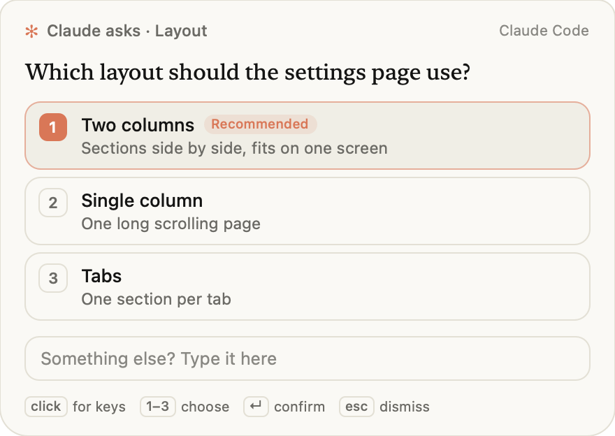

# Ask Notch

When Claude asks you something, the question drops from your Mac's notch as a card, so you can
answer without switching back to the terminal.



- **Click an option** to answer. The card never takes your keyboard when it appears, so typing in
  another app can't answer it by accident.
- **Click the card** to use keys: **1–4** picks an option, **↵** confirms the highlighted one
  (Claude's recommendation starts highlighted), **esc** dismisses it and the question appears in
  Claude Code as usual, so it is never lost
- **Click the text box** to answer in your own words

Needs macOS 13+ and Claude Code **v2.1.287** or later (`claude --version`). It is a Claude Code
[mod](https://code.claude.com/docs/en/plugins/mods/overview): it hooks Claude's `AskUserQuestion`
tool and nothing else. Nothing is compiled: the card is a JavaScript file that macOS's own
`osascript` runs.

## Try it for one session

Nothing is installed and nothing is written to your settings:

```sh
claude --plugin-url https://github.com/sameeeeeeep/ask-notch/releases/latest/download/ask-notch.zip
```

Ask Claude something that makes it ask you back, or run `/notch test`.

## Keep it

In Claude Code (v2.1.275+ adds the marketplace and installs in one step):

```text
/plugin install ask-notch --marketplace sameeeeeeep/ask-notch
```

Updates: `claude plugin update ask-notch@ask-notch`.

## Settings

Say what you want after `/notch`, in your own words: `/notch put it by my mouse`, `/notch pause for now`,
`/notch bring the cat`, `/notch show me one`. Claude reads it and changes the setting. On its own, `/notch`
shows the current settings. The words below skip Claude and take effect instantly:

| Command | Effect |
| --- | --- |
| `/notch cursor` | Open cards beside the pointer instead of at the notch |
| `/notch notch` | Back to the notch |
| `/notch companion cat` | A small painted cat hops out beside the card and waits with you |
| `/notch companion off` | No companion (the default) |
| `/notch off` / `/notch on` | Use Claude Code's own dialog / the card |
| `/notch test` | Show a test card |

Multi-select, free-text and number questions always use Claude Code's own form.

## Choices come to you

While cards are on, Claude asks with `AskUserQuestion` whenever it would otherwise list options in its reply
("A or B?", "go ahead?"), so those choices arrive as a card at the notch. The plugin adds one short paragraph saying
so to Claude's system prompt while cards are on (none while they're off), and ships the same guidance as a skill,
`ask-at-the-notch`.

## Examples

Any request where Claude stops to ask you a question shows the card. Three to try:

1. **A design choice.** "Add a settings page to this app. Ask me which layout to use before you
   build it." The card shows the layouts Claude proposes, with its pick highlighted. Click one, or
   click the card and press **1–4** or **↵**.
2. **A risky step.** "Clean up the old migration files, but ask me before deleting anything." Claude's
   question lands at the notch while you work in another app; answer it there and Claude carries on.
3. **Your own answer.** "Help me name this CLI tool and ask me to choose." Ignore the options, click
   the card's text box, type a name, and press **↵**. Claude receives exactly what you typed.

`/notch test` shows a sample card without asking Claude anything.

## Where it works

Cards appear when Claude Code runs on your Mac: the `claude` CLI in any terminal, and the Desktop
app's Code tab once it ships Claude Code v2.1.287. In other places, such as cloud sessions, the mod
steps aside and Claude Code asks as usual. Chat on claude.ai and Cowork don't run Claude Code mods,
so the plugin does nothing there. On Windows and Linux the card can't open, and Claude Code asks
as usual.

## Troubleshooting

- **No card appears.** Run `claude --version` (needs v2.1.287+), then `/plugin` and look for
  `ask-notch` in the `mods active` line under the tabs. Run `/notch test`. If `/notch` is off, run `/notch on`.
- **The card opens on the wrong screen.** Run `/notch cursor` to open it beside the pointer.
- **You'd rather answer in the terminal.** Press **esc** on any card, or run `/notch off`.

## What it does on your machine

The mod is [`hooks/register.js`](hooks/register.js) (about 100 lines) and the card is
[`helper/card.js`](helper/card.js) (about 600 lines). Both are plain JavaScript you can read; the
plugin ships no compiled code.

- **Which tool it answers, and when.** It handles only Claude Code's `AskUserQuestion` tool, and
  only single-choice questions. When you pick or type an answer in the card, the mod returns that
  answer in place of Claude Code's own question dialog, in the same shape the dialog returns. If you
  press esc, the card times out (9 minutes), the question is multi-select, text or number, or the
  card can't start, it hands the question back to Claude Code's dialog unchanged.
- **The one program it starts, and why.** It always runs the same fixed command,
  `/usr/bin/osascript -l JavaScript helper/card.js`, from this plugin's own folder. `osascript` is
  macOS's built-in script runner; the plugin needs it because a Claude Code mod can only draw inside
  Claude Code's window, and the card has to appear at the Mac's notch. The question, its options,
  where to show the card and, if you turned one on, the companion's folder go to the card on its
  **standard input** as one JSON object. It starts nothing else and runs no shell.
- **What the card does.** `helper/card.js` uses macOS's JavaScript bridge to AppKit to draw one
  window, reads the pointer position (for `/notch cursor`) and, with a companion, the pictures in
  `assets/companion/`. It prints your answer as one line of JSON and exits. It makes no network
  requests, writes no files, reads no environment variables and needs no permissions. It refuses
  the keyboard until you click it, and appears without activating, so it can't take keystrokes
  meant for the app you're using.
- **What it reads, and where it sends it.** It reads the question Claude is asking (part of your
  conversation) and sends it to exactly one place: the local `osascript` process above, on its
  standard input. The card prints your answer on standard output and exits, and the mod gives the
  answer back to Claude. Nothing leaves your Mac: no network requests, no files written, no
  credentials or environment variables read.
- **Standing in for a tool.** The mod answers `AskUserQuestion` in place of Claude Code's dialog
  only when you answer on the card; every other case calls through to Claude Code's own dialog.
- **Settings in plain words.** `/notch` followed by words it doesn't recognise sends Claude one
  prompt that quotes them. Claude then changes the setting through the plugin's own tool,
  `mcp__ask-notch__settings` (on/off, notch/cursor, companion, test card). The tool reads and writes
  only the settings below.
- **The system prompt note and the skill.** While cards are on, the mod adds one fixed paragraph to
  Claude's system prompt (`CHOICES_NOTE` in `hooks/register.js`) asking it to put choices to you
  with `AskUserQuestion`. `skills/ask-at-the-notch/SKILL.md` says the same at length. Both are plain
  text and run nothing.
- **What it stores.** Only your `/notch` settings (on or off, notch or cursor, companion), in
  Claude Code's local storage for this plugin.

To list the mod's hooks and calls yourself, run `claude plugin validate` on this directory.

## Privacy

Ask Notch collects nothing. The question, its options and your answer pass only between Claude Code
and `osascript` running `helper/card.js` on your Mac. There is no network access, no analytics and
no account. The only thing saved is your `/notch` settings (on or off, notch or cursor, companion),
in Claude Code's local storage for this plugin; uninstalling the plugin removes it.

## Support

Report problems or ask questions at
[github.com/sameeeeeeep/ask-notch/issues](https://github.com/sameeeeeeep/ask-notch/issues).
For security issues, email [sameeeeeeep@gmail.com](mailto:sameeeeeeep@gmail.com) instead of opening a public issue.

## Develop

The source lives in [`packages/notch-mod`](https://github.com/sameeeeeeep/switchboard/tree/main/packages/notch-mod)
in the Switchboard repo, which also holds the build and release scripts; this repo is a mirror.

```sh
claude --plugin-dir /path/to/ask-notch   # load a checkout for one session; edits hot-reload
claude plugin test                   # unit tests (no session needed)
```
